# Airbyte实践案例: 从Apify Dataset到openGauss DataVec

Airbyte目前有300+ Source可选，本文选择使用频率很高、非常流行的Apify Dataset作为source，destination则为openGauss DataVec。

具体而言，本教程将使用Apify的Website Content Crawler Actor抓取openGauss DataVec的官方文档，存入Apify Dataset，之后通过airbyte平台写入openGauss DataVec向量数据库。再本地部署deepseek-r1大模型和nomic-embed-text嵌入模型，搭建本地AI助手。

## 前置准备

- 本地部署的airbyte
- apify账号
- docker

本文实践所采用的操作系统为 **openEuler 22.03 LTS**。为了确保各个组件之间能够实现无缝兼容并顺利运行，我们选择使用 **python3.11**。


## Apify抓取openGauss DataVec官方文档

登录Apify控制台网站 [Apify Console](https://console.apify.com/)

选择Apify Store -> Website Content Crawler

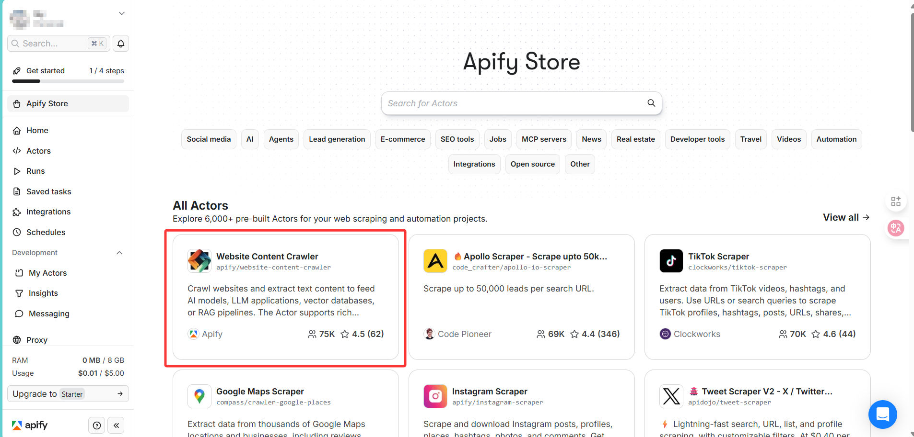

点击后进行简单配置，这里选择抓取一页openGauss DataVec官方文档

- `Start URLs`填 `https://docs.opengauss.org/zh/docs/latest/docs/DataVec/DataVec-Overview.html`

- `Crawler type`选择第三个`Raw HTTP client(Cheerio)-Fastest, but doesn't render JavaScript content.`
- `HTML Processing` -> `Keep HTML elements (CSS selector)` 填入 `article`

其他保留默认值即可。

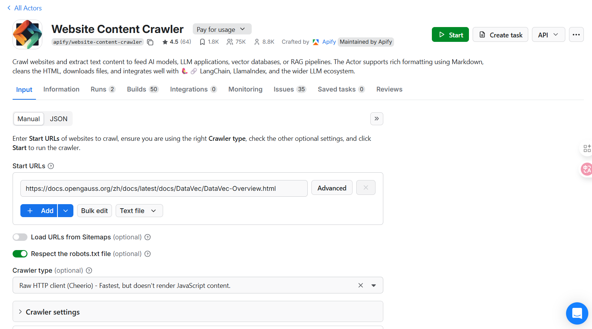

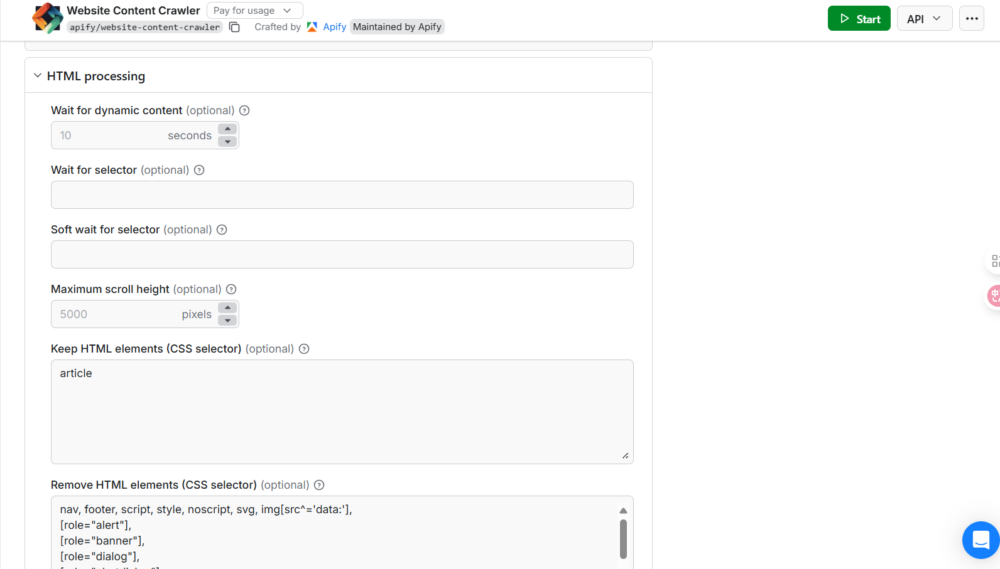

点击start，获取到结果如下。

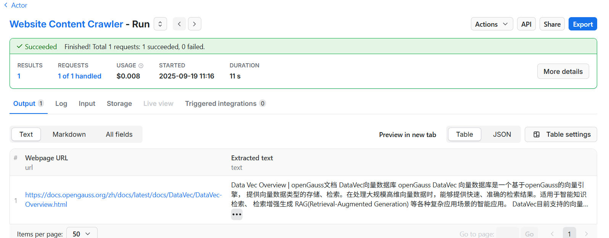

点击左边导航栏Storage，查看最新捕获内容的`Dataset ID`，并修改name为`openGauss DataVec介绍`

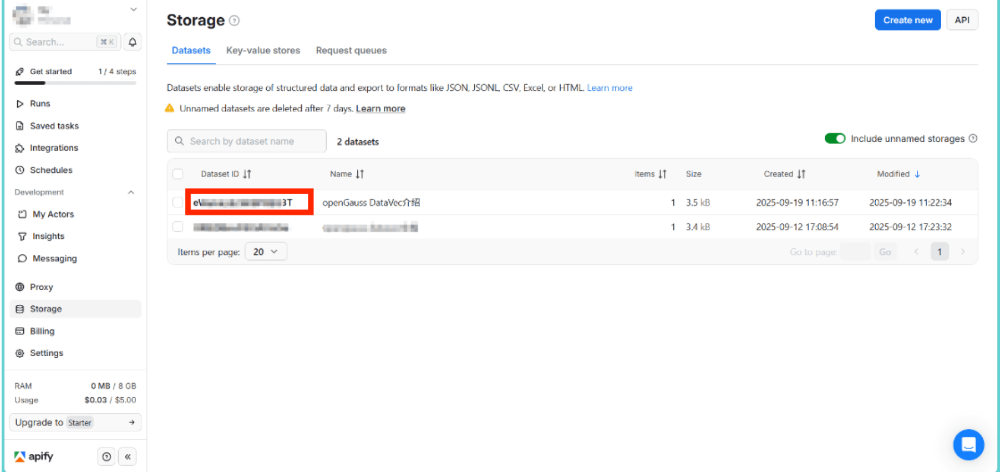

复制`Dataset ID`，等下airbyte需要用到。

点击左边栏`Settings`  -> `API& Integrations`复制 `Personal API tokens`，等下airbyte也需要用到。

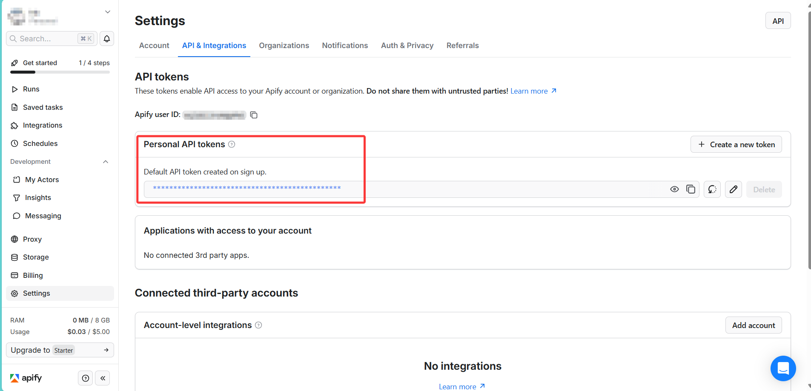

## 配置Airbyte-Apify Dataset

进入airbyte界面，点击左边栏`Source`  ，选择`Apify Dataset`，填充我们之前复制的`Dataset ID`和 `Personal API tokens`，然后`set up source`

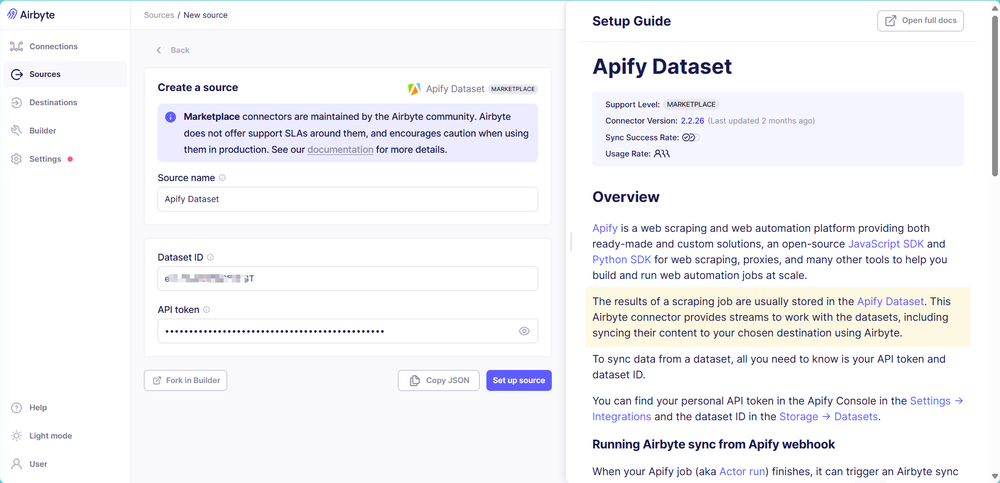


---

## 部署openGauss DataVec

命令行拉取openGauss镜像并运行

```bash
# 拉取镜像
docker pull opengauss/opengauss:latest

# 运行容器
docker run --name opengauss --privileged=true -d -e GS_PASSWORD=Test@123 -v /opengauss:/var/lib/opengauss -p 5432:5432 opengauss/opengauss:latest
```

创建新用户(因为openGauss不支持初始用户通过远程连接登录)

```bash
# 进入opengauss容器
docker exec -it opengauss bash

# 切换用户
su omm
# 连接opengauss
gsql -d postgres
# 创建新用户
CREATE USER airbyte WITH PASSWORD 'Airbyte@123';
# 分配权限
GRANT ALL PRIVILEGES TO airbyte; 
GRANT SELECT ON ALL TABLES IN SCHEMA public TO airbyte;
GRANT INSERT, UPDATE, DELETE ON ALL TABLES IN SCHEMA public TO airbyte;
ALTER DEFAULT PRIVILEGES IN SCHEMA public GRANT SELECT, INSERT, UPDATE, DELETE ON TABLES TO airbyte;
```


## 部署deepseek-r1大模型和nomic-embed-text嵌入模型

命令行拉取ollama镜像并运行

```bash
# 拉取镜像
docker pull ollama/ollama

# 运行镜像
docker run -d -p 11434:11434 --name ollama ollama/ollama:latest
# 进入容器
docker exec -it ollama bash
# 拉取模型
ollama pull nomic-embed-text
ollama pull deepseek-r1:1.5b # 根据电脑配置选择适当参数的模型
```


## 配置airbyte-openGauss DataVec

### 加载openGauss DataVec destination connector镜像

进入airbyte主界面，点击`Setting` -> `Destinations` -> `+New connector`

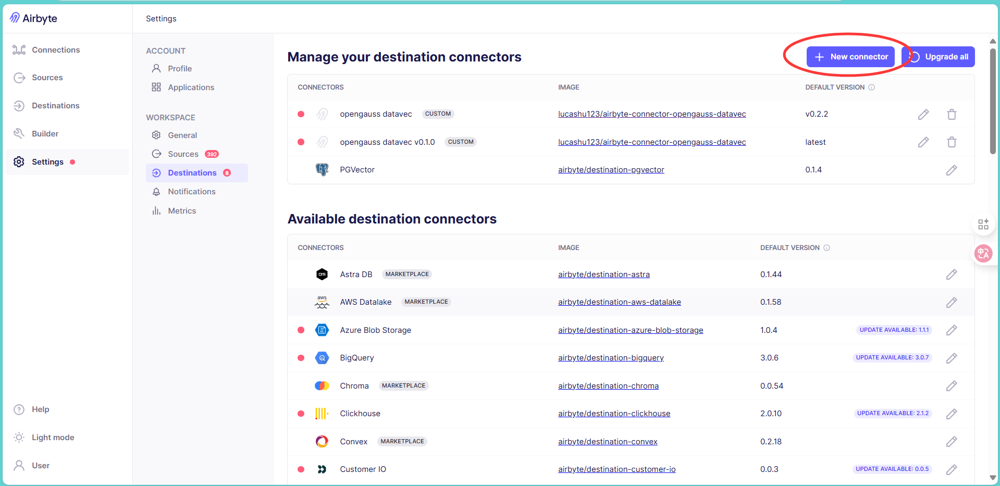

填写表单如下

- `Connector display name`：`openGauss DataVec`
- `Docker repository name`:  `lucashu123/airbyte-connector-opengauss-datavec`
- `Docker image tag`：`latest`

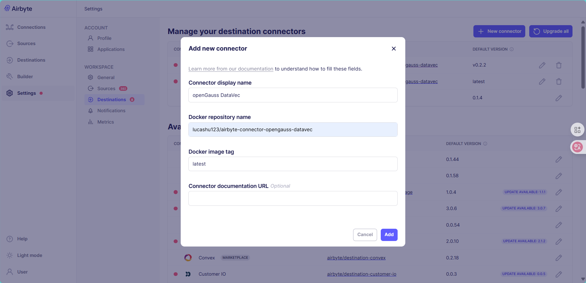

之后便可在Destination -> Custom中选择openGauss DataVec作为destination。

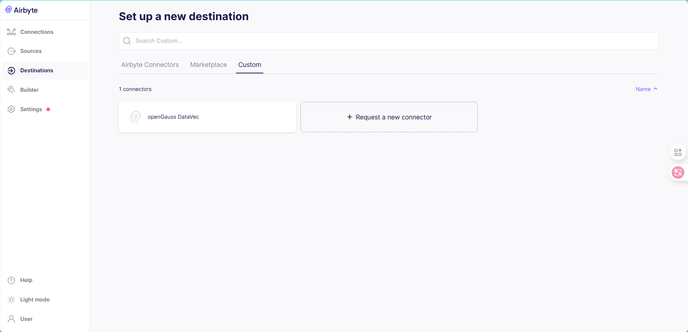

### 填写配置

配置openGauss DataVec有3个部分。

- `Processing`—决定将source中获取的内容的哪些字段作为元数据，哪些字段作为文本字段，分别由`Fields to store as metadata`和`Text fields to embed`控制(若不填，默认选择所有字段)。以及将所有文本字段拼接成一个总文本后，如何进行分块，由`Chunk size`和`Text splitter`等控制。
- `Embedding`—选择嵌入向量模型API，将每个chunk分块文本嵌入向量。可以选OpenAI API，自部署的OpenAI-compatible API等。这里我们选择自部署的`nomic-embed-text嵌入模型`。
- `Indexing`—填写openGauss向量数据库的连接配置。

配置如下：

- `Processing`部分
  - `chunk size`: 100
  - `Fields to store as metadata`: `metadata`
  - `Text fields to embed`:  `markdown`
  - `Text splitter`选择`By Markdown header`，`Split level`填充`2`
- `Embedding`部分，选择`OpenAI-compatible`
  - `Base URL`: http://localhost:11434/v1 (替换为上面部署ollama容器所在机器的ip地址)
  - `Embedding dimensions`: 768
  - `Model name` : `nomic-embed-text`
- `Indexing`部分
  - `Host`: `localhost` (替换为上面部署openGauss容器所在机器的ip地址)
  - `Database`: `postgres`
  - `Username`: `airbyte` (上面创建的新用户)
  - `Password`: `Airbyte@123` (上面创建的新用户密码)

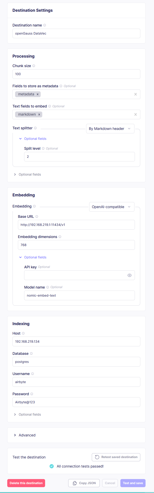


## 建立连接

进入airbyte主界面点击左边栏`connections` -> `+ New connection`

`Define source`选择上面配置好的`Apify Dataset`，`Define destination`选择上面配置好的`openGauss DataVec`

`Select streams`中有4个stream，我们只选择`item_collection_website_content_crawler`流，其中只勾选`markdown`和`metadata`字段

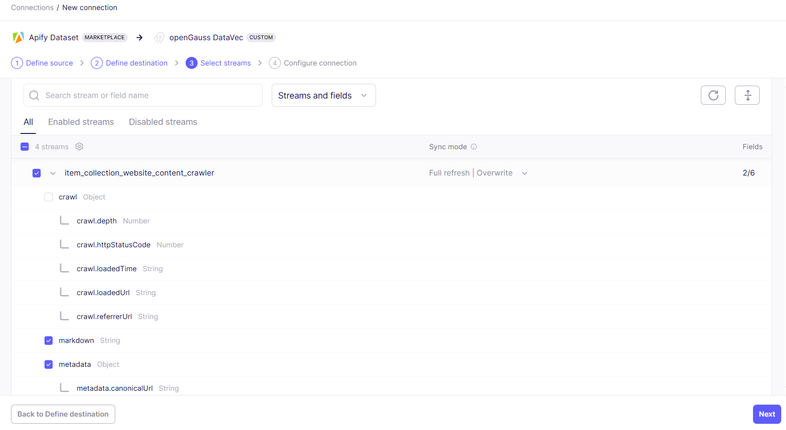

`Configure connection`中的`Schedule type`我们选择调度方式为`Manual`，因为我们选择的Apify Dataset的内容是固定的，手动同步一次即可，无需定时按频率同步。

## 开始同步

建立好连接后，即可点击`Sync now`开始同步，大概花费5min，等待同步结束。

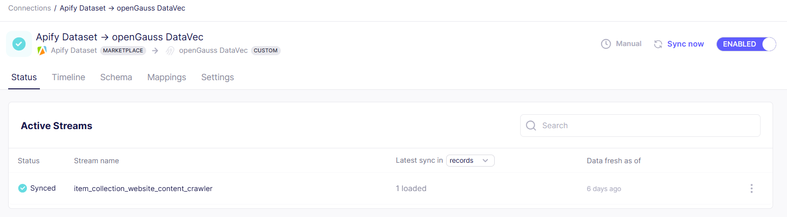

所有流将被存储到同名的表中。如果表不存在将创建表。表将具有以下列： 

- `document_id`（字符串）- 文档的唯一标识符，通过stream名 + stream的主键构成，若没有主键，则uuid随机生成`document_id`
- `chunk_id`（字符串）- 块的唯一标识符，通过将块编号附加到 document_id 创建
- `metadata`（变体）- 文档的元数据，以键值对形式存储
- `document_content`（字符串）- 块的文本内容
- `embedding`（向量）- 块的嵌入，以浮点数列表形式存储

## 搭建AI助手进行测试

源代码如下，利用本地部署的deepseek-r1作大模型

```python
import ollama
import psycopg2

table_name = "item_collection_website_content_crawler"

def embedding(text):
    vector = ollama.embeddings(model="nomic-embed-text", prompt=text)
    return vector["embedding"]

# 替换为自己的配置
conn = psycopg2.connect(
    database="postgres",
    user="airbyte",
    password="Airbyte@123",
    host="192.168.219.134",
    port="5432"
)

cur = conn.cursor()
# 设置搜索路径
cur.execute("SET search_path TO public;")
# 创建索引
cur.execute("CREATE INDEX IF NOT EXISTS idx_{}_embedding_hnsw ON {} USING hnsw (embedding vector_l2_ops);".format(table_name, table_name))
conn.commit()

question = "介绍一下openGauss DataVec"
emb_data = embedding(question)
dimensions = len(emb_data)

cur = conn.cursor()
cur.execute("select document_content from {} order by embedding <-> '{}' limit 3;".format(table_name, emb_data))
conn.commit()

rows = cur.fetchall()
print(rows)

cur.close()
conn.close()


# 指定容器所在主机或容器名、端口（如果需要的话）, 或通过设置环境变量
# client = ollama.Client(host="http://<宿主机 IP>:11434")

context = rows
# 测试
# context = ""

SYSTEM_PROMPT = "你作为一个对话 AI 助手，结合上下文信息简练高效的回答用户提出的问题"
USER_PROMPT = f"请结合{context}信息来回答{question}的问题，不需要额外的无用回答"

response = ollama.chat(
    model="deepseek-r1:1.5b",
    stream=True,
    messages=[
        {"role": "system", "content": SYSTEM_PROMPT},
        {"role": "user",   "content": USER_PROMPT}
    ]
)

print("\n\n")
# 实时打印每一段内容
for chunk in response:
    print(chunk["message"]["content"], end="", flush=True)
```

问题为`介绍一下openGauss DataVec`。当没有为大模型提供DataVec查询结果作为上下文时的回答如下

```
<think>
好，我现在需要帮用户介绍一下openGauss DataVec的问题。用户要求答案要简洁高效，不需要额外的信息。

首先，我得了解DataVec的基本概念和结构。DataVec是openGauss的一个数据结构，用于存储数据向量，类似于Java中的List或Python的List。

接下来，我要考虑用户可能对DataVec的使用情况感兴趣。也许他们是在开发一个需要高扩展性的数据库系统，或者在进行数据管理和查询 优化的工作中。因此，在回答时可以提到DataVec的优势，比如快速查找和插入记录，以及支持聚合操作，这样能帮助用户更好地理解其价 值。

另外，用户可能关心如何高效存储大量数据。DataVec的随机访问特性可能能满足他们的需求，尤其是在处理高并发或大表的情况下。

最后，总结一下DataVec适合什么样的场景，比如在需要动态查询、快速插入和数据管理中的应用。
</think>

openGauss DataVec是一个高效的数据库数据结构，专为存储动态数据向量设计。与传统列表类型数据结构相比，DataVec的优势在于：

1. **快速查找**：支持从随机位置获取记录信息，适用于动态查询场景。
2. **快速插入**：无需重新初始化数据结构，可以快速添加新记录。
3. **支持聚合操作**：适合进行统计、汇总等操作。

例如，在大数据分析或实时系统中，DataVec能够高效管理大量数据向量，满足高扩展性和灵活性的需求。
```

幻觉比较严重，当我们添加DataVec查询结果作为大模型补充上下文时的回答如下

```
<think>
好的，我现在需要帮助用户解决一个关于openGauss DataVec的问题。根据用户提供的上下文，我看到他们提到了DataVec向量数据库和它的多语言生态对接，并且提供了详细的说明。

首先，我要理解用户的需求是什么。他们想知道详细介绍openGauss DataVec的内容，但不需要额外的信息，所以我只需要提取关键点。

接下来，我会回顾一下提供的信息：DataVec是一个基于openGauss的向量引擎，支持存储、检索大规模高维向量数据，适用于智能知识检索和RAG应用。它还提到了支持的各种功能，如最近邻搜索、L2距离、余弦距离、内积等，并且用熟悉的SQL语法操作。

然后，我会考虑用户可能的身份和使用场景。他们可能是开发人员或者研究人员，需要在大数据环境中高效地处理向量数据。因此，我应该强调DataVec的性能优势以及其对多种语言的支持。

最后，我会整理这些信息，确保回答简明扼要，涵盖主要功能、支持的语言生态和技术特点。
</think>

openGauss DataVec是一个基于openGauss的向量引擎，提供向量数据类型的存储和检索。在处理大规模高维向量数据时，能够快速、准确地检索结果，并适用于智能知识检索和RAG（Retrieval-Augmented Generation）等复杂应用场景的智能应用。

DataVec支持的各种功能包括：

1. **精确和近似的最近邻搜索**：快速找到最接近的向量。
2. **L2距离&余弦距离&内积**：多种距离计算方式，满足不同场景的需求。
3. **向量索引**：高效的索引结构，提升查询性能。
4. **向量操作函数和操作符**：灵活的操作符组合，增强功能扩展。

此外，DataVec提供了多语言生态对接，支持通过Python、Java、Node.js等编程语言的API调用，使用户能够快速集成向量数据库能力。另 外，它还采用开源组件，优化了RAG场景下的兼容性，提供了多样化的选择。

总体而言，openGauss DataVec在处理向量数据时表现出色，结合了高效的性能和丰富的功能支持，满足复杂智能应用的需求。
```

可见，AI助手回答效果更加精确和可靠。
