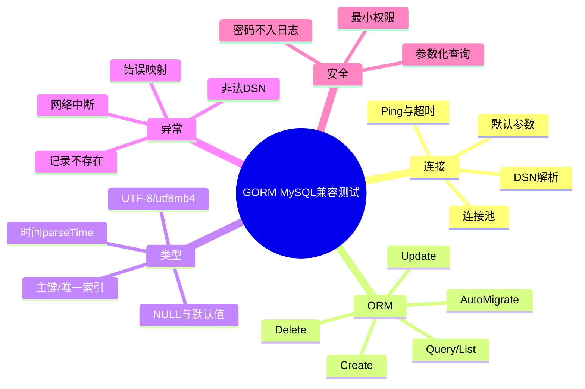

# GORM + openGauss B 测试思维导图

```mermaid
mindmap
  root((GORM MySQL兼容测试))
    连接
      DSN解析
      默认参数
      Ping与超时
      连接池
    ORM
      AutoMigrate
      Create
      Query/List
      Update
      Delete
    类型
      时间parseTime
      UTF-8/utf8mb4
      NULL与默认值
      主键/唯一索引
    异常
      错误映射
      记录不存在
      网络中断
      非法DSN
    安全
      参数化查询
      密码不入日志
      最小权限
```
