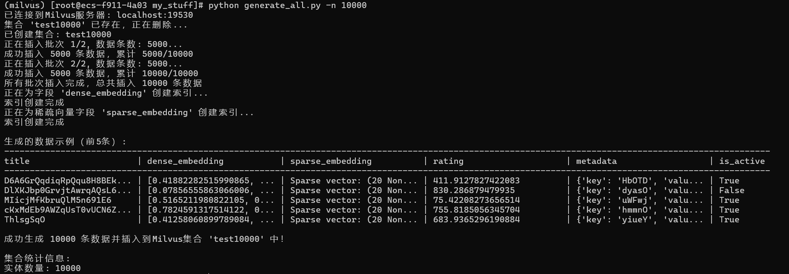
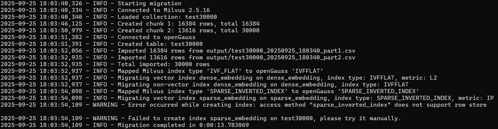
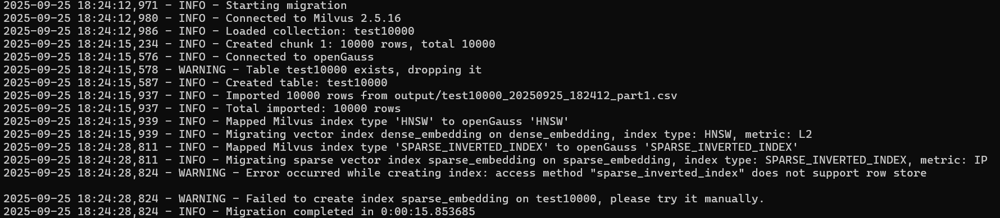
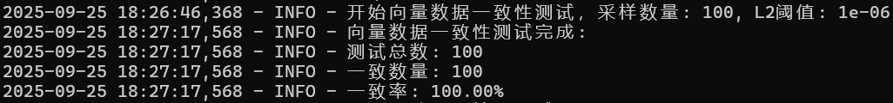
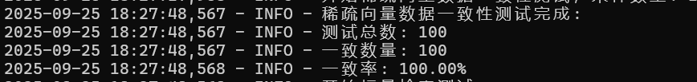
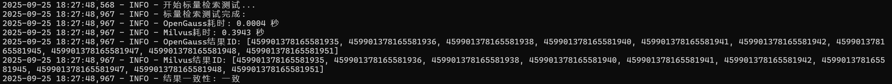
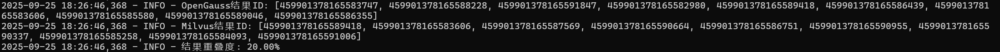
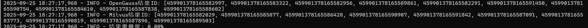

# Milvus2OpenGauss 迁移工具测试报告

## 1. 基本信息

| 项目名称 | Milvus2OpenGauss 迁移工具 |
| -------- | ------------------------- |
| 测试版本 | v1.0.0                    |
| 测试人员 | 杨天宇                    |
| 报告日期 | 2025年9月2日              |

## 2. 测试概述

### 2.1 测试目标
- 验证迁移工具的功能正确性
- 确保数据迁移的完整性和一致性
- 评估迁移前后的性能变化
- 验证索引迁移的正确性

### 2.2 测试环境

#### 硬件环境
- CPU：___4___ 核心
- 内存：___8___ GB
- 存储：___40___ GB
- 网络：___1000Mbps___

#### 软件环境
- Milvus 版本：___2.3___
- openGauss 版本：___7.0.0-RC1___
- Python 版本：___3.8___
- 依赖库版本：___psycopg2、pymilvus==2.4.9、numpy___

## 3. 测试结果详情

### 3.1 数据生成功能测试

| 测试用例ID | 测试场景         | 实际结果                        | 测试状态                                  |
| ---------- | ---------------- | ------------------------------- | ----------------------------------------- |
| DG-001     | 指定标量字段生成 | 成功生成指定数量的标量数据      | 正常生成                                  |
| DG-002     | 指定向量字段生成 | 成功生成指定维度的向量数据      | 正常生成                                  |
| DG-003     | 指定稀疏向量生成 | 成功生成稀疏向量数据            | 正常生成                                  |
| DG-004     | 创建指定索引     | 成功创建指定索引                | 创建成功                                  |
| DG-005     | 分批数据注入     | 数据分批成功注入，不超出RPC限制 | 依次分批插入数据库，未发生rpc调用失败情况 |

以生成10000条数据为例，如图所示



### 3.2 数据迁移功能测试

| 测试用例ID | 测试场景                | 实际结果                   | 测试状态                        |
| ---------- | ----------------------- | -------------------------- | ------------------------------- |
| DM-001     | 小规模数据迁移（<10K）  | 迁移成功，数据完整         | 正常迁移未报错                  |
| DM-002     | 大规模数据迁移（>100K） | 迁移成功，无死循环         | 输出多个csv文件，正常迁移未报错 |
| DM-003     | 稀疏向量迁移            | 稀疏向量格式正确转换       | 正常迁移未报错                  |
| DM-004     | 数据类型兼容性          | 所有支持的数据类型正确迁移 | 正常迁移未报错                  |
| DM-005     | 迁移过程日志            | 迁移进度和状态正确记录     | 输出日志完整详细                |

以30000条数据的迁移为例：



这里出现了稀疏向量索引迁移失败的情况，因为目前两款产品的稀疏向量索引的对应关系并不明确，因此此部分索引的映射很有限。索引建立失败不影响正常数据迁移，用户可在迁移后根据自身需求进行手动构建。

### 3.3 索引迁移功能测试

| 测试用例ID | 测试场景         | 实际结果                       | 测试状态               |
| ---------- | ---------------- | ------------------------------ | ---------------------- |
| IM-001     | IVF_FLAT索引迁移 | 索引正确创建，参数正确迁移     | 正常迁移               |
| IM-002     | HNSW索引迁移     | 索引正确创建，参数正确迁移     | 正常迁移               |
| IM-004     | 索引迁移开关     | config.ini配置正确控制索引迁移 | 配置后正确控制         |
| IM-005     | 索引迁移失败处理 | 迁移失败不影响数据迁移功能     | 迁移失败后数据状态正常 |

迁移HNSW索引数据如下图：



### 3.4 数据一致性测试

| 测试用例ID | 测试场景       | 实际结果                   | 测试状态   |
| ---------- | -------------- | -------------------------- | ---------- |
| DC-001     | 标量数据一致性 | 迁移前后标量数据完全一致   | 一致率100% |
| DC-002     | 稠密向量一致性 | L2距离误差率小于设定阈值   | 一致率100% |
| DC-003     | 稀疏向量一致性 | 稀疏向量内容和维度完全一致 | 一致率100% |

一致性测试如下：







### 3.5 DQL功能测试

| 测试用例ID | 测试场景     | 实际结果                  | 测试状态                  |
| ---------- | ------------ | ------------------------- | ------------------------- |
| DQL-001    | 基本检索查询 | 迁移前后检索结果一致      | 检索结果一致              |
| DQL-002    | 相似度搜索   | ***Top-K结果召回率较低*** | 多数情况下召回率在20%以下 |

DQL检索Top-k召回率测试：




**原因分析：**在两个数据库数据一致的情况下，且注意到两个数据库检索到的数据均距离目标数据较近，返回内容属于合理内容，此类问题很可能与迁移脚本无关，而与两个数据库的检索模式和索引构造有关。

### 3.6 性能测试

| 测试用例ID | 测试场景       | 性能指标                     | 实际结果                                                     |
| ---------- | -------------- | ---------------------------- | ------------------------------------------------------------ |
| PT-001     | 迁移吞吐量测试 | 迁移指定数量的数据消耗的时间 | 1000条数据: 0.80秒<br />10000条数据：3.16秒<br />100000条数据：33.12 |

 备注：测试中使用的数据库field配置如下：

```python
    fields = [
        FieldSchema(name="id", dtype=DataType.INT64, is_primary=True, auto_id=True),
        FieldSchema(name="title", dtype=DataType.VARCHAR, max_length=100),
        FieldSchema(name="dense_embedding", dtype=DataType.FLOAT_VECTOR, dim=128),
        FieldSchema(name="sparse_embedding", dtype=DataType.SPARSE_FLOAT_VECTOR),
        FieldSchema(name="rating", dtype=DataType.FLOAT),
        FieldSchema(name="metadata", dtype=DataType.JSON),
        FieldSchema(name="is_active", dtype=DataType.BOOL)
    ]
```

其中dense_embedding索引类型为IVFFLAT，采用L2度量。

## 4. 测试总结

### 4.1 测试结论
- [x] 通过  
- [ ] 有条件通过  
- [ ] 不通过

### 4.2 待改进点
- 由于缺少指引文档，稀疏矩阵索引类型的映射部分目前还不完善，大多数情况下会出现索引迁移失败的问题。后续有更多信息的情况下可以补全这一部分
- 测试过程中出现openGauss和milvus检索top-k结果差异较大的问题，考虑到已验证数据一致未遗失且索引多数情况下已迁移，可能是因为两个数据库底层实现上区别的问题，后续可以深究其原因。
