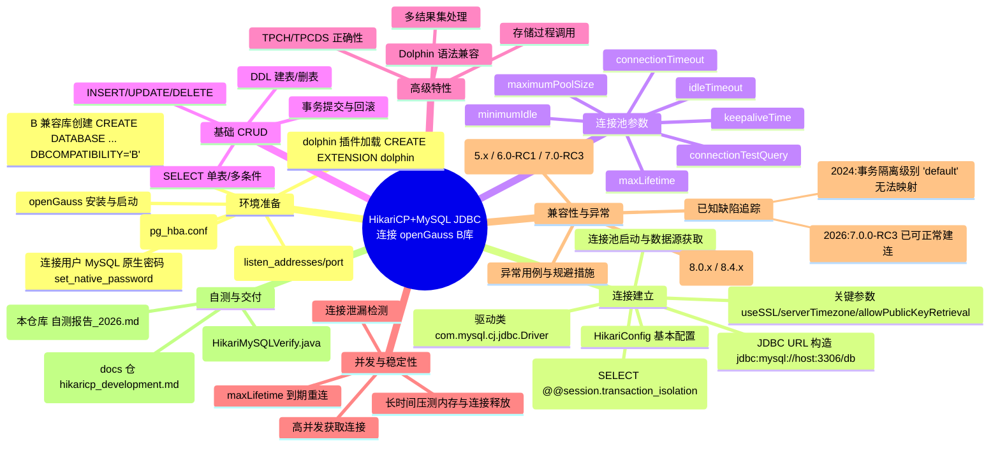

# HikariCP + MySQL JDBC 连接 openGauss B 兼容库 测试思维导图

> 本思维导图覆盖基于 HikariCP 连接池配合 MySQL JDBC Driver 连接 openGauss B 兼容模式（dolphin 插件）的兼容性测试范围。
> 可与 `自测报告_2026.md`（7.0.0-RC3 验证版）配合使用。

```mermaid
mindmap
  root((HikariCP+MySQL JDBC<br/>连接 openGauss B库))
    环境准备
      openGauss 安装与启动
      B 兼容库创建 CREATE DATABASE ... DBCOMPATIBILITY='B'
      dolphin 插件加载 CREATE EXTENSION dolphin
      MySQL 协议端口开启(listen_addresses/port)
      连接用户 MySQL 原生密码 set_native_password
      客户端接入白名单(pg_hba.conf)
    连接建立
      JDBC URL 构造 jdbc:mysql://host:3306/db
      驱动类 com.mysql.cj.jdbc.Driver
      关键参数 useSSL/serverTimezone/allowPublicKeyRetrieval
      HikariConfig 基本配置
      连接池启动与数据源获取
      事务隔离级别探测(SELECT @@session.transaction_isolation)
    连接池参数
      maximumPoolSize
      minimumIdle
      connectionTimeout
      idleTimeout
      maxLifetime
      keepaliveTime
      connectionTestQuery
    基础 CRUD
      DDL 建表/删表
      INSERT/UPDATE/DELETE
      SELECT 单表/多条件
      事务提交与回滚
    高级特性
      存储过程调用
      多结果集处理
      Dolphin 语法兼容
      TPCH/TPCDS 正确性
    并发与稳定性
      高并发获取连接
      连接泄漏检测
      长时间压测内存与连接释放
      maxLifetime 到期重连
    兼容性与异常
      MySQL 驱动版本矩阵(8.0.x / 8.4.x)
      openGauss 版本矩阵(5.x / 6.0-RC1 / 7.0-RC3)
      已知缺陷追踪
        2024:事务隔离级别 'default' 无法映射
        2026:7.0.0-RC3 已可正常建连
      异常用例与规避措施
    自测与交付
      自测报告(本仓库 自测报告_2026.md)
      指导文档(docs 仓 hikaricp_development.md)
      示例代码(HikariMySQLVerify.java)
```
