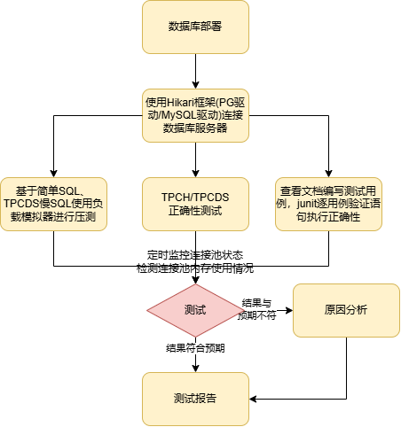
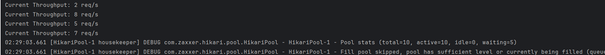
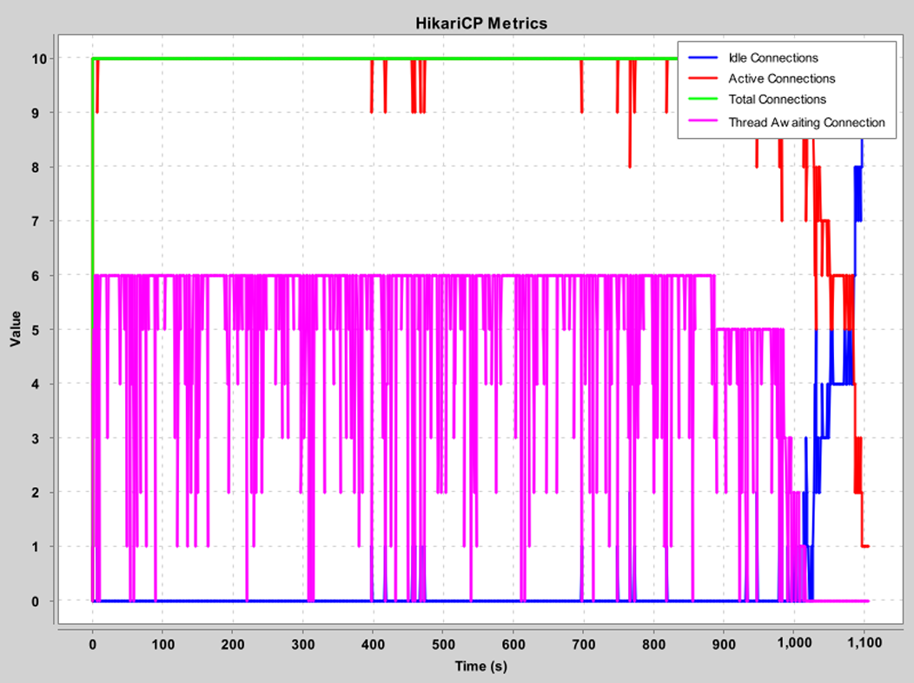
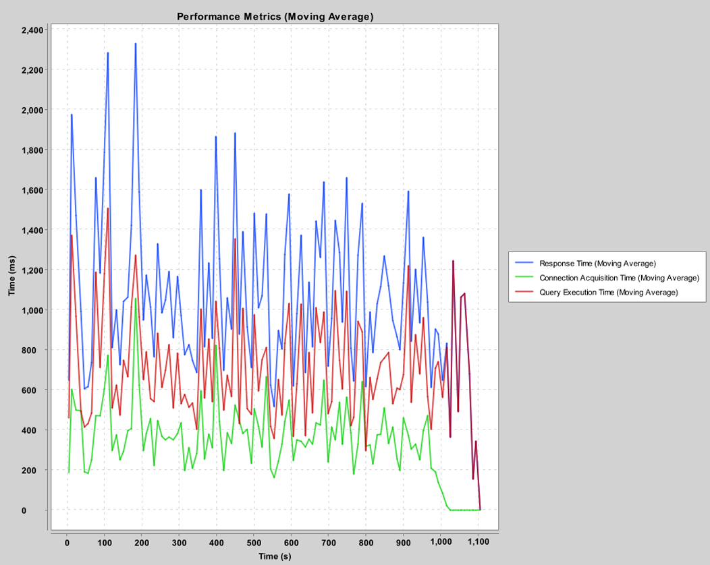

# 结项报告

## 项目信息

### 项目名称

openGauss 对 hikari 框架的兼容性测试

### 方案描述

#### 兼容性测试方法

+ 兼容性测试
  + 验证 HikariCP 使用 MySQL JDBC 驱动/PG JDBC 驱动连接 openGauss 数据库时能否创建数据源并正确获得连接，是否支持 openGauss 特有的功能和数据类型如dolphin协议。同时测试对 openGauss 存储过程的支持。
  + 测试驱动特有的功能和特性，验证这些功能在 openGauss 数据库能否正常工作。
+ 基本操作测试
  + 查看相关文档，选择合适的测试用例。通过 HikariCP 连接 openGauss 数据库，逐语句运行并输出结果。对比数据库中产生的结果，分析语句执行的正确性及一致性。如有异常，记录并分析原因。
  + 设置连接池和 connection 的隔离级别，测试两者之间关系，验证事务隔离级别是否符合设置。
    + 默认情况下，获取到 connection 后，总是处于“自动提交”模式，也就是每一条 SQL 都是作为事务自动执行的。
    + 可以通过 setTransactionIsolation() 设置连接的隔离级别。
  + 事务隔离级别
    + TRANSACTION_READ_UNCOMMITTED
    + TRANSACTION_READ_COMMITTED
    + TRANSACTION_REPEATABLE_READ
    + TRANSACTION_SERIALIZABLE
+ 正确性测试
  + 创建TPCH数据库，导入TPCH测试的表与数据，进行正确性测试；
  + 创建TPCDS数据库，导入TPCDS测试的表与数据，进行正确性测试；
+ 异常处理测试
  + 测试 HikariCP 在连接失效或数据库重启时的处理能力。通过手动重启数据库实例模拟连接失效，验证连接池正确处理坏连接并自动恢复的能力。记录连接池在数据库重启或连接失效后， 恢复正常的时间，并验证连接池能否正确地回收失效连接并替换成新的连接。
  + 测试 HikariCP 连接超时、查询超时等配置是否生效，并验证超时错误能否被正确捕获和处理。设置 HikariCP 的连接超时（connectionTimeout）和查询超时（maxLifetime、 idleTimeout）设置，并通过PreparedStatement.setQueryTimeout() 设置查询超时时间。执行慢 SQL 或人为延迟模拟超时情况（Thread.sleep()），验证超时设置是否生效。验证捕获超时异常的逻辑，记录并分析超时错误的日志信息。
+ 配置测试
  + 验证 HikariCP 的配置参数能否正确影响连接池的行为并在实际使用时生效，记录和观察连接池日志所记录的连接池的状态、性能指标和错误信息。
  + 验证不同配置参数对 openGauss 数据库的影响，监控配置变更对测试性能的影响。测试各种参数配置形式，全量测试 HikariCP 的 API 接口。
+ 资源管理
  + 验证 HikariCP 能否正确管理数据库连接，所有连接在使用后能够被正确关闭，且连接池中不会出现泄露的连接。
  + 使用 'try-with-resources' ，确保每个数据库操作完成后都显式地关闭连接，使用HikariCP提 供的监控接口（HikariPoolMXBean）定期检查连接池状态。引入异常（错误的SQL），验证 异常发生时连接能被正确关闭。
  + 运行负载测试工具对 HikariCP 进行长时间的负载测试，模拟真实生产环境。使用 JDK 自带的  JConsole 工具监控运行情况，检查是否存在未关闭连接。分析内存快照，检查是否存在长时间持有的对象或未释放的内存。监控 HikariCP 在长时间运行中的内存使用情况，记录内存使 用的趋势，观察是否有异常的内存增长，检查是否存在内存泄露的迹象。设置配置参数  leakDetectionThreshold，若发生内存泄漏情况，验证该参数能否正确发挥作用。

#### 兼容性测试框架示意图

  

### 时间规划

+ 项目研发第一阶段（07月01日-08月01日） 在这个阶段，需要进一步深入了解hikari框架，整合 openGauss常用的SQL语法，并撰写测试设计文档。
  + 阅读openGauss官方文档，整合openGauss常用语法
  + 阅读hikari源码，了解openGauss常用DDL、DML、DCL、存储过程等语法测试相关的API接口
  + 实践openGauss，在openGauss数据库上尝试运行这些语句 
  + 撰写设计文档，介绍测试工具的实现细节与实现方法
+ 项目研发第二阶段（08月02日-09月30日） 在这个阶段，将基于设计文档对hikari兼容性测试工具 进行开发，并输出测试报告。
  + 使用JAVA编写测试工具，分别使用MySQL驱动和openGauss(PG)驱动连接 openGauss 数据 库，获取hikari 框架的全量API接口 
  + 结合设计文档，基于hikari框架执行各种测试语句，收集连接池状态以及测试结果 
  + 分析测试结果，输出测试报告

## 项目进度

### 已完成工作

1. 探索hikari框架，整合openGauss常用的SQL语句并自定义测试用例，设计测试项，撰写测试设计文档；
2. 编写测试工具，分别使用MySQL驱动和PG驱动连接openGauss数据库，执行测试用例并进行压测，监测连接池是否存在内存泄露问题，分析hikari连接池异常处理逻辑； 
3. 收集测试结果，对不符预期的结果进行原因分析并输出测试报告。

### 测试用例

+ 兼容性测试设计了31个测试用例。覆盖的数据库对象为行存表、列存表、分区表、临时表、物化视图、存储过程、函数等，覆盖语句为 openGauss 常用的 DDL、DML、DCL、存储过程以及基础 dolphin语法。使用SQLinTransactionTest()逐用例执行验证预期结果。

+ 包含TPCH TPCDS测试sql，配置好表及数据集即可进行正确性测试。

+ 负载性能压测用于检测hikaricp连接池稳定性。目前压测用例基于 TPC-DS表和数据。使用原 TPC DS 查询作为慢 SQL 进行测试，并在此基础上新增多条事务 SQL 。压测步骤：

  1. 执行sql/user_defined/test_high_concurrency/ddl.sql创建测试表；
  2. 在类LoadGenerator设置sql文件路径，执行线程数以及每个线程执行的操作数；
  3. 配置hikari.properties，设置连接池初始数据；
  4. 在类HikariCPMetricsCollector中启动负载生成器以及连接池状态监控器，配有连接池大小调整任务可选择是否开启。

  

​		压测过程中会输出每秒吞吐量。

​		测试结束后生成性能分析图表。主要收集连接获取时间、sql执行时间以及HikariPoolMXBean收集的4项指标。

  
  

开启连接池大小动态调整任务。动态调整池大小后性能分析图表中连接获取时间减为0，总执行时间增长是因为负载模拟器随机插入休眠时间使得该指标没价值。

  
  

### 遇到的问题及解决方案
1. 问题描述：dhcp协议导致虚拟机ip隔段时间更换一次，使得原ip无法启动数据库

   解决方案：将网络设置为静态ip，避免此种情况发生

2. 问题描述：JDBC使用MySQL驱动连接不上openGauss数据库

   解决方案：查找相关文档，创建B兼容数据库并配置dolphin插件，pom中选择文档指定的MySQL 驱动版本

### 心得体会
通过此次项目，我研读了hikari连接池源码以及openGauss数据库文档，深入了解了hikari连接池，同时也对openGauss数据库更加熟悉。此次项目虽然是测试类项目，但设计测试项的过程也并不算轻松，总是思考是否有遗漏之处，确保测试的全面性与有效性，当测试结果不符合预期的时候也需要逐步深挖原因，确定主要过错方。本次开源之夏给予我参与开源项目的机会，从项目申请到项目开发，遇到问题后查找文档、在社区提issue寻求答案，以及提交PR，于我而言都是崭新的体验。总之，此次开发经历不仅让我在技术上有所提升，更让我体验了开源项目的开发。我期待未来能继续参与更多的开源项目，不断提升自己的能力，同时为社区贡献力量。

### 后续工作

后续工作可以从以下方向展开：
1. 提升 openGauss 与 HikariCP 兼容性，dolphin 协议新增对 MySQL 事务语法的支持。
2. 对比 HikariCP 与其他数据库连接池（如 C3P0、Druid）在连接 openGauss 时的性能表现，评估 HikariCP 连接 openGauss 数据库的性能。
3. 探索 HikariCP 连接池对于不同生产环境下的较优配置，确保其能够更好地适应实际需求。