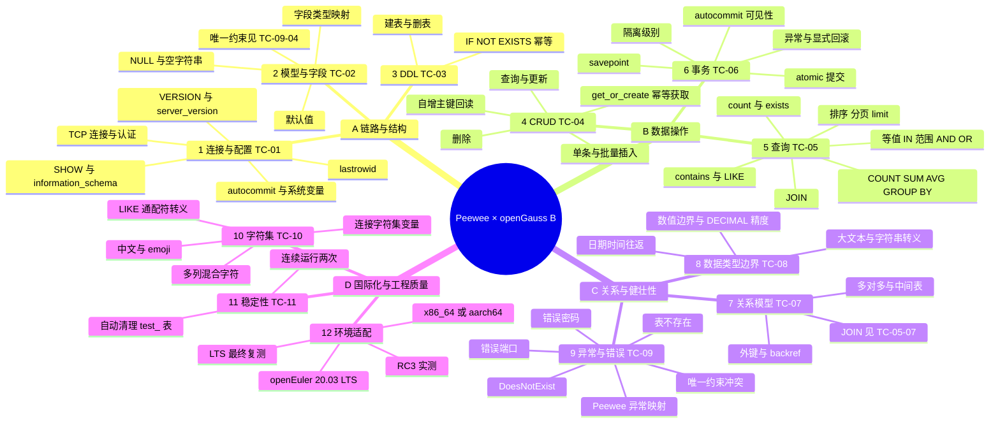

# Peewee × openGauss B 库适配测试思维导图

```mermaid
mindmap
  root((Peewee × openGauss B))
    A 链路与结构
      1 连接与配置 TC-01
        TCP 连接与认证
        VERSION 与 server_version
        lastrowid
        SHOW 与 information_schema
        autocommit 与系统变量
      2 模型与字段 TC-02
        字段类型映射
        默认值
        NULL 与空字符串
        唯一约束见 TC-09-04
      3 DDL TC-03
        建表与删表
        IF NOT EXISTS 幂等
    B 数据操作
      4 CRUD TC-04
        单条与批量插入
        自增主键回读
        查询与更新
        删除
        get_or_create 幂等获取
      5 查询 TC-05
        等值 IN 范围 AND OR
        contains 与 LIKE
        排序 分页 limit
        COUNT SUM AVG GROUP BY
        count 与 exists
        JOIN
      6 事务 TC-06
        atomic 提交
        异常与显式回滚
        savepoint
        autocommit 可见性
        隔离级别
    C 关系与健壮性
      7 关系模型 TC-07
        外键与 backref
        多对多与中间表
        JOIN 见 TC-05-07
      8 数据类型边界 TC-08
        数值边界与 DECIMAL 精度
        日期时间往返
        大文本与字符串转义
      9 异常与错误 TC-09
        错误端口
        错误密码
        表不存在
        唯一约束冲突
        DoesNotExist
        Peewee 异常映射
    D 国际化与工程质量
      10 字符集 TC-10
        中文与 emoji
        LIKE 通配符转义
        多列混合字符
        连接字符集变量
      11 稳定性 TC-11
        连续运行两次
        自动清理 test_ 表
      12 环境适配
        openEuler 20.03 LTS
        x86_64 或 aarch64
        RC3 实测
        LTS 最终复测
```
