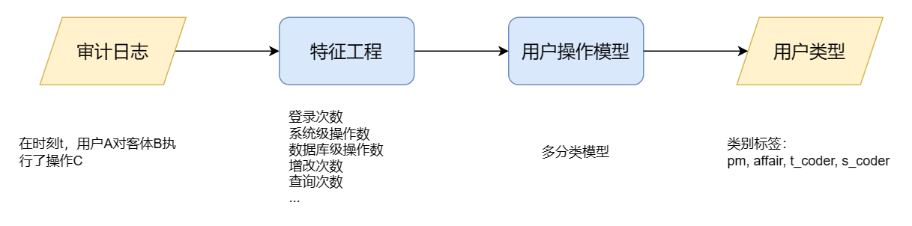

# openGauss用户操作模型
*Tang Wuguo,   tangwg@csu.edu.cn*

本demo使用openGauss中的[AI模块](https://docs.opengauss.org/zh/docs/5.0.0/docs/AIFeatureGuide/%E5%8E%9F%E7%94%9FDB4AI%E5%BC%95%E6%93%8E.html)以及数据库产生的审计日志，对数据库用户的操作进行建模并进行用户画像。

在openGauss中提供了完善的日志系统，其中的审计日志中就记录了用户每次的操作，日志中每一条记录表示: 时间t用户A对客体B进行了操作C。首先对原始的审计日志进行筛选过滤去除噪声记录，然后使用特征工程设计了基于统计学上的特征。最后让AI模型使用前面的特征自动学习数据更深层的特征。最后模型具有识别不同类型用户的能力。




## 1.文件说明🚀
- **code1-SimulateAuditLog**
  由于没有找到公开的openGauss审计日志，所以在这里我使用python脚本模拟了一个教务管理系统场景下的审计日志
  - `\code\1.1_simulateOperation.ipynb`
        模拟了教务管理系统中4种用户(学生端、教师端、教务处、管理员)的操作
  - `\code\1.2_analyzeLog.ipynb`
        对产生的审计日志进行分析其频数分布，包括：操作的主体即用户，操作客体，操作类型，涉及到的数据库
  - `\data` 
    - `xxx.csv`: 包括模拟操作需要的源数据(学生、教师信息、课程表等)
    - `hist_xxx.jpg`: 分析日志保存的分布图
    - `audit_log_202307101107.csv`: 经过模拟操作得到的审计日志
    - `log_01.csv`: 初步筛选后得到的日志
- **code2-UserPortraitModel**
  用户操作建模&用户画像
  - `2.1FeatureEngineering.sql`
        收集&筛选日志，构建特征
  - `2.2UserPortraitModel.sql`
        训练、评估模型, 用户画像, 识别危险用户
- **data**
  - `audit_log.csv`:  审计日志
  - `log_01.csv`：    过滤后的日志
  - `log_train.csv`:  训练集   
  - `log_test.csv`:   测试集
  - `log_test2.csv`:  测试集2, 用来测试识别危险用户
- **doc**
  - `设计文档.md `
  - `审计日志调研.md`
  - `AI模块调研.md`


## 2.如何在自己的数据库上进行用户画像✨
前面所构建的用户操作模型是在模拟的教务管理系统的日志上进行开发的，模型肯定无法适用各种用户场景，但是方式是通用的。所以在这个部分将介绍如何修改SQL脚本来在你的数据库上，适用自己的审计日志构建用户画像。
需要修改的代码都在**code2-UserPortraitModel**目录下，步骤如下：

### 配置审计日志
虽然openGauss中默认打开了审计日志，但是记录日志需要额外的存储所以并不会对所有用户的操作都会记录，所以需要对审计项目进行配置，例如下面的代码打开了对表修改和表查询的审计项：
```
# 检查audit_dml_state配置值
cat /var/lib/opengauss/data/postgresql.conf | grep audit_dml_state

# 修改配置
gs_guc set -D /var/lib/opengauss/data -c "audit_dml_state=1"
gs_guc set -D /var/lib/opengauss/data -c "audit_dml_state_select=1"

# 重启数据库使参数生效
gs_ctl restart -D /var/lib/opengauss/data
```

### 修改FeatureEngineering.sql
**1. 收集日志**
      这里需要筛选出你需要的日志数据，需要修改的地方有日志的起止时间、感兴趣的用户   

**2. 提取特征**
- 代码中统计了用户每天对各种类型的操作次数作为特征，每种操作的统计都存在一个视图中，操作的类型分为：**登录、系统级、数据库级、表级**。

- 对于前面3类的特征应该保留，重点需要修改对**表级别的操作特征提取**，考虑自己的系统中各个**用户的操作特点**来设计表级别的操作特征。

- 例如在教务系统中，对学生端和教师端分别对学生表和教师表查询得多，教师端还还会对成绩表进行增改操作，教务处则是维护学生信息、教师信息。所以我在设计特征的时候，统计了这些表的查询次数、修改次数。因为这些统计信息可以将各类型的用户区别开来。
  
- 最后，在这一步设计的特征可以尽可能的多些，因为在后面训练模型时还可以选择哪些特征要输入到模型中

**3. 汇总特征**
      这个部分将上一步所有的特征视图汇总到一张表中，这个表基本就是我们用来训练模型的数据集了

### 修改UserPortraitModel.sql
**1. 整理数据**
   为了能让数据适用openGauss中需要的模式需要对数据进行一些修改：给每条数据标号、将特征值转换成双精度浮点型

**2. 创建模型**
这个部分用到的是使用logistic_regression作为基础分类器的多分类模型
这里应该修改的有：
- 输入模型的特征，FEATURES关键字
- 模型的[超参数](https://docs.opengauss.org/zh/docs/5.0.0/docs/AIFeatureGuide/%E5%8E%9F%E7%94%9FDB4AI%E5%BC%95%E6%93%8E.html#:~:text=GD%3A-,logistic_regression,-%E3%80%81linear_regression%E3%80%81svm_classification%E3%80%81pca)，WITH关键字部分

**3. 模型预测**
    使用上一步训练好的模型进行预测，注意这里用于预测的特征应该与前面用于训练的特征要一致

**4. 模型评估**
   计算模型分类的准确率作为评估模型的指标，我们如果准确率不高，应该回到第二步构建模型的时候调整参数，或是输入模型的特征数

**5. 模型应用**
- 用户画像
    设置用户画像标签
    设置赋予标签的阈值，例如在代码中设置的是下四分位值作为阈值
- 识别危险用户
    和模型预测这部分类似，需要修改模型接收的特征


