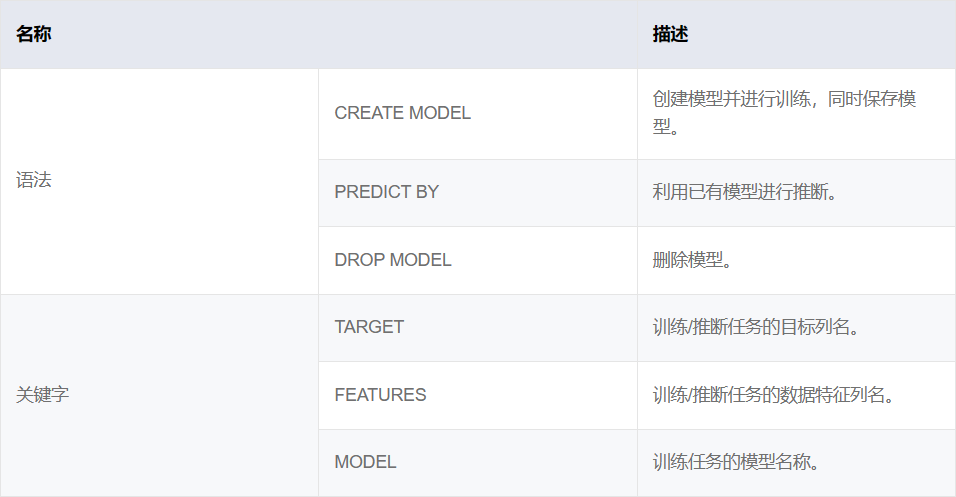
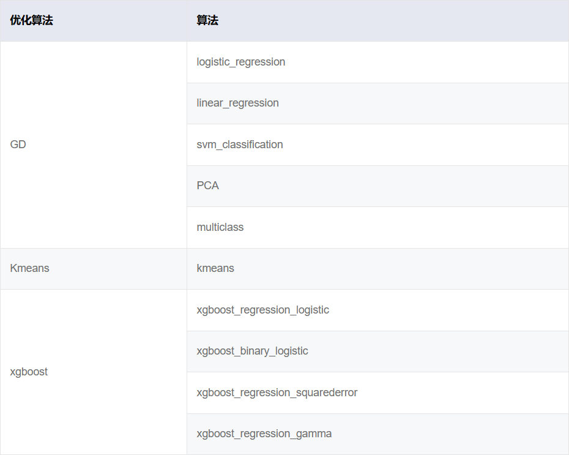
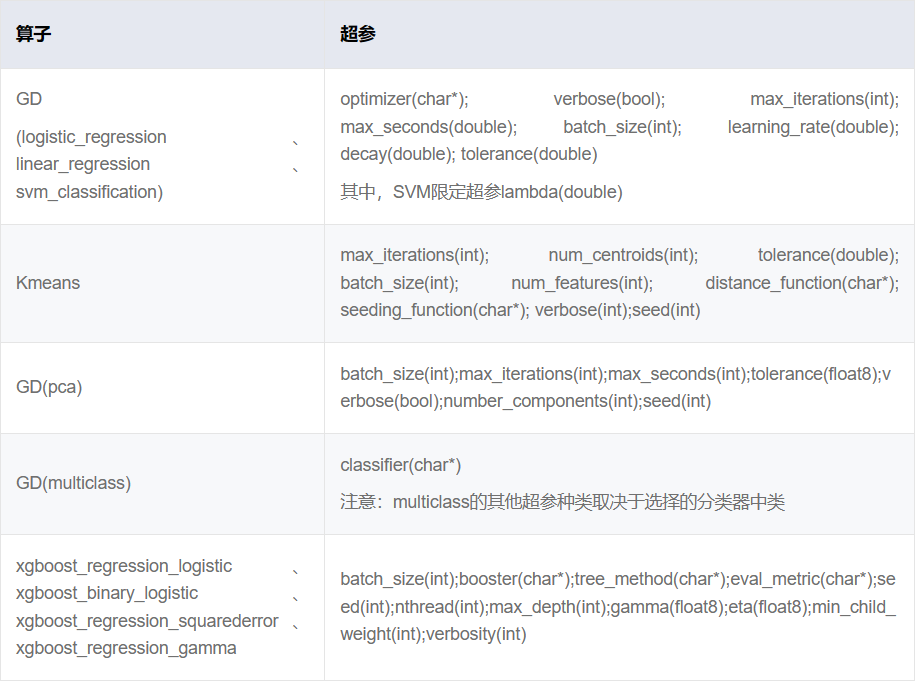
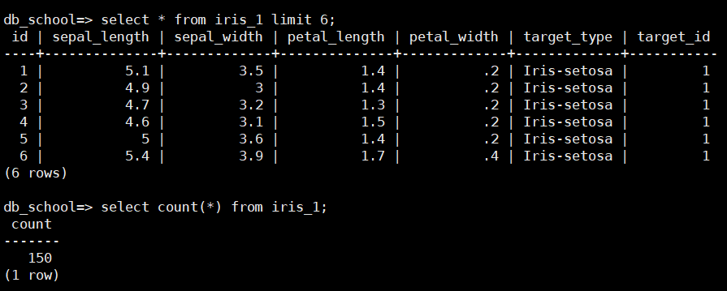
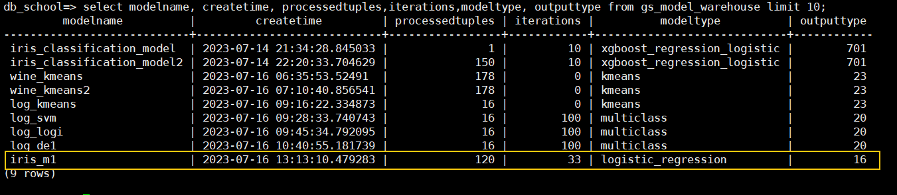
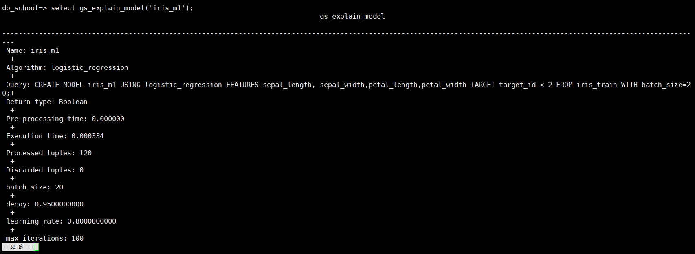
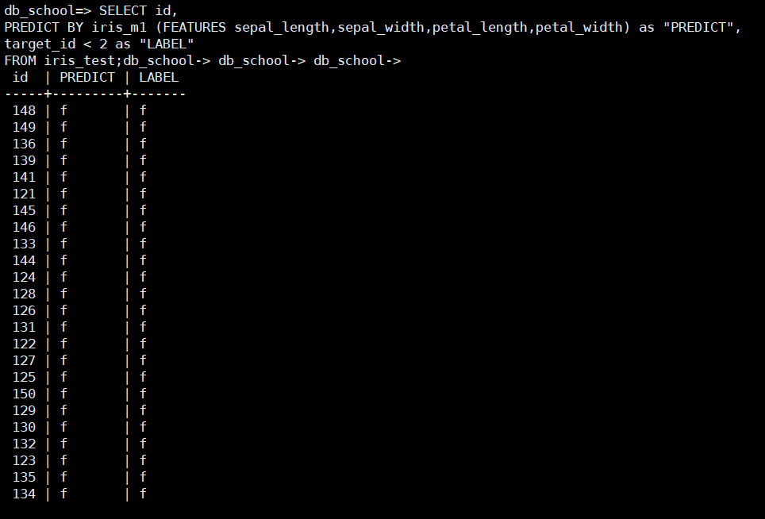
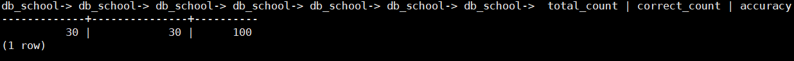
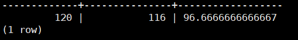
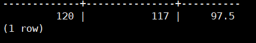

# openGauss中的AI模块调研
*Tang Wuguo,   tangwg@csu.edu.cn*

这篇博客中对openGauss中的[AI模块](https://docs.opengauss.org/zh/docs/5.0.0/docs/AIFeatureGuide/AI%E7%89%B9%E6%80%A7.html)进行介绍，并且以iris鸢尾花数据集为例介绍AI模块的使用.

openGauss将AI与数据库结合，其中的AI特性大致可分为AI4DB和DB4AI两个部分:

- **AI4DB**就是指用人工智能技术优化数据库的性能，从而获得更好地执行表现；也可以通过人工智能的手段实现自治、免运维等。主要包括自调优、自诊断、自安全、自运维、自愈等子领域；
- **DB4AI**就是指打通数据库到人工智能应用的端到端流程，通过数据库来驱动AI任务，统一人工智能技术栈，达到开箱即用、高性能、节约成本等目的。例如通过SQL-like语句实现推荐系统、图像检索、时序预测等功能，充分发挥数据库的高并行、列存储等优势，既可以避免数据和碎片化存储的代价，又可以避免因信息泄漏造成的安全风险；

## DB4AI概要
在我们的用户操作模型的构建中，主要使用DB4AI模块，借助其中的类似SQL语句的形式，直接在openGauss数据库中对数据进行建模、训练及预测。




## 鸢尾花分类模型实践
下面我们已鸢尾花数据集为例，使用openGauss中的DB4AI模块搭建两种模型：二分类模型，多分类模型。同时还利用内置的函数`_gs_explain_model_`查看模型的详细信息，`_PREDICT BY_`关键字来进行模型的推理。
### Iris数据集
iris数据集是ML中最经典的数据集之一，其中共包括150个样本，对于每个样本有花萼长度、花萼宽度、花瓣长度、花瓣宽度4个特征，我们需要依据这4个特征区分3种花型：山鸢尾、变色鸢尾还是维吉尼亚鸢尾。

### 划分数据集
我们对iris数据集随机打乱，选择80%的数据作为训练集，剩下的作为测试集。
训练集用于模型的训练，模型训练好后可以分别在计算训练集和测试集上的准确率。
```sql
CREATE VIEW iris_random AS
SELECT *,
       ROW_NUMBER() OVER () AS row_num,
       COUNT(*) OVER () AS total_rows
FROM iris_1
ORDER BY RANDOM();

CREATE VIEW iris_train AS
SELECT *
FROM iris_random
WHERE row_num <= total_rows * 0.8;

CREATE VIEW iris_test AS
SELECT *
FROM iris_random
WHERE row_num > total_rows * 0.8;

```

### 二分类模型
假定我们现在的目标是要区分是否为山鸢尾，yes or no，这是一个二分类问题，这里我们选择使用逻辑回归算法来解决。

**CREATE MODEL**
```sql
CREATE MODEL iris_m1 USING logistic_regression 
FEATURES sepal_length, sepal_width,petal_length,petal_width 
TARGET target_id < 2 
FROM iris_train 
WITH batch_size=20;
```
执行上面的脚本后正常会输出：`MODEL CREATED. PROCESSED 1`
表示模型构建好了，下面测试模型的预测效果
通过查询`gs_model_warehouse`表可以看到数据库中的所有模型

通过使用`gs_explain_model`函数可以查看指定模型的详细参数：
`select gs_explain_model('iris_m1');`



**PREDICT BY**
```sql
SELECT id, 
PREDICT BY iris_m1 (FEATURES sepal_length,sepal_width,petal_length,petal_width) as "PREDICT", 
target_id < 2 as "LABEL" 
FROM iris_train limit 20;
```
```sql
SELECT id, 
PREDICT BY iris_m1 (FEATURES sepal_length,sepal_width,petal_length,petal_width) as "PREDICT", 
target_id < 2 as "LABEL" 
FROM iris_test;
```


**计算分类准确率**
准备率 = 分类正确的数量 / 样本总数
```sql
SELECT id, 
PREDICT BY iris_m1 (FEATURES sepal_length,sepal_width,petal_length,petal_width) as "PREDICT", 
target_id < 2 as "LABEL" 
INTO temp_pred 
FROM iris_train limit 20;

SELECT
    COUNT(*) AS total_count,
    SUM(CASE WHEN "PREDICT"= "LABEL" THEN 1 ELSE 0 END) AS correct_count,
    CASE
        WHEN COUNT(*) = 0 THEN 0.0
        ELSE (SUM(CASE WHEN "PREDICT" = "LABEL" THEN 1 ELSE 0 END)::FLOAT / COUNT(*)) * 100.0
    END AS accuracy
FROM temp_pred;
```


### 多分类模型
假定现在的任务是给定一个样本要预测是3种花型中的哪一种，这是一个多分类的问题。
```sql
CREATE MODEL iris_m2 USING multiclass 
FEATURES sepal_length, sepal_width,petal_length,petal_width 
TARGET target_id 
FROM iris_train 
WITH classifier="logistic_regression", batch_size=20,max_iterations=300,learning_rate = 1.0;

drop table temp_pred;

SELECT id, 
PREDICT BY iris_m2 (FEATURES sepal_length,sepal_width,petal_length,petal_width) as "PREDICT", 
target_id as "LABEL" 
INTO temp_pred
FROM iris_test;

SELECT
    COUNT(*) AS total_count,
    SUM(CASE WHEN "PREDICT"= "LABEL" THEN 1 ELSE 0 END) AS correct_count,
    CASE
        WHEN COUNT(*) = 0 THEN 0.0
        ELSE (SUM(CASE WHEN "PREDICT" = "LABEL" THEN 1 ELSE 0 END)::FLOAT / COUNT(*)) * 100.0
    END AS accuracy
FROM temp_pred;
```
batch_size=20


经过调节超参数batch_size=4，在训练集上的结果可以提升



## 小结
最后总结下使用openGauss中AI模块的流程

1. 处理数据集
   1. 数据集中的每个样本通常包括多个属性列和标签列，建议添加一个id列用于标识每个样本
   2. 划分数据集，在ML中需要在训练集上训练模型，在测试集上评估
   3. 明确属于是哪种任务类型（分类or回归），才能选择后面相应的算法
2. 创建模型
   1. `CREATE MODEL`关键字创建模型
   2. `DROP MODEL xxx` 删除模型
   3. `SELECT gs_explain_model('xxx')` 查看模型详细信息
   4. `SELECT modelname, createtime, processedtuples,iterations,modeltype, outputtype FROM gs_model_warehouse LIMIT 5;`查看数据库中所有模型
3. 模型推理
   1. 通产推理结果应该包含样本的id, 预测值PREDICT, 标签值LABEL
   2. 使用`PREDICT BY`关键字进行模型的推理，得到PREDICT列
4. 模型评估
   1. 可以通过SQL语句计算ACC准确率（for 分类）、MSE均方误差（for 回归）等指标
   2. 也可以将预测的结果导出到CSV文件使用其他工具来分析，`COPY(...)TO '/path' WITH(FORMAT CSV, HEADER)`
5. 模型调参
   1. 通过观察模型在训练集上的结果，我们可以通过调整不同的超参数来创建不同的模型
   2. 不同的模型有这不同的可调参数，可以参考文档中列出的[这张表](https://docs.opengauss.org/zh/docs/5.0.0/docs/AIFeatureGuide/DB4AI-Query-%E6%A8%A1%E5%9E%8B%E8%AE%AD%E7%BB%83%E5%92%8C%E6%8E%A8%E6%96%AD.html#:~:text=%E8%A1%A8%203-,%E8%B6%85%E5%8F%82%E7%9A%84%E9%BB%98%E8%AE%A4%E5%80%BC%E4%BB%A5%E5%8F%8A%E5%8F%96%E5%80%BC%E8%8C%83%E5%9B%B4,-%E7%AE%97%E5%AD%90)。
   3. 当你觉的效果足够满意了，就将这组参数选定作为最终的模型

*参考资料*
[openGauss Doc-Ai特性](https://docs.opengauss.org/zh/docs/5.0.0/docs/AIFeatureGuide/AI%E7%89%B9%E6%80%A7.html)
[openGauss Doc-原生Db4Ai引擎](https://docs.opengauss.org/zh/docs/5.0.0/docs/AIFeatureGuide/%E5%8E%9F%E7%94%9FDB4AI%E5%BC%95%E6%93%8E.html)