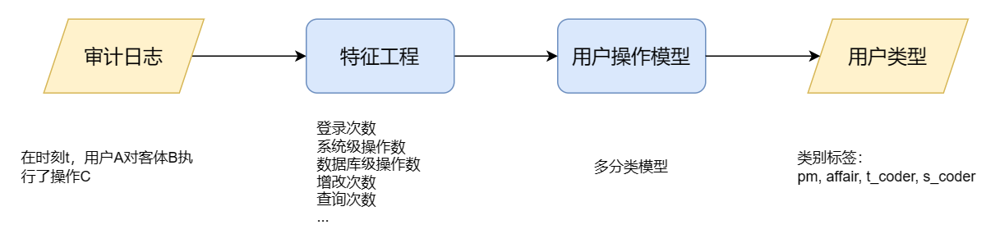

# 设计文档
*Tang Wuguo,   tangwg@csu.edu.cn*

首先我们明确一下将用户的画像问题看作一个多分类任务，确定好模型的输入输出。模型的输入是设计好的用户操作特征，模型输出的是该用户的类型。而要从原始的审计日志到用户特征需要经过特征工程模块；在用户操作模型中选用的是openGauss中定义好的机器学习模型。
整体的流程如下图所示：

1. 首先需要收集指定时间段的审计审计日志
2. 通过分析改日志来筛除一些无效的数据，设计一些用户特征，例如用户的一次操作需要包括主体、客体、操作类型（哪个用户对谁做了什么）等信息；
3. 接着需要处理数据集，例如给类别数据编号，划分数据集；
4. 使用为了评估模型分类的好坏，这里选择准确率作为指标；
5. 根据指标的好坏，我们可以调整模型的超参数，使得模型在训练集上分类得更好；
6. 选定好超参数后模型就可以部署上线，之后数据库中又会产生许多的用户操作日志，我们可以重新收集日志来迭代模型；

## 1.模拟审计日志
由于没有找到公开的审计日志可以使用，于是设计了一个多数据库用户操作的教务管理系统，并使用python脚本模拟各个用户操作数据库，从而得到审计日志。

模拟日志流程：

### 1.1数据库db_school设计
该数据库包括两个模式，教务管理系统中的各种数据存在public模式下；操作日志、操作模型相关的数据都存在pm模式下。

这个教务管理系统中由4个表组成：
教师表（工号，姓名）
学生表（学号，姓名，班级）
课程表（课程号，授课老师工号，课程名，学分）
成绩表（学号，课程号，成绩）

### 1.2多用户设计
opengauss：超级管理员，创建用户pm
- pm：项目架构师；负责设计、创建数据库、表格、视图；创建下面的用户
   - t_coder：老师端，主要对成绩表增、改
   - s_coder：学生端，成绩查询
   - affair：教务处，负责增删学生表、老师表、课程表
  
### 1.3各个用户的权限设计
openGauss支持以下的权限：SELECT、INSERT、UPDATE、DELETE、TRUNCATE、REFERENCES、CREATE、CONNECT、EXECUTE、USAGE、ALTER、DROP、COMMENT、INDEX和VACUUM。不同的权限与不同的对象类型关联，对象所有者的权限是隐式拥有的，即只要拥有对象就可以执行对象所有者的这些隐式权限。

**pm**: sysadmin
**s_coder**: SELECT ON ALL TABLES IN SCHEMA public 
**t_coder**: SELECT ON ALL TABLES IN SCHEMA public, UPDATE ON public.score
**affair**: SELECT ON ALL TABLES IN SCHEMA public, UPDATE ON ALL TABLES IN SCHEMA public

### 1.4模拟用户操作
准备40名学生、5名老师、5门课程信息，使用python脚本模拟5天操作的数据
具体是使用`psycopg2`库创建数据库连接对象，再使用数据库连接对象执行增删改查操作。

## 2.用户操作模型
### 2.1日志中的用户操作类型
通过观察日志可以发现操作主要分为：
- 系统级别的操作，如登录，创建用户，分配权限，设置参数
- 数据库级操作，创建数据库，模式，表
- 表级操作，对表的增删改查

因此，在设计操作特征的时候，也按照这些类别创建了各类操作的视图（所有视图均是统计每天的次数）：

- query_login，用户每天的登录次数
- query_sys，除了登录操作，其他的系统级操作次数
- query_db，数据库级的操作次数
- query_insert_all，所有对表的插入操作
- query_insert_score，所有对score表的插入操作
- query_insert_score，所有对score表的插入操作
- query_sel_info，各类信息表的查询
- query_sel_score，对成绩表的查询

### 2.2模型应用场景
**给某日用户的画像**
首先通过计算训练数据中各个特征的下四分位值a_25作为我们的判定阈值。即有75%的数据是大于这个a_25，a_25排在后25名的位置；同时防止该特征出现的很少例如操作数据库的特征，绝大部分数据都会等于0此时，对于这种情况我们手动设置该阈值为1。

**识别危险用户操作**
根据用户的操作行为，判断其是否行为异常。即该用户的操作特征与其实际用户标签不符。
在测试时故意增加了一条s_coder的异常数据，例如该一条学生客户端端的数据的成绩表修改次数改为正值，但其实学生端是没法对成绩表进行增改的，看模型是否能预测出的异常行为。
