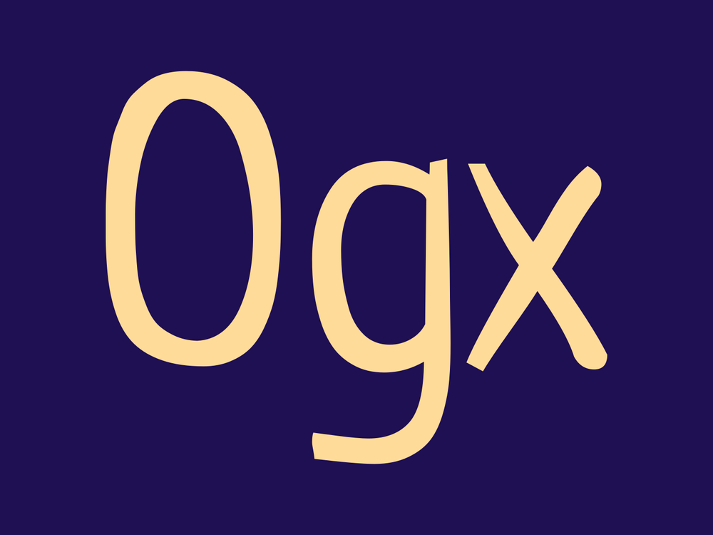

# 简介
Ogx是一个openGauss数据库的GO实现的ORM。使用Ogx编写代码仿佛直接构造、操作SQL语句，相比于其他ORM更加SQL-like。除此之外，Ogx对原有代码较小的破坏性，可以方便的集成到原有项目当中。
# 教程
## Declaring Models 声明模型
### 表到go结构体的映射
对于每个表，需要定义一个相应的 Go struct（即模型）。ogx 将暴露的结构字段映射到表列并忽略未暴露的字段。
```
type User struct {
	ogx.BaseModel `ogx:"table:users,alias:u"`

    ID    int64  `ogx:"id,pk,autoincrement"`
    Name  string `ogx:"name,notnull"`
    email string // unexported fields are ignored
}
```
### struct tags
ogx会使用默认值来生成和限制，但是您可以使用以下tag标记来覆盖默认值。

| TAG | 作用 |
| --- | --- |
| ogx.BaseModel `ogx:"table:table_name" | 覆盖默认表名。 |
| ogx.BaseModel `ogx:"alias:table_alias"` | 覆盖默认表别名。 |
| ogx.BaseModel `ogx:"select:view_name"` | 覆盖 SELECT 查询的表名。 |
| ogx:"-" | 忽略字段。 |
| ogx:"column_name" | 覆盖默认列名。 |
| ogx:"alt:alt_name" | 替代列名。Migrations时使用。 |
| ogx:",pk" | 将列标记为主键并应用notnull选项。支持多个/复合主键。 |
| ogx:",autoincrement" | 标记为自动增量 |
| ogx:"type:uuid" | 覆盖默认 SQL 类型。 |
| ogx:"default:gen_random_uuid()" | 使CreateTable设置DEFAULT表达式。 |
| ogx:",notnull" | 使CreateTable添加NOT NULL约束。 |
| ogx:",unique" | 使CreateTable添加一个唯一的约束。 |
| ogx:",unique:group_name" | 一组列的唯一约束。 |
| ogx:",nullzero" | Marshal Go 零值作为 SQLNULL或DEFAULT（如果支持）。 |
| ogx:",scanonly" | 仅使用该字段扫描查询结果并在 SELECT/INSERT/UPDATE/DELETE 中忽略。 |
| ogx:",array" | 使用 PostgreSQL 数组。 |
| ogx:",json_use_number" | 用json.Decoder.UseNumber解码 JSON。 |
| ogx:",msgpack" | 使用 MessagePack 编码/解码数据。 |
| DeletedAt time.Time `ogx:",soft_delete"` | 在Model上启用软删除 |

### 表名

ogx 通过下划线从结构名称生成表名和别名。ogx会将表名变成复数，例如， struct`ArticleCategory`获取表名`article_categories`和别名`article_category`。
要覆盖生成的名称和别名：
```cpp
type User struct {
	ogx.BaseModel `ogx:"table:myusers,alias:u"`
}
```
要为查询指定不同的表名`SELECT`：
```cpp
type User struct {
	ogx.BaseModel `ogx:"select:users_view,alias:u"`
}
```
#### ModelTableExpr()
使用该`ModelTableExpr()`方法，您可以覆盖结构表名称，但不能覆盖别名。`ModelTableExpr()`应始终使用相同的表别名，例如：
```cpp
type User struct {
	ogx.BaseModel `ogx:"table:myusers,alias:u"`
}

// Good.
db.NewSelect().Model(&User{}).ModelTableExpr("all_users AS u")
db.NewSelect().Model(&User{}).ModelTableExpr("deleted_users AS u")

// Bad.
db.NewSelect().Model(&User{}).ModelTableExpr("all_users AS user")
db.NewSelect().Model(&User{}).ModelTableExpr("deleted_users AS deleted")
```
### 列名
ogx通过下划线从结构字段名称生成列名称。例如， struct fieldUserID获取列名user_id。
要覆盖生成的列名：
```cpp
type User struct {
	Name string `ogx:"myname"`
}
```
### 列类型
Ogx 从结构字段类型生成列类型。例如， Go 类型 `string`被翻译为 SQL 类型`varchar`。
要覆盖生成的列类型：
```cpp
type User struct {
    ID int64 `ogx:"type:integer"`
}
```
### NULLS
要表示 SQL NULL，您可以使用指针或sql.Null*类型：
```cpp
type Item struct {
    Active *bool
    // or
    Active sql.NullBool
}
```
例如：

- `(*bool)(nil)`并`sql.NullBool{}`表示`NULL`。
- `(*bool)(false)`并`sql.NullBool{Valid: true}`表示`FALSE`。
- `(*bool)(true)`并`sql.NullBool{Valid: true, Value: true}`表示`TRUE`。

要将Go 零值编组为`NULL`，请使用`nullzero`标记
```cpp
type User struct {
	Name string `ogx:",nullzero"`
}
```
### DEFAULT
要指定默认 SQL 表达式，请使用`nullzero`、`notnull`和`default`标记的组合：
```cpp
type User struct {
	Name string `ogx:",nullzero,notnull,default:'unknown'"`
}

err := db.NewCreateTable().Model((*User)(nil)).Exec(ctx)
```
```cpp
CREATE TABLE users (
  name text NOT NULL DEFAULT 'unknown'
);
```
### timestamps
使用以下代码自动设置创建和更新时间`INSERT`：
```cpp
type User struct {
	CreatedAt time.Time `ogx:",nullzero,notnull,default:current_timestamp"`
	UpdatedAt time.Time `ogx:",nullzero,notnull,default:current_timestamp"`
}
```
如果您不想设置更新时间，请使用`ogx.NullTime`：
```cpp
type User struct {
	CreatedAt time.Time `ogx:",nullzero,notnull,default:current_timestamp"`
	UpdatedAt ogx.NullTime
}
```
您还可以使用hook来设置结构字段：
```cpp
var _ ogx.BeforeAppendModelHook = (*User)(nil)

func (u *User) BeforeAppendModel(ctx context.Context, query ogx.Query) error {
	switch query.(type) {
	case *ogx.InsertQuery:
		u.CreatedAt = time.Now()
	case *ogx.UpdateQuery:
		u.UpdatedAt = time.Now()
	}
	return nil
}
```
### extend
extend您可以使用标签选项在现有模型中添加/删除字段。新模型将从原始模型继承表名和别名。
```cpp
type UserWithCount struct {
	User `ogx:",extend"`

	Name		string `ogx:"-"` // remove this field
	AvatarCount int				 // add a new field
}
```
### 嵌入结构
ogx 允许使用前缀将模型嵌入到另一个模型中，例如：
```cpp
type Role struct {
	Name     string
	Users    Permissions `ogx:"embed:users_"`
	Profiles Permissions `ogx:"embed:profiles_"`
	Roles    Permissions `ogx:"embed:roles_"`
}

type Permissions struct {
	View   bool
	Create bool
	Update bool
	Delete bool
}
```
上面的代码生成下表：
```cpp
CREATE TABLE roles (
    name TEXT,

    users_view BOOLEAN,
    users_create BOOLEAN,
    users_update BOOLEAN,
    users_delete BOOLEAN,

    profiles_view BOOLEAN,
    profiles_create BOOLEAN,
    profiles_update BOOLEAN,
    profiles_delete BOOLEAN,

    roles_view BOOLEAN,
    roles_create BOOLEAN,
    roles_update BOOLEAN,
    roles_delete BOOLEAN
);
```
## CRUD接口
### 编写查询
#### 查询的设计
建议您首先使用数据库的命令行工具编写查询并测试，然后使用ogx构建对应的查询。
ogx查询语句的特点：

- 将一个长查询按逻辑分成一个一个块
- 使用转义值替换占位符（ogx.Ident和ogx.Safe)

比如下面的查询代码
```go
err := db.NewSelect().
	Model(book).
	ColumnExpr("lower(name)").
	Where("? = ?", ogx.Ident("id"), "some-id").
	Scan(ctx)
```
对应的SQL查询语句
```go
SELECT lower(name)
FROM "books"
WHERE "id" = 'some-id'
```
#### Scan与Exec
组建了一个查询后，需要Exec()执行
```go
result, err := db.NewInsert().Model(&user).Exec(ctx)
```
对于select语句还可以使用Scan()
```go
err := db.NewSelect().Model(&user).Where("id = 1").Scan(ctx)
```
默认情况下Exec()将列扫描到模型中，但您也可以指定不同的目标：
```go
err := db.NewSelect().Model((*User)(nil)).Where("id = 1").Scan(ctx, &user)
```
可以将结果扫描至：

- struct
- map[string]interface{}
- 普通变量
- 由以上几种组成的slices
```go
// Scan into a map.
m := make(map[string]interface{})
err := db.NewSelect().Model(&user).Where("id = 1").Scan(ctx, &m)

// Scan into a slice of maps.
ms := make([]map[string]interface{}, 0)
err := db.NewSelect().Model(&user).Limit(100).Scan(ctx, &ms)

// Scan into a var.
var name string
err := db.NewSelect().Model(&user).Column("name").Where("id = 1").Scan(ctx, &name)

// Scan columns into separate slices.
var ids []int64
var names []string
err := db.NewSelect().Model(&user).Column("id", "name").Limit(100).Scan(ctx, &ids, &names)
```
#### ogx.IDB
igx 提供igx.IDB接口，您可以使用它来接受igx.DB、igx.Tx和igx.Conn：
```go
func InsertUser(ctx context.Context, db igx.IDB, user *User) error {
	_, err := db.NewInsert().Model(user).Exec(ctx)
	return err
}

err := InsertUser(ctx, db, user)

err := db.RunInTx(ctx, nil, func(ctx context.Context, tx ogx.Tx) error {
	return InsertUser(ctx, tx, user)
})
```
#### 扫描行
执行查询语句并并扫描所有行：
```go
rows, err := db.QueryContext(ctx, "SELECT * FROM users")
if err != nil {
    panic(err)
}

err = db.ScanRows(ctx, rows, &users)
```
逐行扫描
```go
rows, err := db.NewSelect().Model((*User)(nil)).Rows(ctx)
if err != nil {
	panic(err)
}
defer rows.Close()

for rows.Next() {
	user := new(User)
	if err := db.ScanRow(ctx, rows, user); err != nil {
		panic(err)
	}
}

if err := rows.Err(); err != nil {
	panic(err)
}
```
#### Scanonly
Scanonly可以使有些字段无法被插入和更新，但是还是可以被扫描。
```go
type Model struct {
    Foo string
-    Bar string `"ogx:"-"`
+    Bar string `"ogx:",scanonly"`
}
```
#### WithDiscardUnknownColumns()
WitchDiscardUnknownColunms()可以丢弃未知的SQL列
```go
db := ogx.NewDB(sqldb, ogdialect.New(), ogx.WithDiscardUnknownColumns())
```
如果要忽略单个列，只需加下划线即可：
```go
err := db.NewSelect().
    ColumnExpr("1 AS _rank"). // ignore the column when scanning
    OrderExpr("_rank DESC").  // but use it for sorting
    Scan(ctx)
```
### SQL placeholders
ogx在查询中识别`?`占位符并用提供的参数替换它们。ogx 引用和转义字符串值并删除空字节。
#### 基本占位符
基本占位符：
```go
// SELECT 'foo', 'bar'
db.ColumnExpr("?, ?", 'foo', 'bar')
```
```go
// SELECT 'foo', 'bar', 'foo'
db.ColumnExpr("?0, ?1, ?0", 'foo', 'bar')
```
#### ogx.Ident
引用SQL标识符（比如列名或者表名）时，使用ogx.Ident:
```go
q.ColumnExpr("? = ?", ogx.Ident("foo"), "bar")
```
```go
"foo" = 'bar' -- openGauss
```
#### ogx.Safe
使用ogx.Safe可以禁用双引号
```go
q.TableExpr("(?) AS foo", ogx.Safe("generate_series(0, 10)"))
```
```go
FROM (generate_series(0, 10)) AS foo
```
#### IN 语句
使用ogx.In生成IN(...)查询
```go
// WHERE foo IN ('hello', 'world')
q.Where("foo IN (?)", ogx.In([]string{"hello", "world"}))
```
对于复合（多个）键，您可以使用嵌套切片：
```go
// WHERE (foo, bar) IN (('hello', 'world'), ('hell', 'yeah'))
q.Where("(foo, bar) IN (?)", ogx.In([][]string{
	{"hello", "world"},
	{"hell", "yeah"},
}))
```
#### 模型占位符
ogx 还支持以下模型占位符：

- `?TableName`- 模型表名称，例如"`users`".
- `?TableAlias`- 模型表别名，例如"`user`".
- `?PKs`- 表主键，例如，"`id`"
- `?TablePKs`- 具有别名的表主键，例如，"`user`"."`id`"
- `?Columns`- 表格列，例如"`id`", "`name`", "`emails`".
- `?TableColumns`- 具有别名的表列，例如"`user`"."`id`", "`user`"."`name`", "`user`"."`emails`"
#### 全局占位符
ogx还支持全局占位符：
```go
// db1 and db2 share the same *sql.DB, but have different named args.
db1 := db.WithNamedArg("SCHEMA", ogx.Ident("foo"))
db2 := db.WithNamedArg("SCHEMA", ogx.Ident("bar"))

// FROM foo.table
db1.NewSelect().TableExpr("?SCHEMA.table")

// FROM bar.table
db2.NewSelect().TableExpr("?SCHEMA.table")
```
### SELECT
#### 常见API
```go
db.NewSelect().
	With("cte_name", subquery).

	Model(&strct).
	Model(&slice).

	Column("col1", "col2"). // quotes column names
	ColumnExpr("col1, col2"). // arbitrary unsafe expression
	ColumnExpr("count(*)").
	ColumnExpr("count(?)", ogx.Ident("id")).
	ColumnExpr("(?) AS alias", subquery).
	ExcludeColumn("col1"). // all columns except col1
	ExcludeColumn("*"). // exclude all columns

	Table("table1", "table2"). // quotes table names
	TableExpr("table1 AS t1"). // arbitrary unsafe expression
	TableExpr("(?) AS alias", subquery).
	ModelTableExpr("table1 AS t1"). // overrides model table name

	Join("JOIN table2 AS t2 ON t2.id = t1.id").
	Join("LEFT JOIN table2 AS t2").JoinOn("t2.id = t1.id").

	WherePK(). // where using primary keys
	Where("id = ?", 123).
	Where("name LIKE ?", "my%").
	Where("? = 123", ogx.Ident("id")).
	Where("id IN (?)", ogx.In([]int64{1, 2, 3})).
	Where("id IN (?)", subquery).
	Where("FALSE").WhereOr("TRUE").
	WhereGroup(" AND ", func(q *ogx.SelectQuery) *ogx.SelectQuery {
		return q.WhereOr("id = 1").
			WhereOr("id = 2")
	}).

	Group("col1", "col2"). // quotes column names
	GroupExpr("lower(col1)"). // arbitrary unsafe expression

	Order("col1 ASC", "col2 DESC"). // quotes column names
	OrderExpr("col1 ASC NULLS FIRST"). // arbitrary unsafe expression

    Having("column_name > ?", 123).

	Limit(100).
	Offset(100).

	For("UPDATE").
	For("SHARE").

	Scan(ctx)
```
#### 示例

1. 定义模型并使用Select方法查询
```go
book := new(Book)
err := db.NewSelect().Model(book).Where("id = ?", 123).Scan(ctx)
```

2. Count

Ogx提供Count方法来构建count(*)查询
```go
count, err := db.NewSelect().Model((*User)(nil)).Count(ctx)
```
因为scan和count都是很常见的操作，ogx提供ScanAndCount函数
```go
var users []User
count, err := db.NewSelect().Model(&users).Limit(20).ScanAndCount(ctx)
if err != nil {
	panic(err)
}
fmt.Println(users, count)
```
#### Exists
可以使用Exists方法来构建Exists表达式
```go
exists, err := db.NewSelect().Model((*User)(nil)).Where("name LIKE '%foo%'").Exists(ctx)
if err != nil {
	panic(err)
}
if !exists {
	fmt.Println("such user does not exist")
}

// SQL
// SELECT EXISTS (SELECT * FROM users WHERE name LIKE '%foo%')
```
#### Joins
使用Join方法可以构建Join表达式
```go
book := new(Book)
err := db.NewSelect().
    Model(book).
    ColumnExpr("book.*").
    ColumnExpr("a.id AS author__id, a.name AS author__name").
    Join("JOIN authors AS a ON a.id = book.author_id").
    OrderExpr("book.id ASC").
    Limit(1).
    Scan(ctx)

// SQL
// SELECT book.*, a.id AS author__id, a.name AS author__name
// FROM books
// JOIN authors AS a ON a.id = book.author_id
// ORDER BY book.id ASC
// LIMIT 1
```
JoinOn方法用于构建复杂Join语句
```go
q = q.
    Join("JOIN authors AS a").
    JoinOn("a.id = book.author_id").
    JoinOn("a.deleted_at IS NULL")

// SQL
// JOIN authors AS a ON a.id = book.author_id AND a.deleted_at IS NULL
```
#### Subqueries
Ogx支持构建子查询
```go
subq := db.NewSelect().Model((*Book)(nil)).Where("author_id = ?", 1)

err := db.NewSelect().Model().TableExpr("(?) AS book", subq).Scan(ctx, &books)

// SQL
// SELECT * FROM (
//  SELECT "book"."id", "book"."title", "book"."text"
//  FROM "books" AS "book" WHERE (author_id = 1)
// ) AS book
```
#### Raw queries
Ogx可以方便的构建原始查询
```go
type User struct {
	ID int64
	Name string
}

users := make([]User, 0)

err := db.NewRawQuery(
	"SELECT id, name FROM ? LIMIT ?",
	ogx.Ident("users"), 100,
).Scan(ctx, &users)

// SQL
// SELECT id, name FROM "users" LIMIT 100
```
### WHERE
#### Basics
Where方法基本用法
```go
q = q.Where("column LIKE 'hello%'")
```
但是这是不安全的，您可以使用placeholders和ogx.Ident来更安全的构建Where语句
```go
q = q.Where("? LIKE ?", ogx.Ident("mycolumn"), "hello%")
```
#### QueryBuilder
Ogx提供QueryBuilder接口来支持构建查询所需要的常见方法
```go
func addWhere(q ogx.QueryBuilder) ogx.QueryBuilder {
    return q.Where("id = ?", 123)
}

qb := db.NewSelect().QueryBuilder()
addWhere(qb)

qb := db.NewUpdate().QueryBuilder()
addWhere(qb)

qb := db.NewDelete().QueryBuilder()
addWhere(qb)

// Alternatively.

db.NewSelect().ApplyQueryBuilder(addWhere)
db.NewUpdate().ApplyQueryBuilder(addWhere)
db.NewDelete().ApplyQueryBuilder(addWhere)
```
#### Where In
可以使用ogx.In来进行Where In查询
```go
q = q.Where("user_id IN (?)", ogx.In([]int64{1, 2, 3}))
```
#### WherePk
WherePk支持自动生成Where语句
```go
users := []User{
    {ID: 1},
    {ID: 2},
    {ID: 3},
}
err := db.NewSelect().Model(&users).WherePK().Scan(ctx)

// SQL
// SELECT * FROM users WHERE id IN (1, 2, 3)
```
WherePk也支持指定列名进行查找
```go
users := []User{
	{Email: "one@my.com"},
	{Email: "two@my.com"},
	{Email: "three@my.com"},
}
err := db.NewSelect().Model(&users).WherePK("email").Scan(ctx)

// SQL
// SELECT * FROM users WHERE email IN ('one@my.com', 'two@my.com', 'three@my.com')
```
#### Grouping
您可以使用WhereOr来实现OR的效果：
```
q = q.Where("id = 1").WhereOr("id = 2").WhereOr("id = 3")
```
可以用括号将条件分组：
```
q = q.
	WhereGroup(" AND ", func(q *ogx.SelectQuery) *ogx.SelectQuery {
		return q.Where("id = 1").WhereOr("id = 2").WhereOr("id = 3")
	}).
	WhereGroup(" AND NOT ", func(q *ogx.SelectQuery) *ogx.SelectQuery {
		return q.Where("active").WhereOr("archived")
	})

// SQL：
// WHERE (id = 1 OR id = 2 OR id = 3) AND NOT (active OR archived)
```
#### 

### CTE and VALUES
#### With
大多数ogx queries 通过With方法支持CTEs：
```
q1 := db.NewSelect()
q2 := db.NewSelect()

q := db.NewInsert().
    With("q1", q1).
    With("q2", q2).
    Table("q1", "q2")
```
使用With方法在两个表之间拷贝数据：
```
src := db.NewSelect().Model((*Comment)(nil))

res, err := db.NewInsert().
    With("src", src).
    Table("comments_backup", "src").
    Exec(ctx)

// SQL：
// WITH src AS (SELECT * FROM comments)
// INSERT INTO comments_backups SELECT * FROM src
```
#### Values
Ogx提供ValuesQuery来帮助构建CTEs
```
values := db.NewValues(&[]*Book{book1, book2})

res, err := db.NewUpdate().
    	With("_data", values).
    	Model((*Book)(nil)).
    	Table("_data").
    	Set("title = _data.title").
    	Set("text = _data.text").
    	Where("book.id = _data.id").
    	Exec(ctx)

// SQL:
// WITH _data (id, title, text) AS (VALUES (1, 'title1', 'text1'), (2, 'title2', 'text2'))
// UPDATE books AS book
// SET title = _data.title, text = _data.text
// FROM _data
// WHERE book.id = _data.id
```
#### WithOrder
您也可以使用WithOrder在值中插入行排名
```
users := []User{
	{ID: 1, "one@my.com"},
	{ID: 2, "two@my.com"}
}

err := db.NewSelect().
    	With("data", db.NewValues(&users).WithOrder()).
    	Model(&users).
    	Where("user.id = data.id").
    	OrderExpr("data._order").
    	Scan(ctx)

// SQL:
// WITH “data” ("id", "email", _order) AS (
//	VALUES
//		(42::BIGINT, 'one@my.com'::VARCHAR, 0),
//  	(43::BIGINT, 'two@my.com'::VARCHAR, 1)
// )
// SELECT "user"."id", "user"."email"
// FROM "users" AS "user"
// WHERE (user.id = data.id)
// ORDER BY data._order
```
### INSERT
#### 常见API
```
db.NewInsert().
    With("cte_name", subquery).

    Model(&strct).
    Model(&slice).
    Model(&map). // only map[string]interface{}

    Column("col1", "col2"). // list of columns to insert
    ExcludeColumn("col1"). // all columns except col1
    ExcludeColumn("*"). // exclude all columns

    Table("table1", "table2"). // quotes table names
    TableExpr("table1 AS t1"). // arbitrary unsafe expression
    TableExpr("(?) AS subq", subquery).
    ModelTableExpr("table1 AS t1"). // overrides model table name

    Value("col1", "expr1", arg1, arg2). // overrides column value

    On("CONFLICT (id) DO UPDATE").
	Set("col1 = EXCLUDED.col1").

    WherePK(). // where using primary keys
    Where("id = ?", 123).
    Where("name LIKE ?", "my%").
    Where("? = 123", ogx.Ident("id")).
    Where("id IN (?)", ogx.In([]int64{1, 2, 3})).
    Where("id IN (?)", subquery).
    Where("FALSE").WhereOr("TRUE").
    WhereGroup(" AND ", func(q *ogx.SelectQuery) *ogx.SelectQuery {
        return q.WhereOr("id = 1").
            WhereOr("id = 2")
    }).

    Returning("*").
    Returning("col1, col2").
    Returning("NULL"). // don't return anything

    Exec(ctx)
```
#### 示例

1. 定义Model并插入数据
```
book := &Book{Title: "hello"}

res, err := db.NewInsert().Model(book).Exec(ctx)
```

2. 使用slice进行批量数据插入
```
books := []Book{book1, book2}
res, err := db.NewInsert().Model(&books).Exec(ctx)
if err != nil {
    panic(err)
}

for _, book := range books {
    fmt.Println(book.ID) // book id is scanned automatically
}
```

3. 插入并且更新数据
```
_, err := db.NewInsert().
	Model(&book).
	On("CONFLICT (id) DO UPDATE").
	Set("title = EXCLUDED.title").
	Exec(ctx)

// SQL
// INSERT INTO "books" ("id", "title") VALUES (100, 'my title')
// ON CONFLICT (id) DO UPDATE SET title = EXCLUDED.title
```

4. 忽略重复
```
_, err := db.NewInsert().
	Model(&book).
	Ignore().
	Exec(ctx)

// SQL
// INSERT INTO `books` (`id`, `title`) VALUES (100, 'my title')
// ON CONFLICT DO NOTHING;
```

5. 使用Map[string]interface{}进行数据插入
```
values := map[string]interface{}{
    "title": "title1",
    "text":  "text1",
}
_, err := db.NewInsert().Model(&values).TableExpr("books").Exec()

// SQL
// INSERT INTO "books" ("title", "text") VALUES ('title1', 'text2')
```

6. Insert...select

从另一个表拷贝数据
```
_, err := db.NewInsert().
    Table("books_backup").
	Table("books").
	Exec(ctx)

// SQL:
// INSERT INTO "books_backup" SELECT * FROM "books"
```
您还可以指定要复制的列
```
_, err := db.NewInsert().
    ColumnExpr("id, name").
    Table("dest").
    Table("src").
    Exec(ctx)

// SQL:
// INSERT INTO "dest" (id, name) SELECT id, name FROM "src"
```
### UPDATE
[@OmariPablo(emotional-da66l)](/emotional-da66l)
#### 常见API
```go
db.NewUpdate().
With("cte_name", subquery).

Model(&strct).
Model(&slice).
Model(&map). // only map[string]interface{}

Column("col1", "col2"). // list of columns to insert
ExcludeColumn("col1"). // all columns except col1
ExcludeColumn("*"). // exclude all columns

Table("table1", "table2"). // quotes table names
TableExpr("table1 AS t1"). // arbitrary unsafe expression
TableExpr("(?) AS alias", subquery).
ModelTableExpr("table1 AS t1"). // overrides model table name

Value("col1", "expr1", arg1, arg2). // overrides column value

// Generates `SET col1 = 'value1'`
Set("col1 = ?", "value1").
SetColumn("col1", "?", "value1").

WherePK(). // where using primary keys
Where("id = ?", 123).
Where("name LIKE ?", "my%").
Where("? = 123", ogx.Ident("id")).
Where("id IN (?)", ogx.In([]int64{1, 2, 3})).
Where("id IN (?)", subquery).
Where("FALSE").WhereOr("TRUE").
WhereGroup(" AND ", func(q *ogx.SelectQuery) *ogx.SelectQuery {
        return q.WhereOr("id = 1").
        WhereOr("id = 2")
    }).

Returning("*").
Returning("col1, col2").
Returning("NULL"). // don't return anything

Exec(ctx)
```
#### 示例
更新一行：通过定义model和使用UpdateQuery实现
```go
book := &Book{ID: 123, Title: "hello"}

res, err := db.NewUpdate().Model(book).WherePK().Exec(ctx)
```
更新一列：
```go
book.Title = "hello"

res, err := db.NewUpdate().
	Model(book).
	Column("title").
	Where("id = ?", 123).
	Exec(ctx)
```
```go
UPDATE books SET title = 'my title' WHERE id = 1
```
或者：
```go
res, err := db.NewUpdate().
    Model(book).
    Set("title = ?", "hello").
    Where("id = ?", 123).
    Exec(ctx)
```
#### 批量更新
可以通过通用表表达式（CTE)进行批量更新
```go
values := db.NewValues(&[]*Book{book1, book2})

res, err := db.NewUpdate().
	With("_data", values).
	Model((*Book)(nil)).
	TableExpr("_data").
	Set("title = _data.title").
	Set("text = _data.text").
	Where("book.id = _data.id").
	Exec(ctx)
```
```go
WITH _data (id, title, text) AS (
  VALUES
    (1, 'title1', 'text1'),
    (2, 'title2', 'text2')
)
UPDATE books AS book
SET title = _data.title, text = _data.text
FROM _data
WHERE book.id = _data.id
```
或者可以使用`Bulk()`创建CTE
```go
res, err := db.NewUpdate().
	Model(&books).
	Column("title", "text").
	Bulk().
	Exec(ctx)
```
#### 通过map更新
使用`map[string]interface{}`:
```go
value := map[string]interface{}{
	"title": "title1",
	"text":	 "text1",
}
res, err := db.NewUpdate().
	Model(&value).
	TableExpr("books").
	Where("id = ?", 1).
	Exec(ctx)
```
```go
UPDATE books
SET title = 'title1', text = 'text2'
WHERE id = 1
```
#### OmitZero()
ogx可以使用`OmitZero()`方法来忽略空值的字段，比如下面的例子就因为`email`字段是空值而没有更新。
```go
type User struct {
	ID	  int64
	Name  string
	Email string
}

res, err := db.NewUpdate().
	Model(&User{ID: 1, Name: "John Doe"}).
	OmitZero().
	WherePK().
	Exec(ctx)
```
```go
UPDATE users
SET name = "John Doe"
WHERE id = 1
```
### DELETE
[@OmariPablo(emotional-da66l)](/emotional-da66l)
#### 常见API
```go
db.NewDelete().
    With("cte_name", subquery).

    Model(&strct).
    Model(&slice).

    Table("table1", "table2"). // quotes table names
    TableExpr("table1 AS t1"). // arbitrary unsafe expression
    TableExpr("(?) AS alias", subquery).
    ModelTableExpr("table1 AS t1"). // overrides model table name

    WherePK(). // where using primary keys
    Where("id = ?", 123).
    Where("name LIKE ?", "my%").
    Where("? = 123", ogx.Ident("id")).
    Where("id IN (?)", ogx.In([]int64{1, 2, 3})).
    Where("id IN (?)", subquery).
    Where("FALSE").WhereOr("TRUE").
    WhereGroup(" AND ", func(q *ogx.SelectQuery) *ogx.SelectQuery {
        return q.WhereOr("id = 1").
            WhereOr("id = 2")
    }).

    Returning("*").
    Returning("col1, col2").
    Returning("NULL"). // don't return anything

    Exec(ctx)
```
#### 示例
需要先定义一个model然后使用delete语句：
```go
res, err := db.NewDelete().Where("id = ?", 123).Exec(ctx)
```
#### 批量删除
通过主键批量删除：
```go
books := []*Book{book1, book2} // slice of books with ids
res, err := db.NewDelete().Model(&books).WherePK().Exec(ctx)
```
```go
DELETE FROM "books" WHERE id IN (1, 2)
```
#### USING
使用别的表删除行：
```go
res, err := db.NewDelete().
    Model((*Book)(nil)).
    TableExpr("archived_books AS src").
    Where("book.id = src.id").
    Exec(ctx)
```
```go
DELETE FROM "books" AS book
USING archived_books AS src
WHERE book.id = src.id
```

### Truncate Table
#### 常见API
```
db.NewTruncateTable().

	Model(&strct).

	Table("table1"). // quotes table names
	TableExpr("table1"). // arbitrary unsafe expression
	ModelTableExpr("table1"). // overrides model table name

	ContinueIdentity().
	Cascade().
	Restrict().

	Exec(ctx)
```
#### 示例
```
_, err := db.NewTruncateTable().Model((*Book)(nil)).Exec(ctx)
if err != nil {
	panic(err)
}
```
### Create Table
#### 常见API
```go
db.NewCreateTable().

	Model(&strct).

	Table("table1"). // quotes table names
	TableExpr("table1"). // arbitrary unsafe expression
	ModelTableExpr("table1"). // overrides model table name

	Temp().
	IfNotExists().
	Varchar(100). // turns VARCHAR into VARCHAR(100)

	WithForeignKeys().
	ForeignKey(`(fkey) REFERENCES table1 (pkey) ON DELETE CASCADE`).
	PartitionBy("HASH (id)").
	TableSpace("fasttablespace").

	Exec(ctx)
```
#### 示例

1. 创建table
```go
_, err := db.NewCreateTable().
	Model((*Book)(nil)).
	ForeignKey(`("author_id") REFERENCES "users" ("id") ON DELETE CASCADE`).
	Exec(ctx)
if err != nil {
	panic(err)
}
```

2. 重置table
```go
err := db.ResetModel(ctx, (*Model1)(nil), (*Model2)(nil))

// SQL:
// DROP TABLE IF EXISTS model1 CASCADE;
// CREATE TABLE model1 (...);
// DROP TABLE IF EXISTS model2 CASCADE;
// CREATE TABLE model2 (...);
```
#### Hooks

1. ogx.BeforeCreateTableHook
```go
var _ ogx.BeforeCreateTableHook = (*Book)(nil)

func (*Book) BeforeCreateTable(ctx context.Context, query *ogx.CreateTableQuery) error {
	query.ForeignKey(`("author_id") REFERENCES "users" ("id") ON DELETE CASCADE`)
	return nil
}

if _, err := db.NewCreateTable().Model((*Book)(nil)).Exec(ctx); err != nil {
	panic(err)
}
```

2. ogx.AfterCreateTableHook
```go
var _ ogx.AfterCreateTableHook = (*Book)(nil)

func (*Book) AfterCreateTable(ctx context.Context, query *ogx.CreateTableQuery) error {
	_, err := query.DB().NewCreateIndex().
		Model((*Book)(nil)).
		Index("category_id_idx").
		Column("category_id").
		Exec(ctx)
	return err
}
```
### Drop Table
#### API
常用的删除表API：
```go
db.NewDropTable().

	Model(&strct).

	Table("table1"). // quotes table names
	TableExpr("table1"). // arbitrary unsafe expression
	ModelTableExpr("table1"). // overrides model table name

	IfExists().

	Cascade().
	Restrict().

	Exec(ctx)
```
#### 示例
删除openGauss表：
```go
_, err := db.NewDropTable().Model((*Book)(nil)).IfExists().Exec(ctx)
if err != nil {
	panic(err)
}
```

## Relations 关联
ogx支持以下四种关系：has-one、belongs-to、has-many、polymorphic-has-many、many-to-many。
### has-one
has one与另一个模型建立一对一的关联，这种关联表示一个模型的每个实例都包含另一个模型的一个实例。例如，`User`模型和`Profile`模型，`User`模型 has one `Profile`模型。为了在模型之上定义has-one关系，需要将`ogx:"rel:has-one"` tag 添加到模型域上：
```go
// Profile belongs to User.
type Profile struct {
	ID     int64 `ogx:",pk"`
	Lang   string
	UserID int64
}

type User struct {
	ID      int64 `ogx:",pk"`
	Name    string
	Profile *Profile `ogx:"rel:has-one,join:id=user_id"`
}
```
您也可以指定join多个列，例如：`join:id=user_id,join:vendor_id=vendor_id.`
### belongs-to
为了在模型之上定义belongs-to关系，需要将`ogx:"rel:belongs-to"` tag 添加到模型域上：
```go
type Profile struct {
	ID   int64 `ogx:",pk"`
	Lang string
}

// User has one profile.
type User struct {
	ID        int64 `ogx:",pk"`
	Name      string
	ProfileID int64
	Profile   *Profile `ogx:"rel:belongs-to,join:profile_id=id"`
}
```
### has-many
通过在模型域上添加`ogx:"rel:has-many"` tag，可以实现has-many关系：
```go
type Profile struct {
	ID     int64 `ogx:",pk"`
	Lang   string
	Active bool
	UserID int64
}

// User has many profiles.
type User struct {
	ID       int64 `ogx:",pk"`
	Name     string
	Profiles []*Profile `ogx:"rel:has-many,join:id=user_id"`
}
```
### many-to-many
为了定义many-to-many关系，您需要添加`ogx:"m2m:order_to_items"`到模型域。您还需要在中间模型上定义两个has-one关系并且使用`db.RegisterModel`手动注册模型。
下面这个例子，Order模型和Item模型是has-many关系，我们使用`OrderToItem`模型作为中间模型联接`Order`模型和`Items`模型。
```go
func init() {
    // Register many to many model so ogx can better recognize m2m relation.
    // This should be done before you use the model for the first time.
    db.RegisterModel((*OrderToItem)(nil))
}

type Order struct {
	ID    int64  `ogx:",pk"`
    // Order and Item in join:Order=Item are fields in OrderToItem model
	Items []Item `ogx:"m2m:order_to_items,join:Order=Item"`
}

type Item struct {
	ID int64 `ogx:",pk"`
}

type OrderToItem struct {
	OrderID int64  `ogx:",pk"`
	Order   *Order `ogx:"rel:belongs-to,join:order_id=id"`
	ItemID  int64  `ogx:",pk"`
	Item    *Item  `ogx:"rel:belongs-to,join:item_id=id"`
}
```
## Migrations 迁移
您可以编写Migrations以更改数据库schema或者数据。Migrations可以是常规的 Go 函数或 SQL 命令组文件。
#### Migrations names
每次Migration放入一个独立的文件，迁移文件名由唯一的迁移名称和注释组合成。eg：`20210707110026_add_foo_column.go`
#### Migrations 状态
ogx将完成的Migrations names存储在ogx_migrations表中，以决定运行哪些迁移。ogx还使用该信息来回滚。
当迁移失败时，ogx仍会将迁移标记为已实施，以便您可以回滚部分应用的迁移并尝试再次运行迁移。
#### 组迁移
当有多个Migrations要运行时，ogx将这些migrations作为一个group一起运行。在回滚期间，ogx会还原最后一个迁移组（而不是单个迁移）。
要回滚单个迁移，您需要回滚最后一个组，删除要跳过的迁移，然后再次运行迁移。或者，您可以进行有所需要的更改的新迁移。
#### Go-based Migrations
Go-based Migrations使用常规 Go 函数来进行迁移。每个这类函数都必须在`main.go`文件创建的Migrations集合中注册：
```go
var Migrations = migrate.NewMigrations()

func init() {
	if err := Migrations.DiscoverCaller(); err != nil {
		panic(err)
	}
}
```
然后，在一个单独的文件中，您应该使用`MustRegister`方法来定义和注册Migrations，例如，在`20220707110026_test_migration.go`：
```go
func init() {
	Migrations.MustRegister(func(ctx context.Context, db *ogx.DB) error {
		fmt.Print(" [up migration] ")
		return nil
	}, func(ctx context.Context, db *ogx.DB) error {
		fmt.Print(" [down migration] ")
		return nil
	})
}
```
#### SQL-based Migrations
SQL-based Migrations使用一个以.up.sql为文件名结尾的包含SQL命令的文件进行Miragtion。您可以使用`--migration:splitline `作为分隔符来创建包含多个语句的迁移。
```go
SELECT 1

--migration:split

SELECT 2
```
您可以使用`Discover()`方法注册此类迁移：
```go
var sqlMigrations embed.FS

func init() {
	if err := Migrations.Discover(sqlMigrations); err != nil {
		panic(err)
	}
}
```
要创建事务迁移，请使用.tx.up.sql作为文件名后缀。
## Fixtures 数据库初始化
您可以使用fixtures将初始数据加载到数据库中以进行测试或演示。您可以以 YAML 格式编写fixtures，并根据需要从测试或者Migrations中加载它们。
### 创建Fixtures
Fixtures是一个够使用text/template表达式来生成值的 YAML 文件。ogx通过yaml.v3将YAML数据解析到Go models中然后将改models保存进数据库中。
### 加载Fixtures
假设Fixture储存在testdata/fixture.yml,您可以通过以下代码来加载：
```
//在db注册该Model
db.RegisterModel((*User)(nil), (*Org)(nil))

fixture := dbfixture.New(db)
err := fixture.Load(ctx, os.DirFS("testdata"), "fixture.yml")
```
#### fixture.WithRecreateTables()
使用WithRecreateTables()函数，您可以删除现存的表然后替换为一个新表。
```
fixture := dbfixture.New(db, dbfixture.WithRecreateTables())
```
#### dbfixture.WithTemplateFuncs()
您还可以在Fixture中注册和使用自定义模板函数
```
funcMap := template.FuncMap{
	"now": func() string {
		return time.Now().Format(time.RFC3339Nano)
	},
}

fixture := dbfixture.New(db, dbfixture.WithTemplateFuncs(funcMap))
```
### 检索Fixtures数据
您可以使用Row和MustRow方法检索已经加载过的模型。
```
fmt.Println("Smith", fixture.MustRow("User.smith").(*User))
```
### 字段名称
ogx使用 SQL 列名查找匹配的 struct 字段，然后调用yaml.v3来解析数据。因此，当解析到结构字段时，您可能需要使用yaml tag来覆盖默认的 YAML 字段名称。
```
type User struct {
    ID     int64      `ogx:",pk,autoincrement"`
    Params UserParams `ogx:"type:jsonb"`
}

type UserParams struct {
    Param1 string `yaml:"param1"`
    Param2 string `yaml:"param2"`
}
```
## Transactions 事务
`ogx.Tx`是`sql.Tx`的轻量wrapper，除了sql.Tx的常用接口，ogx.Tx还提供了query hooks和构建query的builder。
```go
// 开始一个事务
tx, err := db.BeginTx(ctx, &sql.TxOptions{})

// 提交/回滚一个事务
err := tx.Commit()
err := tx.Rollback()
```
### 在事务中执行查询
和`ogx.DB`一样，您可以在`ogx.Tx`执行查询
```go
res, err := tx.NewInsert().Model(&models).Exec(ctx)

res, err := tx.NewUpdate().Model(&models).Column("col1", "col2").Exec(ctx)

err := tx.NewSelect().Model(&models).Limit(100).Scan(ctx)
```
### 使用`RunInTx`在事务中运行函数
Ogx提供RunIntx函数来帮助在事务中运行特定函数。如果函数返回错误，则事务将回滚；否则，事务已经被提交。
```go
err := db.RunInTx(ctx, &sql.TxOptions{}, func(ctx context.Context, tx ogx.Tx) error {
    _, err := tx.Exec(...)
    return err
})
```
## Hooks 钩子
Hook是用户创建的，在指定操作之前、之后调用的函数。例如，您可以编写在每个query处理前执行的函数。在编写Hook时，常用compile time check技巧确保
您的函数实现了Hook接口。Ogx中的Hook可以分为Model Hook、Model query hooks、Query Hook三种。
### Model hooks
#### BeforeAppendModel
当需要在插入或者更新前进行某种操作时，可以使用该Hook
##### 示例
```go
type Model struct {
    ID        int64
    CreatedAt time.Time
    UpdatedAt time.Time
}

var _ ogx.BeforeAppendModelHook = (*Model)(nil)

func (m *Model) BeforeAppendModel(ctx context.Context, query ogx.Query) error {
	switch query.(type) {
	case *ogx.InsertQuery:
		m.CreatedAt = time.Now()
	case *ogx.UpdateQuery:
		m.UpdatedAt = time.Now()
	}
	return nil
}
```
#### Before/AfterScanRow
该Hook在scan row value之前或者之后被调用
```go
type UserModel struct{}

var _ ogx.BeforeScanRowHook = (*UserModel)(nil)
func (m *Model) BeforeScanRow(ctx context.Context) error { return nil }

var _ ogx.AfterScanRowHook = (*UserModel)(nil)
func (m *Model) AfterScanRow(ctx context.Context) error { return nil }
```
### Model query hooks
该Hook定义在Model之上，每次Model在执行特定操作前后会调用该Hook。Ogx支持的Model query hook：
```go
type UserModel struct{}																			// user model

var _ ogx.BeforeSelectHook = (*UserModel)(nil)													// compile time checks
func (*Model) BeforeSelect(ctx context.Context, query *ogx.SelectQuery) error { return nil }
var _ ogx.AfterSelectHook = (*UserModel)(nil)
func (*Model) AfterSelect(ctx context.Context, query *ogx.SelectQuery) error { return nil }

var _ ogx.BeforeInsertHook = (*UserModel)(nil)
func (*Model) BeforeInsert(ctx context.Context, query *ogx.InsertQuery) error { nil }
var _ ogx.AfterInsertHook = (*UserModel)(nil)
func (*Model) AfterInsert(ctx context.Context, query *ogx.InsertQuery) error { return nil }

var _ ogx.BeforeUpdateHook = (*UserModel)(nil)
func (*Model) BeforeUpdate(ctx context.Context, query *ogx.UpdateQuery) error { return nil }
var _ ogx.AfterUpdateHook = (*UserModel)(nil)
func (*Model) AfterUpdate(ctx context.Context, query *ogx.UpdateQuery) error { return nil }

var _ ogx.BeforeDeleteHook = (*UserModel)(nil)
func (*Model) BeforeDelete(ctx context.Context, query *ogx.DeleteQuery) error { return nil }
var _ ogx.AfterDeleteHook = (*UserModel)(nil)
func (*Model) AfterDelete(ctx context.Context, query *ogx.DeleteQuery) error { return nil }

var _ ogx.BeforeCreateTableHook = (*UserModel)(nil)
func (*Model) BeforeCreateTable(ctx context.Context, query *CreateTableQuery) error { return nil }
var _ ogx.AfterCreateTableHook = (*UserModel)(nil)
func (*Model) AfterCreateTable(ctx context.Context, query *CreateTableQuery) error { return nil }

var _ ogx.BeforeDropTableHook = (*UserModel)(nil)
func (*Model) BeforeDropTable(ctx context.Context, query *DropTableQuery) error { return nil }
var _ ogx.AfterDropTableHook = (*UserModel)(nil)
func (*Model) AfterDropTable(ctx context.Context, query *DropTableQuery) error { return nil }
```
### Query Hooks
OGX支持在执行查询之前和之后调用的Query Hook。OGX内部使用Query Hook实现Logging Query的功能。
实现自定义QueryHook需要实现QueryHook接口
```go
BeforeQuery(context.Context, *QueryEvent) context.Context
AfterQuery(context.Context, *QueryEvent)
```
#### 示例
```go
type MyQueryHook struct{}

func (h *MyQueryHook) BeforeQuery(ctx context.Context, event *ogx.QueryEvent) context.Context {
	return ctx
}

func (h *MyQueryHook) AfterQuery(ctx context.Context, event *ogx.QueryEvent) {
	fmt.Println(time.Since(event.StartTime), string(event.Query))
}

db.AddQueryHook(&MyQueryHook{})
```
## ogx软删除
#### 软删除
软删除可以将某一行标记为已删除，而无需从数据库中实际删除它们。您可以通过使用辅助标志列并修改查询来检查是否有软删除标志来实现软删除。
例如，使用`deleted_at timestamptz`列作为软删除某一行的标志。
```cpp
UPDATE users SET deleted_at = now() WHERE id = 1
```
要选择未删除的（实时）行：
```cpp
SELECT * FROM users WHERE deleted_at IS NULL
```
#### 使用ogx模型
ogx 通过使用`time.Timecolumn` 作为行是否被删除的标识来支持软删除。ogx 自动调整查询以检查标志。
要在模型上启用软删除，请添加`DeletedAt`带有`soft_delete`标签的字段：
```cpp
type User struct {
	ID int64
	CreatedAt time.Time `ogx:",nullzero,notnull,default:current_timestamp"`
	DeletedAt time.Time `ogx:",soft_delete,nullzero"`
}
```
对于此类模型，ogx只会更新行而不是删除：
```cpp
_, err := db.NewDelete().Model(user).Where("id = ?", 123).Exec(ctx)
```
```cpp
UPDATE users SET deleted_at = current_timestamp WHERE id = 123
```
``ogx 还会自动从查询结果中排除软删除的行：
```cpp
err := db.NewSelect().Model(&users).Scan(ctx)
```
```cpp
SELECT * FROM users WHERE deleted_at IS NULL
```
要选择软删除的行
```cpp
err := db.NewSelect().Model(&users).WhereDeleted().Scan(ctx)
```
```cpp
SELECT * FROM users WHERE deleted_at IS NOT NULL
```
要选择包括软删除行在内的所有行：
```cpp
err := db.NewSelect().Model(&users).WhereAllWithDeleted().Scan(ctx)
```
```cpp
SELECT * FROM users
```
最后，要从数据库中实际删除软删除的行：
```cpp
db.NewDelete().Model(user).Where("id = ?", 123).ForceDelete().Exec(ctx)
```
```cpp
DELETE FROM users WHERE id = 123 AND deleted_at IS NOT NULL
```
#### 使用表的视图
您还可以使用表视图实现软删除。给定下表架构
```cpp
CREATE TABLE all_users (
  id int8 PRIMARY KEY GENERATED BY DEFAULT AS IDENTITY,
  name varchar(500),

  created_at timestamptz NOT NULL DEFAULT now(),
  deleted_at timestamptz
);
```
您可以创建忽略已删除用户的视图：
```cpp
CREATE VIEW users AS
SELECT * FROM all_users
WHERE deleted_at IS NULL
```
openGauss视图支持插入和删除，因此您可以在模型中使用它们：
```cpp
type User struct {
	ogx.BaseModel `ogx:"users"`

	ID   uint64
	Name string
}
```
要查询已删除的行，请使用`ModelTableExpr()`更改表：
```cpp
var deletedUsers []User
err := db.NewSelect().
	Model(&deletedUsers).
	ModelTableExpr("all_users").
	Where("deleted_at IS NOT NULL").
	Scan(ctx)
```
#### Unique indexs
使用具有唯一索引的软删除可能会导致插入查询发生冲突，因为软删除的行与普通行一样包含在唯一索引中。
使用某些 DBMS，您可以从索引中排除软删除的行：
```cpp
CREATE UNIQUE INDEX index_name ON table (column1) WHERE deleted_at IS NULL;
```
或者，您可以`deleted_at`使用函数将列包含到索引列`coalesce`以转换`NULL`时间，因为`NULL`它不等于包括自身在内的任何其他值：
```cpp
CREATE UNIQUE INDEX index_name ON table (column1, coalesce(deleted_at, '1970-01-01 00:00:00'))
```
如果您的 DBMS 不允许在索引列中使用表达式，您可以通过删除 `nullzero` 选项为ogx 配置零时间1970-01-01 00:00:00+00:00：
```cpp
type User struct {
	ID int64
	CreatedAt time.Time `ogx:",nullzero,notnull,default:current_timestamp"`
-	 DeletedAt time.Time `ogx:",soft_delete,nullzero"`
+	 DeletedAt time.Time `ogx:",soft_delete"`
}
```
## Debugger
为了方便查看执行的SQL命令，可以使用ogxdebug包来打印这些命令到stdout。
首先，需要安装ogxdebug包
```go
go get gitee.com/chentanyang/ogx/extra/ogxdebug
```
然后添加query hook，默认情况下ogx只会打印失败的queries
```go
import "gitee.com/chentanyang/ogx/extra/ogxdebug"

db := ogx.NewDB(sqldb, dialect)
db.AddQueryHook(ogxdebug.NewQueryHook())
```
ogxdebug.NewQueryHook可以通过传入参数进行配置，目前全部的可配置项如下：
```go
	db.AddQueryHook(ogxdebug.NewQueryHook(
        ogxdebug.WithEnabled(true),		
		ogxdebug.WithVerbose(true),		
        ogxdebug.WithWriter(),			 
		ogxdebug.FromEnv("ogxDEBUG"), 
	))
```
ogxdebug.WithEnabled(on bool)函数决定是否启动该hook
ogxdebug.WithVerbose(on bool)函数决定是否打印所有queries
ogxdebug.WithWriter(w io.Writer)函数设置debug打印日志的输出
ogxdebug.FromEnv("OGXDEBUG")函数通过环境变量来设置hook，

- OGXDEBUG=0 表示关闭此hook
- OGXDEBUG=1 表示打开此hook
- OGXDEBUG=2 表示打开hook，并且打开verbose，打印每条query

还可以默认情况下禁用钩子，并使用环境变量在需要时启用它：
```go
ogxdebug.NewQueryHook(
    // disable the hook
    ogxdebug.WithEnabled(false),

    // OGXDEBUG=1 logs failed queries
    // OGXDEBUG=2 logs all queries
    ogxdebug.FromEnv("OGXDEBUG"),
)
```
### 示例
```go
func main() {
	ctx := context.Background()

	connStr := "host=192.168.20.40 port=26000 user=test password=Gauss@123 dbname=test sslmode=disable"
	opengaussdb, err := sql.Open("opengauss", connStr)
	if err != nil {
		panic(err)
	}

	db := ogx.NewDB(opengaussdb, ogdialect.New())
	db.AddQueryHook(ogxdebug.NewQueryHook(ogxdebug.WithVerbose(true)))

	if _, err := db.NewCreateTable().Model((*Book)(nil)).Exec(ctx); err != nil {
		panic(err)
	}
	defer func() {
		_ = dropSchema(ctx, db, (*Book)(nil))
	}()
}

// Output:
// [ogx]  11:26:30.389   CREATE TABLE        329.644ms  CREATE TABLE "books" ("id" BIGSERIAL NOT NULL, "name" VARCHAR, "category_id" BIGINT, PRIMARY KEY ("id"))
// [ogx]  11:26:30.456   CREATE INDEX         66.762ms  CREATE INDEX "category_id_idx" ON "books" ("category_id")
// [ogx]  11:26:30.507   DROP TABLE           50.403ms  DROP TABLE IF EXISTS "books" CASCADE
```
## Custom Types 自定义数据类型
Ogx使用database/sql接口访问openGauss，所以可以通过实现sql.Scanner和driver.Valuer实现用户自定义类型的支持。
### 示例
sql.Scanner的值可以为下列类型：

- int64
- float64
- bool
- []byte
- string
- time.Time
- nil - for NULL values

以自定义Time结构体为例子：
```go
type Time struct {
	time.Time
}
```
为Time实现sql.Scanner接口：
```go
var _ sql.Scanner = (*Time)(nil)

// Scan scans the time parsing it if necessary using timeFormat.
func (tm *Time) Scan(src interface{}) (err error) {
	switch src := src.(type) {
	case time.Time:
		*tm = NewTime(src)
		return nil
	case string:
		tm.Time, err = time.ParseInLocation(timeFormat, src, time.UTC)
		return err
	case []byte:
		tm.Time, err = time.ParseInLocation(timeFormat, string(src), time.UTC)
		return err
	case nil:
		tm.Time = time.Time{}
		return nil
	default:
		return fmt.Errorf("unsupported data type: %T", src)
	}
}
```
driver.Valuer将golang类型返回到driver中，其值必须为下列类型之一：

- int64
- float64
- bool
- []byte
- string
- time.Time
- nil - for NULL values

为Time实现driver.Valuer接口
```go
var _ driver.Valuer = (*Time)(nil)

// Scan scans the time parsing it if necessary using timeFormat.
func (tm Time) Value() (driver.Value, error) {
	return tm.UTC().Format(timeFormat), nil
}
```
用户测试代码：
```go
src := Now()
var dest Time
if err := db.NewSelect().ColumnExpr("?", src).Scan(ctx, &dest); err != nil {
	panic(err)
}

// Output:
// [ogx]  09:37:55.619   SELECT              216.927ms  SELECT '01:37:55.4027804'
// src 0000-01-01 01:37:55.4027804 +0000 UTC
// dest 0000-01-01 01:37:55.4027804 +0000 UT
```
## Cursor pagination 使用游标进行数据库分页
#### 常规分页
通常，您可以使用以下命令对结果进行分页`LIMIT X OFFSET Y`：
```
SELECT * FROM entries ORDER BY id ASC LIMIT 10 OFFSET 0; -- first page
SELECT * FROM entries ORDER BY id ASC LIMIT 10 OFFSET 10; -- second page
SELECT * FROM entries ORDER BY id ASC LIMIT 10 OFFSET 20; -- third page
```
但是当offset很大时这种分页方法使得查询非常缓慢。
#### 游标分页
基于游标的分页通过向客户端返回指向页面上最后一项的指针（游标）来工作。为了获得下一页，客户端将游标传递给服务器，服务器在给定游标后返回结果。这种方法的主要限制是客户端不能跳转到特定页面并且不知道页面的总数。请注意：基于游标的分页比常规分页体验更差，因此只在必须时使用。
因为游标必须明确地标识行，所以只能在具有唯一约束的主键或列上使用基于游标的分页。这也确保了查询使用索引并且可以快速跳过已经分页的行
#### 示例
例如，我们在Ogx里使用主键作为指针对以下模型进行分页：
```
type Entry struct {
	ID   int64
	Text string
}
```
我们的辅助`Cursor`结构可能如下所示
```
type Cursor struct {
	Start int64 // pointer to the first item for the previous page
	End   int64 // pointer to the last item for the next page
}
```
要检索下一页，我们需要从游标指向最后一项继续：
```
func selectNextPage(ctx context.Context, db *ogx.DB, cursor int64) ([]Entry, Cursor, error) {
	var entries []Entry
	if err := db.NewSelect().
		Model(&entries).
		Where("id > ?", cursor).
		OrderExpr("id ASC").
		Limit(10).
		Scan(ctx); err != nil {
		return nil, Cursor{}, err
	}
	return entries, NewCursor(entries), nil
}
```
要检索上一页，我们需要从指向第一项的游标开始向后迭代：
```
func selectPrevPage(ctx context.Context, db *ogx.DB, cursor int64) ([]Entry, Cursor, error) {
	var entries []Entry
	if err := db.NewSelect().
		Model(&entries).
		Where("id < ?", cursor).
		OrderExpr("id DESC").
		Limit(10).
		Scan(ctx); err != nil {
		return nil, Cursor{}, err
	}
	return entries, NewCursor(entries), nil
}
```
我们可以使用这些方法：
```
page1, cursor, err := selectNextPage(ctx, db, 0)
if err != nil {
	panic(err)
}

page2, cursor, err := selectNextPage(ctx, db, cursor.End)
if err != nil {
	panic(err)
}

prevPage, _, err := selectPrevPage(ctx, db, cursor.Start)
if err != nil {
	panic(err)
}
```
