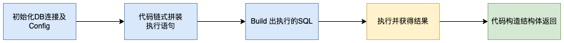
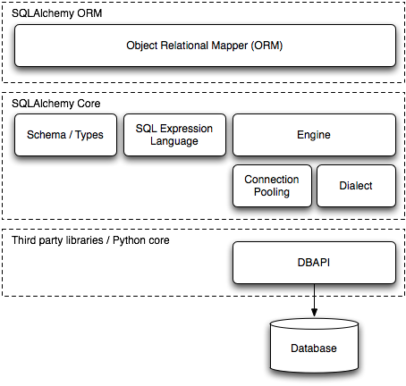
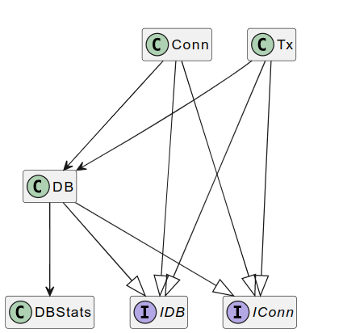
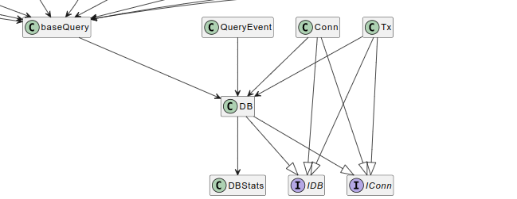
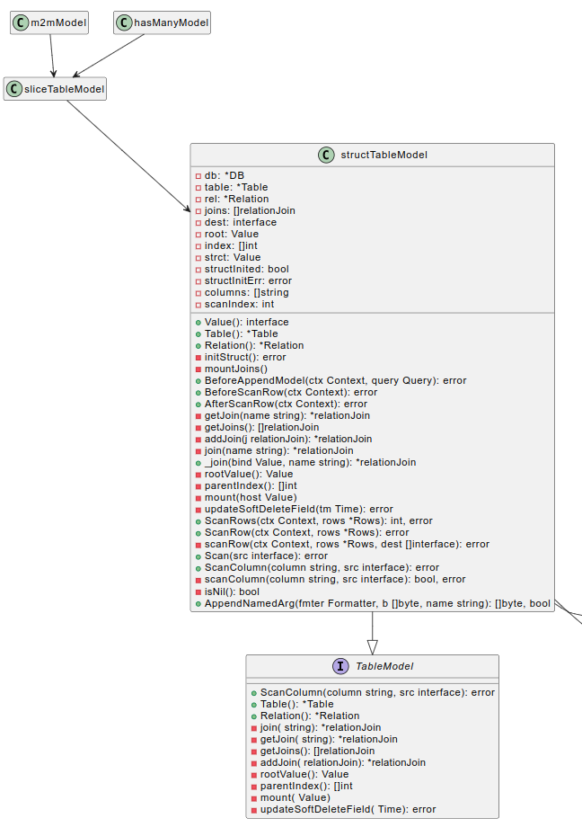
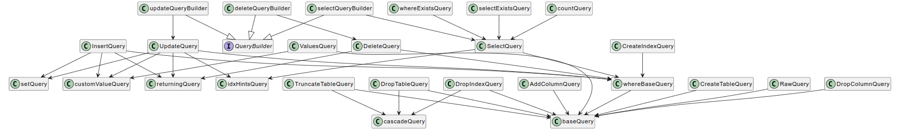
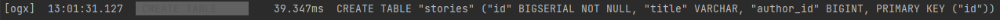
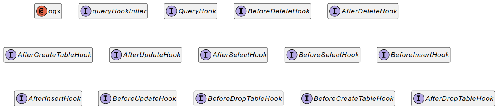

## 1 整体概览
### 1.1 引言
ORM全称为Object-Relational Mapping(对象-关系映射)，通常用于使用面向对象的编程语言在类型系统之间转换数据。换句话来说，通过使用ORM框架来弥合高级编程语言类型系统和数据库类型系统。SQL作为操作数据库的通用接口，ORM一般通过反射技术将高级编程语言中的类型转化为SQL语句，然后通过数据库connection让数据库执行。
ORM进行对象-关系映射的核心在于将对象及其关系转化为一种原子形式，该形式可以通过SQL语句反映到数据库中，并且可以保留对象之间的属性和对象间关系以便在需要的时候可以从数据库中构造对象及其关系。ORM核心在于对象-关系的建模以及QueryBuilder的实现。
与传统的直接在代码里写SQL语句相比，ORM往往需要更少的SQL模板代码和更安全、灵活的SQL实现方式，ORM以更抽象的方式操作SQL以及数据库，这带来了更高层的思考建模方式的好处，与此同时带来了缺点。ORM高层抽象带来的一个问题是，ORM的实现掩盖了SQL的构造过程，黑箱掩盖了实际执行过程和理解上的难度。除此之外，对象-关系阻抗问题也是萦绕在ORM框架的另一个问题。
Ogx是一个openGauss平台的golang ORM 框架，可以方便的对openGauss进行操作。Ogx专门为更直观的构造SQL，通过简明的Query API尽可能的避免ORM对SQL语句构造的遮挡。Ogx特点如下：

- 兼容database/sql接口
- 使用openGauss-connector-go-pq作为数据库驱动
- 实现openGauss dialect
- 更自然的SQL构造语法
### 1.2 Ogx处理流程

当用户使用database/sql创建sql.DB后，实例化ogx.DB对象，便可以使用NewXXXQuery()函数创建Query对象。Query对象调用.Model()方法后，ogx将传入的对象通过反射机制映射到Model中。有的Query支持Where子句，当用户调用Where等查询条件时，ogx传入对应参数。当最终用户调用Scan()或Exec()方法后，ogx调用AppendQuery()根据Model信息、子句信息和dialect信息构造SQL语句，最终通过database/sql中已经创建的连接进行执行。
## 2 具体实现分析
### 2.1 连接
Ogx为了良好的扩展性和兼容性，选择使用database/sql接口来支持OpenGauss，Ogx 直接使用database/sql的数据库driver来建立与数据库的连接，为了支持OpenGauss方言，使用opengauss dialect进行实现。通过dialect模块，可以解耦ORM框架与特定数据库SQL方言。

以example/basic示例来说：
```go
import (
	"database/sql"

	"gitee.com/chentanyang/ogx"
	"gitee.com/chentanyang/ogx/dialect/ogdialect"
    
	_ "gitee.com/opengauss/openGauss-connector-go-pq"
)
```
首先需要引入database/sql模块，然后通过openGauss-connector-go-pg模块注册驱动，最后引入ogx和ogdialect进行Ogx和openGauss方言引入。
```go
connStr := "host=127.0.0.1 port=26000 user=test password=Gauss@123 dbname=test sslmode=disable"
opengaussdb, err := sql.Open("opengauss", connStr)

db := ogx.NewDB(opengaussdb, ogdialect.New())
```
然后构造数据库连接信息，通过sql.Open()函数连接数据库，Ogx通过NewDB()方法获取构造的sql.DB对象，并通过sql.DB对象进行数据库执行操作。下面为Ogx.DB的结构体定义：
```go
type DB struct {
	*sql.DB

	dialect  schema.Dialect
    ...
}
```
通过NewDB方法实例化ogx.DB中的sql.DB对象，实现将构造的SQL语句执行的效果。
#### 抽象的IConn和IDB接口

Ogx抽象了database/sql中三种连接方式：sql.DB，sql.Conn和sql.Tx，上层的ogx.DB，ogx.Conn和ogx.Tx通过IConn对象，屏蔽下层具体数据库连接方式，IConn定义如下：
```go
type IConn interface {
	QueryContext(ctx context.Context, query string, args ...interface{}) (*sql.Rows, error)
	ExecContext(ctx context.Context, query string, args ...interface{}) (sql.Result, error)
	QueryRowContext(ctx context.Context, query string, args ...interface{}) *sql.Row
}
```
因为Ogx支持database/sql接口，所以所有SQL语句执行最后都会通过抽象的IConn函数调用QueryContext()、ExecContext()或者QueryRowContext()函数最终执行。

以DropTable功能为例：
```go
db.NewDropTable().Model(model).IfExists().Cascade().Exec(ctx)
```
Ogx.db调用NewDropTable()函数会将Ogx.db构造NewDropTableQuery结构体中的IConn对象conn：
```go
func (db *DB) NewDropTable() *DropTableQuery {
	return NewDropTableQuery(db)
}

func NewDropTableQuery(db *DB) *DropTableQuery {
	q := &DropTableQuery{
		baseQuery: baseQuery{
			db:   db,
			conn: db.DB,
		},
	}
	return q
}
```
当调用Exec()函数，会调用conn执行：
```go
func (q *baseQuery) exec(...) (sql.Result, error) {
	...
    res, err := q.conn.ExecContext(ctx, query)
	...
}
```
ogx.IDB抽象了ogx.DB，ogx.Conn和ogx.Tx三种对象，ogx.IDB定义如下：
```
type IDB interface {
	IConn
	Dialect() schema.Dialect

	NewValues(model interface{}) *ValuesQuery
	NewSelect() *SelectQuery
	NewInsert() *InsertQuery
	NewUpdate() *UpdateQuery
	NewDelete() *DeleteQuery
	NewRaw(query string, args ...interface{}) *RawQuery
	NewCreateTable() *CreateTableQuery
	NewDropTable() *DropTableQuery
	NewCreateIndex() *CreateIndexQuery
	NewDropIndex() *DropIndexQuery
	NewTruncateTable() *TruncateTableQuery
	NewAddColumn() *AddColumnQuery
	NewDropColumn() *DropColumnQuery

	BeginTx(ctx context.Context, opts *sql.TxOptions) (Tx, error)
	RunInTx(ctx context.Context, opts *sql.TxOptions, f func(ctx context.Context, tx Tx) error) error
}
```
用户可以直接使用ogx.IDB对象，以屏蔽具体ogx数据库映射实现。
```
func InsertUser(ctx context.Context, db ogx.IDB, user *User) error {
	_, err := db.NewInsert().Model(user).Exec(ctx)
	return err
}
```
### 2.2 映射

#### 2.2.1 Struct到Table映射实现
Ogx通过golang reflect反射，将不同的struct信息提取到Table类之中，进而读取Table中字段值来构造SQL语句，因此Table类是映射的核心数据结构。下面是Table类一些关键字段：
```go
type Table struct {
	dialect Dialect

	Type      reflect.Type
	ZeroValue reflect.Value // reflect.Struct
	ZeroIface interface{}   // struct pointer

	TypeName  string
	ModelName string

	Name              string
	SQLName           Safe
	SQLNameForSelects Safe
	Alias             string
	SQLAlias          Safe

	Fields     []*Field // PKs + DataFields
	PKs        []*Field
	DataFields []*Field

	fieldsMapMu sync.RWMutex
	FieldMap    map[string]*Field

	Relations map[string]*Relation
	Unique    map[string][]*Field

	SoftDeleteField       *Field
	UpdateSoftDeleteField func(fv reflect.Value, tm time.Time) error

	allFields []*Field // read only

	flags internal.Flag
}
```
ogx首先通过反射获取结构体名和类型名，ogx将类型名改成camel_cased_string并通过下划线连接。最后使用inflection库改成复数形式，设置为表名。例如，将User类型改为users表名，并设别名为user。
将Model和结构体进行映射主要通过structTableModel类，以下是structTableModel类的定义：
```
type structTableModel struct {
	db    *DB
	table *schema.Table

	rel   *schema.Relation
	joins []relationJoin

	dest  interface{}
	root  reflect.Value
	index []int

	strct         reflect.Value
	structInited  bool
	structInitErr error

	columns   []string
	scanIndex int
}
```
ogx调用table方法，将struct转化为table：
```
func (t *Tables) table(typ reflect.Type, allowInProgress bool) *Table {
	typ = indirectType(typ)
	if typ.Kind() != reflect.Struct {
		panic(fmt.Errorf("got %s, wanted %s", typ.Kind(), reflect.Struct))
	}

	if v, ok := t.tables.Load(typ); ok {
		return v.(*Table)
	}

	t.mu.Lock()

	if v, ok := t.tables.Load(typ); ok {
		t.mu.Unlock()
		return v.(*Table)
	}

	var table *Table

	inProgress := t.inProgress[typ]
	if inProgress == nil {
		table = newTable(t.dialect, typ)
		inProgress = newTableInProgress(table)
		t.inProgress[typ] = inProgress
	} else {
		table = inProgress.table
	}

	t.mu.Unlock()

	inProgress.init1()
	if allowInProgress {
		return table
	}

	if !inProgress.init2() {
		return table
	}

	t.mu.Lock()
	delete(t.inProgress, typ)
	t.tables.Store(typ, table)
	t.mu.Unlock()

	t.dialect.OnTable(table)

	for _, field := range table.FieldMap {
		if field.UserSQLType == "" {
			field.UserSQLType = field.DiscoveredSQLType
		}
		if field.CreateTableSQLType == "" {
			field.CreateTableSQLType = field.UserSQLType
		}
	}

	return table
}
```
因为golang反射的效率问题，为了提高性能，ogx使用了sync.Map来保存缓存的映射结果。如果Model没有变动，可以直接使用table.Load获取对应类型的table。table函数中，两个init函数分别为table添加fields和relations。
### 2.3 Query

Ogx在用户端通过链式调用来是实现相关功能，例如Select功能样例：
```go
db.NewSelect().
		Model(story).
		Relation("Author").
		Limit(1).
		Scan(ctx)
```
Ogx对于每一次查询都创建了一个Query作为查询的主体，类似Laravel的ORM框架，同时为了避免并发访问的问题，查询使用不同的Query实例。例如，db.NewSelect()函数实际上就实例化了一个SelectQuery
```go
func (db *DB) NewSelect() *SelectQuery {
	return NewSelectQuery(db)
}

func NewSelectQuery(db *DB) *SelectQuery {
	return &SelectQuery{
		whereBaseQuery: whereBaseQuery{
			baseQuery: baseQuery{
				db:   db,
				conn: db.DB,
			},
		},
	}
}
```
为了支持不同的Query及其功能的组合，将不同的Query拆分到不同结构体之中，通过组合和继承的方式来使用和构造Query。例如，SelectQuery通过whereBaseQuery，可以实现在Select中构造Where子句的效果。
DropTableQuery在执行的时候需要支持级联操作，所以DropTableQuery结构体和cascadeQuery进行了组合。
```
type DropTableQuery struct {
	baseQuery
	cascadeQuery

	ifExists bool
}
```
在执行AppendQuery()函数构造SQL语句时，通过显式调用cascadeQuery的appendCascade()方法，实现在添加cascade字段。
```
func (q cascadeQuery) appendCascade(fmter schema.Formatter, b []byte) []byte {
	if !fmter.HasFeature(feature.TableCascade) {
		return b
	}
	if q.cascade {
		b = append(b, " CASCADE"...)
	}
	if q.restrict {
		b = append(b, " RESTRICT"...)
	}
	return b
}
```
Query结构体之前有着严格的继承关系，它们的共同基类为BaseQuery结构体，BaseQuery结构体定义如下：
```go
type baseQuery struct {
	db   *DB
	conn IConn

	model Model
	err   error

	tableModel TableModel
	table      *schema.Table

	with           []withQuery
	modelTableName schema.QueryWithArgs
	tables         []schema.QueryWithArgs
	columns        []schema.QueryWithArgs

	flags internal.Flag
}
```
baseQuery实现了基础的从参数构建SQL语句的方法，并且baseQuery通过其成员conn拥有执行SQL语句的能力。
### 2.4 CRUD接口
#### 2.4.1 CREATE TABLE
**NewCreateTable**
调用`NewCreateTableQuery()`组装`CreateTableQuery()`结构体实例并将结构体的地址返回
```go
func NewCreateTableQuery(db *DB) *CreateTableQuery {
	q := &CreateTableQuery{
		baseQuery: baseQuery{
			db:   db,
			conn: db.DB,
		},
	}
	return q
}
```
**Model**
`Model`接口
```go
type Model interface {
	ScanRows(ctx context.Context, rows *sql.Rows) (int, error)
	Value() interface{}
}
```
```go
func (q *CreateTableQuery) Model(model interface{}) *CreateTableQuery 
```
通过`Model`方法将`model`传入`query_table_create.go`中，调用`query_base.go`的setModel然后传入model.go中 调用`_newModel`函数对`model`通过反射进行解析
```go
	v := reflect.ValueOf(dest)
	v = v.Elem()

	switch v.Kind() {
	case reflect.Map:
		typ := v.Type()
		if err := validMap(typ); err != nil {
			return nil, err
		}
		mapPtr := v.Addr().Interface().(*map[string]interface{})
		return newMapModel(db, mapPtr), nil
	case reflect.Struct:
		if v.Type() != timeType {
			return newStructTableModelValue(db, dest, v), nil
		}
	case reflect.Slice:
		switch elemType := sliceElemType(v); elemType.Kind() {
		case reflect.Struct:
			if elemType != timeType {
				return newSliceTableModel(db, dest, v, elemType), nil
			}
		case reflect.Map:
			if err := validMap(elemType); err != nil {
				return nil, err
			}
			slicePtr := v.Addr().Interface().(*[]map[string]interface{})
			return newMapSliceModel(db, slicePtr), nil
		}
		return newSliceModel(db, []interface{}{dest}, []reflect.Value{v}), nil
	}
```
如果传入的是比如实例中的`(*Book)(nil)`这样空的`model`则调用`newStructTableModel`函数
```go
  if v.IsNil() {
    typ := v.Type().Elem()
    fmt.Println(v, typ, "IsNil")
    if typ.Kind() == reflect.Struct {
      return newStructTableModel(db, dest, db.Table(typ)), nil
    }
    return nil, fmt.Errorf("ogx: Model(nil %T)", dest)
  }
```
组装成`structTableModel` 结构实体然后返回该`Model`实体
```sql
func newStructTableModel(db *DB, dest interface{}, table *schema.Table) *structTableModel {
	return &structTableModel{
		db:    db,
		table: table,
		dest:  dest,
	}
}
```
**Exec**
`*CreateTableQuery`结构体调用`query_table_create.go`中的`Exec()`函数
将`q.db.fmter`和`q.db.makeQueryBytes()`传入`AppendQuery`中拼装SQL语句
```sql
	b = append(b, "CREATE "...)
	if q.temp {
		b = append(b, "TEMP "...)
	}
	b = append(b, "TABLE "...)
	if q.ifNotExists && fmter.Dialect().Features().Has(feature.TableNotExists) {
		b = append(b, "IF NOT EXISTS "...)
	}
```
通过`q`的各种成员变量确定拼装的`CREATE TABLE SQL`语句语句
```go
CREATE TABLE "stories" ("id" BIGSERIAL NOT NULL, "title" VARCHAR, "author_id" BIGINT, PRIMARY KEY ("id"))
```
然后将`q`和组装好的`query`语句传入`query_base.go`中的`exec()`中调用q`.conn.ExecContext(ctx, query)`对`sql`语句进行执行。

#### 2.4.2 SELECT
`SELECT`操作通过下列语句执行
```go
db.NewSelect().Model(&users).OrderExpr("id ASC").Scan(ctx)
db.NewSelect().Model(user1).Where("id = ?", 1).Scan(ctx)
```
**SelectQuery结构**
```go
type SelectQuery struct {
    whereBaseQuery
    idxHintsQuery

    distinctOn []schema.QueryWithArgs
    joins      []joinQuery
    group      []schema.QueryWithArgs
    having     []schema.QueryWithArgs
    order      []schema.QueryWithArgs
    limit      int32
    offset     int32
    selFor     schema.QueryWithArgs

    union []union
}

```
**NewSelect()**
传入`query_select.go`中调用`NewSelectQuery`,组装`SelectQuery`结构体实例并将其的地址返回
```go
func NewSelectQuery(db *DB) *SelectQuery {
    return &SelectQuery{
        whereBaseQuery: whereBaseQuery{
            baseQuery: baseQuery{
                db:   db,
                conn: db.DB,
            },
        },
    }
}
```
**Model**
`Model`与上述`CreateTable`原理相同，即调用`query_base.go`的setModel然后传入model.go中 调用`_newModel`函数对`model`通过反射进行解析。
限定条件
此处以`ORDER B`Y为例,将`ORDER B`Y语句作为`query`参数传入`OderExpr`函数中，再将语句设置到`q.order`中
```go
func (q *SelectQuery) OrderExpr(query string, args ...interface{}) *SelectQuery {
    q.order = append(q.order, schema.SafeQuery(query, args))
    return q
}
```
**Scan**
`Scan`函数中首先`query_base.go`函数中`getModel`函数得到`Model`。然后由`AppendQuery`函数通过刚才对q的成员变量的设置拼装出对应的`SQL`语句，然后将`model`和`query`语句一起传入`query_base.go`的`scan`函数中调用`q.conn.QueryContext(ctx, query)`进行执行。
```go
func (q *SelectQuery) Scan(ctx context.Context, dest ...interface{}) error {
    
    model, err := q.getModel(dest)

    queryBytes, err := q.AppendQuery(q.db.fmter, q.db.makeQueryBytes())

    res, err := q.scan(ctx, q, query, model, true)

    if n, _ := res.RowsAffected(); n > 0 {
        if tableModel, ok := model.(TableModel); ok {
            if err := q.selectJoins(ctx, tableModel.getJoins()); err != nil {
                return err
            }
        }
    }

    if q.table != nil {
        if err := q.afterSelectHook(ctx); err != nil {
            return err
        }
    }

    return nil
}
```
#### 2.4.3 INSERT
`INSERT`操作通过下列语句执行
```go
db.NewInsert().Model(&users).Exec(ctx)
```
`InsertQuery`结构
```go
type InsertQuery struct {
	whereBaseQuery
	returningQuery
	customValueQuery

	on schema.QueryWithArgs
	setQuery

	ignore  bool
	replace bool
}
```
首先调用`NewInsert()`组建`InsertQuery`实例
```go
func NewInsertQuery(db *DB) *InsertQuery {
	q := &InsertQuery{
		whereBaseQuery: whereBaseQuery{
			baseQuery: baseQuery{
				db:   db,
				conn: db.DB,
			},
		},
	}
	return q
}
```
然后将需要操作的`model`传入`Model()`函数中进行解析，2.4.1中已经解释过。
最后再调用`Exec()`执行。`Exec`函数中首先根据`model`调用`AppendQuery()`进行`SQL`语句拼装，然后调用`exec()`方法进行执行.
```go
queryBytes, err := q.AppendQuery(q.db.fmter, q.db.makeQueryBytes())
//...
res, err = q.exec(ctx, q, query)
```
`Update`和`Delete`实现原理与`Insert`一致。
### 2.5 占位符
通过往`ColumnExpr()`函数中传入带有问号的`sql`语句并在`scan`中传入对应的变量去接收`select`的结果。
```go
db.NewSelect().Model((*User)(nil)).
		ColumnExpr("'?TableName'").
		ColumnExpr("'?TableAlias'").
		ColumnExpr("'?PKs'").
		ColumnExpr("'?TablePKs'").
		ColumnExpr("'?Columns'").
		ColumnExpr("'?TableColumns'").
		ModelTableExpr("").
		Scan(ctx, &tableName, &tableAlias, &pks, &tablePKs, &columns, &tableColumns);
```
`Model`传入`model`后，通过`addColum`n函数传入的参数通过`SafeQuery`函数处理成`QueryWithArgs`结构体，然后都`append`进`baseQuery`结构体实例的`columns` 成员变量中，即`QueryWithArgs Slice`类型。
```go
columns        []schema.QueryWithArgs
```
调用`scan`函数中通过`AppendQuery`开始组装`select sql`语句，然后`getModel`函数返回了一个`SliceModel`实体，再通过`scan`将对应得结果扫描至该`slice model`的每个对应值中。
```go
type sliceModel struct {
	dest      []interface{}
	values    []reflect.Value
	scanIndex int
	info      []sliceInfo
}
res, err := q.scan(ctx, q, query, model, true)
```
### 2.6 迁移
使用`gopkg.in/urfave/cli.v2` 命令行框架，来完成通过命令行输入`Migration`内容的部分。实例化一个`cli`然后在`commands`中创建命令，添加定义的指针 `&cli.Command `变量，然后创建一个`subcommands` `newDBCommand` 。
```go
Commands: []*cli.Command{
			newDBCommand(migrate.NewMigrator(db, migrations.Migrations)),
		},
```
在`subcommands`中将命令命名为”db“命令的处理函数。再在`subcommands`中创建名为”`migrate`“的`subcommands`，执行`migrator.Migrate()`。
```go
func newDBCommand(migrator *migrate.Migrator) *cli.Command {
	return &cli.Command{
		Name:  "db",
		Usage: "database migrations",
		Subcommands: []*cli.Command{
				Name:  "migrate",
				Usage: "migrate database",
				Action: func(c *cli.Context) error {
					group, err := migrator.Migrate(c.Context)
					fmt.Printf("migrated to %s\n", group)
					return nil
				},
			},
```
最后`main`函数调用`app.Run`启动`cli`程序。
```go
if err := app.Run(os.Args); err != nil {
		log.Fatal(err)
	}
```
### 2.7 数据初始化
首先调用db.RegisterModel()注册Model
```go
func (t *Tables) Register(models ...interface{}) {
	for _, model := range models {
		_ = t.Get(reflect.TypeOf(model).Elem())
	}
}
```
然后调用fixture.Load将yaml文件的内容装载进来，然后调用Decod()将yaml文件解析。
```go
err := fixture.Load(ctx, os.DirFS("testdata"), "fixture.yml")
//...
	var fixtures []fixtureData

	dec := yaml.NewDecoder(fh)
	if err := dec.Decode(&fixtures); err != nil {
		return err
	}
```
fixture.MustRow()检索加载的模型
```go
func (f *Fixture) Row(id string) (interface{}, error) {
	ss := strings.Split(id, ".")
	if len(ss) != 2 {
		return nil, fmt.Errorf("fixture: invalid row id: %q", id)
	}
	model, rowID := ss[0], ss[1]

	rows, ok := f.modelRows[model]
	if !ok {
		return nil, fmt.Errorf("fixture: unknown model=%q", model)
	}

	row, ok := rows[rowID]
	if !ok {
		return nil, fmt.Errorf("fixture: can't find row=%q for model=%q", rowID, model)
	}

	return row, nil
}
```
### 2.8 事务
Ogx的事务是通过database/sql的sql.Tx接口实现的，用户通过调用db.BeginTx()或者db.RunInTx()函数获得一个ogx.Tx对象，ogx.Tx是database/sql里面sql.Tx的简单封装，并支持了Hooks函数。ogx.Tx实现如下：
```go
type Tx struct {
	ctx context.Context
	db  *DB
	// name is the name of a savepoint
	name string
	*sql.Tx
}
```
ogx.Tx支持的例如Commit等函数都是通过调用sql.Tx实现的，以QueryContext()函数为例：
```go
func (tx Tx) QueryContext(
	ctx context.Context, query string, args ...interface{},
) (*sql.Rows, error) {
    ...
	ctx, event := tx.db.beforeQuery(ctx, nil, query, args, formattedQuery, nil)
	rows, err := tx.Tx.QueryContext(ctx, formattedQuery)
	tx.db.afterQuery(ctx, event, nil, err)
	return rows, err
}
```
函数在调用sql.Tx.QueryContext()函数前后调用了ogx支持的QueryHook。
### 2.9 钩子

Ogx的Hooks可以分为model hooks，model query hooks和query hooks。Model hooks将Hook绑定在实现特定Model hooks接口的Model上，可以分为ogx.BeforeAppendModelHook和ogx.Before/ScanRowHook两种Hook。ogx.BeforeAppendModelHook主要用于更新一个Model前进行触发。
#### 2.9.1 Model hooks 实现
举例来说，当用户为Object实现BeforeAppendModelHook接口时，调用NewXXX().Model(&Object)将Object和Model进行映射，这个过程通过调用table的newTable()方法实现。
```go
func newTable(dialect Dialect, typ reflect.Type) *Table {
	t := new(Table)
	t.dialect = dialect
	...
    t.Type = typ
	t.ZeroIface = reflect.New(t.Type).Interface()
	...
    
	hooks := []struct {
		typ  reflect.Type
		flag internal.Flag
	}{
		{beforeAppendModelHookType, beforeAppendModelHookFlag},

		{beforeScanHookType, beforeScanHookFlag},
		{afterScanHookType, afterScanHookFlag},

		{beforeScanRowHookType, beforeScanRowHookFlag},
		{afterScanRowHookType, afterScanRowHookFlag},
	}

	typ = reflect.PtrTo(t.Type)
	for _, hook := range hooks {
		if typ.Implements(hook.typ) {
			t.flags = t.flags.Set(hook.flag)
		}
	}

	return t
}
```
使用reflect.Type.Implements()方法反射得到Object是否实现了beforeAppendModelHookType，如果实现，则设置标志位。
```go
var beforeAppendModelHookType = reflect.TypeOf((*BeforeAppendModelHook)(nil)).Elem()

func (t *Table) HasBeforeAppendModelHook() bool { return t.flags.Has(beforeAppendModelHookFlag) }
```
当执行NewXXX().Model(&Object).Exec()时，会调用映射的tableModel的beforeAppendModel方法，通过判断映射的tableModel是否含有该hook的flag，最终决定是否调用用户代码。
```go
func (m *structTableModel) BeforeAppendModel(ctx context.Context, query Query) error {
	if !m.table.HasBeforeAppendModelHook() || !m.strct.IsValid() {
		return nil
	}
	return m.strct.Addr().Interface().(schema.BeforeAppendModelHook).BeforeAppendModel(ctx, query)
}
```
#### 2.9.2 Model query hooks实现
当用户设置model query hooks时，执行Exec()函数将执行特定的hook，例如，NewInsert()函数的Exec将会检查用户是否实现beforeInsertHook和afterInsertHook，若实现，则直接调用。
```go
func (q *InsertQuery) beforeInsertHook(ctx context.Context) error {
	if hook, ok := q.table.ZeroIface.(BeforeInsertHook); ok {
		if err := hook.BeforeInsert(ctx, q); err != nil {
			return err
		}
	}
	return nil
}
```
#### 2.9.3 Query hooks实现
Query hooks在全局层面对所有queries进行hook调用，主要用于logging。queryHooks为一个Hooks列表，用户调用db.AddQueryHook即添加一个实现了AfterQuery和AfterQuery接口的QueryHook。当执行scan或者exec操作时，调用beforeQuery和afterQuery。beforeQuery和afterQuery内部通过for循环显式调用hook的beforeQuery和afterQuery函数。
```go
func (db *DB) beforeQuery(...) (context.Context, *QueryEvent) {
	...
	for _, hook := range db.queryHooks {
		ctx = hook.BeforeQuery(ctx, event)
	}

	return ctx, event
}
```

