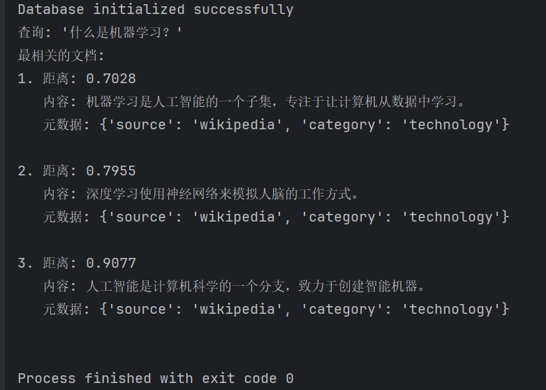
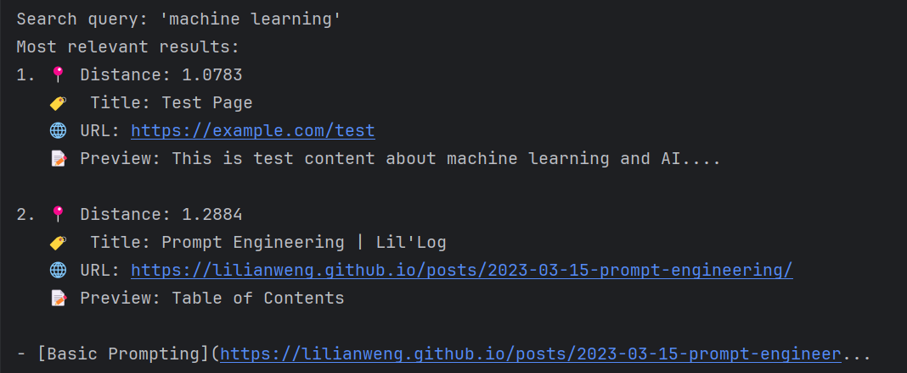
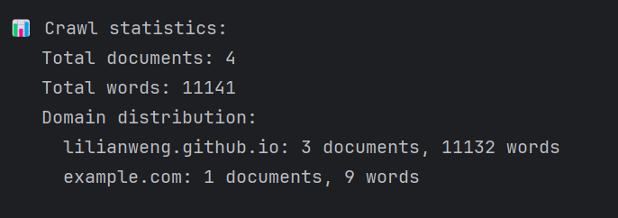

## 概述

本实践文档介绍如何将 openGauss 向量数据库与 Firecrawl 网络爬虫集成，构建一个完整的网络内容抓取、向量化存储和智能检索系统。

## 核心功能

- **网络内容抓取**: 使用 Firecrawl API 抓取网页内容
- **本地向量化**: 使用 SentenceTransformers 生成本地文本嵌入
- **向量存储**: 将内容存储到 openGauss 向量数据库
- **智能检索**: 基于向量相似性的语义搜索
- **批量处理**: 支持多 URL 批量抓取和存储

## 技术栈

| 组件 | 版本 | 用途 |
|------|------|------|
| openGauss | 最新 | 向量数据库存储 |
| Python | 3.8+ | 主开发语言 |
| SentenceTransformers | 最新 | 本地文本嵌入生成 |
| Firecrawl API | v1 | 网页内容抓取 |
| Docker | 最新 | 容器化部署 |

## 环境准备

### 1. 安装依赖

```bash
# 基础依赖
pip install psycopg2-binary sentence-transformers numpy pandas

# 网络请求依赖
pip install aiohttp requests

# 异步支持
pip install asyncio
```

### 2. 部署 openGauss

```bash
# 拉取 Docker 镜像
docker pull enmotech/opengauss:latest

# 运行容器
docker run --name opengauss --privileged=true -d \
  -e GS_PASSWORD=Secretpassword@123 \
  -p 5432:5432 \
  enmotech/opengauss:latest
```

### 3. 获取 Firecrawl API Key

1. 访问 [Firecrawl 官网](https://firecrawl.dev)
2. 注册账号并获取 API Key
3. 在代码中配置 API Key

## 核心代码结构

### 主要类: `FirecrawlOpenGaussVectorDB`

```python
class FirecrawlOpenGaussVectorDB:
    # 初始化数据库连接和配置
    def __init__(self, ...)
    
    # 数据库初始化
    def init_database(self)
    
    # 文本向量化
    def generate_embedding(self, text)
    
    # 单URL抓取
    async def crawl_url(self, url, options)
    
    # 响应数据处理
    def process_firecrawl_response(self, response_data)
    
    # 文档存储
    def store_document(self, document_data)
    
    # 相似性搜索
    def similarity_search(self, query, top_k, domain)
```

## 快速开始

### 1. 基本使用

```python
# 初始化
vector_db = FirecrawlOpenGaussVectorDB(
    firecrawl_api_key="your_api_key_here"
)

# 抓取单个URL
await vector_db.crawl_and_store_url("https://example.com")

# 语义搜索
results = vector_db.similarity_search("机器学习", top_k=3)
```


### 2. 批量处理

```python
# 批量抓取URL列表
urls = [
    "https://en.wikipedia.org/wiki/Machine_learning",
    "https://en.wikipedia.org/wiki/Artificial_intelligence"
]

results = await vector_db.crawl_multiple_urls(urls)
```

### 3. 高级搜索

```python
# 按域名过滤搜索
results = vector_db.similarity_search(
    "深度学习", 
    domain="en.wikipedia.org", 
    top_k=3
)
```

## 配置选项

### Firecrawl 抓取选项

```python
crawl_options = {
    "formats": ["markdown"],  # 输出格式
    "onlyMainContent": True,  # 仅主要内容
    "waitFor": 2000,          # 等待时间(ms)
    "screenshot": False       # 是否截图
}
```

### 数据库配置

```python
db_config = {
    "host": "localhost",
    "port": 5432,
    "database": "postgres",
    "user": "gaussdb",
    "password": "Secretpassword@123"
}
```

## 数据模型

### 数据库表结构

```sql
CREATE TABLE crawled_documents (
    id SERIAL PRIMARY KEY,
    url TEXT NOT NULL UNIQUE,      -- 页面URL
    title TEXT,                    -- 页面标题
    content TEXT NOT NULL,         -- 页面内容
    metadata JSONB,                -- 元数据
    embedding vector(384),         -- 向量嵌入
    crawled_at TIMESTAMP DEFAULT CURRENT_TIMESTAMP,
    domain TEXT,                   -- 域名
    word_count INTEGER             -- 字数统计
);
```

## 搜索功能

### 支持的搜索类型

1. **语义搜索**: 基于向量相似性
2. **域过滤**: 按域名筛选结果
3. **混合搜索**: 结合元数据过滤

### 搜索示例

```python
    # 执行相似性搜索
    if documents:
        print("\n🔍 Testing similarity search...")
        queries = [
            "machine learning",
            "artificial intelligence",
            "neural networks"
        ]

        for query in queries:
            print(f"\nSearch query: '{query}'")
            results = vector_db.similarity_search(query, top_k=2)

            if results:
                print("Most relevant results:")
                for i, (doc_id, url, title, content, metadata, distance) in enumerate(results):
                    print(f"{i + 1}. 📍 Distance: {distance:.4f}")
                    print(f"   🏷️  Title: {title}")
                    print(f"   🌐 URL: {url}")
                    print(f"   📝 Preview: {content[:100]}...")
                    print()
            else:
                print("No results found")
```

## 监控统计

### 获取系统统计

```python
# 显示统计信息
stats = vector_db.get_crawl_statistics()
print(f"\n📊 Crawl statistics:")
print(f"   Total documents: {stats.get('total_documents', 0)}")
print(f"   Total words: {stats.get('total_words', 0)}")
print("   Domain distribution:")
for domain, count, total_words in stats.get('domain_distribution', []):
    print(f"     {domain}: {count} documents, {total_words} words")
```

## 故障排除

### 常见问题

1. **API Key 错误**: 检查 Firecrawl API Key 配置
2. **数据库连接失败**: 确认 openGauss 容器运行状态
3. **向量操作符错误**: 检查 openGauss 向量扩展是否启用

### 调试模式

```python
# 启用详细日志
import logging
logging.basicConfig(level=logging.DEBUG)

# 测试数据处理
test_data_processing()
```

## 最佳实践

### 1. 批量处理建议

```python
# 分批处理大量URLs
batch_size = 10
for i in range(0, len(urls), batch_size):
    batch = urls[i:i+batch_size]
    await vector_db.crawl_multiple_urls(batch)
    await asyncio.sleep(5)  # 避免速率限制
```

### 2. 内存优化

```python
# 限制嵌入文本长度
def generate_embedding(self, text):
    if len(text) > 512:
        text = text[:512]  # 截断长文本
    return self.embedding_model.encode(text)
```

### 3. 错误重试机制

```python
# 添加重试逻辑
async def crawl_with_retry(self, url, max_retries=3):
    for attempt in range(max_retries):
        try:
            return await self.crawl_url(url)
        except Exception as e:
            print(f"Attempt {attempt+1} failed: {e}")
            await asyncio.sleep(2 ** attempt)  # 指数退避
```

## 部署清单

1. [ ] openGauss Docker 容器运行中
2. [ ] Firecrawl API Key 已配置
3. [ ] Python 依赖已安装
4. [ ] 数据库表已初始化
5. [ ] 网络连接正常

## 扩展功能

### 未来增强

1. **实时索引**: 添加增量索引更新
2. **多模态支持**: 支持图像和视频向量化
3. **集群部署**: 支持分布式向量数据库
4. **API 服务**: 提供 RESTful 搜索接口

---

## 使用场景

- **企业知识库**: 抓取和检索内部文档
- **竞品分析**: 监控竞争对手网站内容
- **学术研究**: 收集和分析学术论文
- **内容聚合**: 构建智能内容推荐系统

这个实践文档提供了完整的集成方案，从环境准备到生产部署，帮助您快速构建基于 openGauss 和 Firecrawl 的智能内容处理系统。