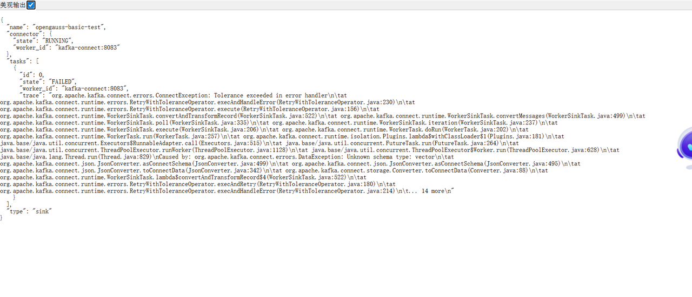

# 在Docker Desktop 中部署Kafka的完整指南

下面我将为您提供在Docker Desktop环境中完整部署Kafka的步骤，包括Zookeeper和Kafka的容器化部署，以及与openGauss的集成方案。

## 一、基础环境准备

### 1.1确认 Docker Desktop 运行状态

·打开Docker Desktop应用程序

·在系统托盘中确认Docker图标显示为运行状态

·在终端中验证Docker是否可用：

```
docker --version
docker-compose --version
```
### 1.2创建专用网络（推荐）

```
docker network create kafka-network
```
## 二、使用Docker Compose部署 Kafka

### 2.1创建docker-compose.yml文件

```
version: '3.8'

services:
  zookeeper:
    image: bitnami/zookeeper:3.8
    container_name: zookeeper
    networks:
      - kafka-network
    ports:
      - "2181:2181"
    environment:
      - ALLOW_ANONYMOUS_LOGIN=yes
    volumes:
      - zookeeper_data:/bitnami/zookeeper

  kafka:
    image: bitnami/kafka:3.4
    container_name: kafka
    networks:
      - kafka-network
    ports:
      - "9092:9092"
    environment:
      - KAFKA_BROKER_ID=1
      - KAFKA_CFG_LISTENERS=PLAINTEXT://:9092
      - KAFKA_CFG_ADVERTISED_LISTENERS=PLAINTEXT://localhost:9092
      - KAFKA_CFG_ZOOKEEPER_CONNECT=zookeeper:2181
      - ALLOW_PLAINTEXT_LISTENER=yes
      - KAFKA_AUTO_CREATE_TOPICS_ENABLE=true
    volumes:
      - kafka_data:/bitnami/kafka
    depends_on:
      - zookeeper

  kafka-ui:
    image: provectuslabs/kafka-ui:latest
    container_name: kafka-ui
    networks:
      - kafka-network
    ports:
      - "8080:8080"
    environment:
      - KAFKA_CLUSTERS_0_NAME=local
      - KAFKA_CLUSTERS_0_BOOTSTRAPSERVERS=kafka:9092
      - KAFKA_CLUSTERS_0_ZOOKEEPER=zookeeper:2181
    depends_on:
      - kafka

volumes:
  zookeeper_data:
  kafka_data:

networks:
  kafka-network:
    external: true
```
### 2.2启动Kafka服务
```
# 打开终端（命令行）并导航到包含 docker-compose.yml 的目录
cd /path/to/your/docker-compose-directory

# 启动所有服务（在后台运行）
docker-compose up -d
```
### 2.3验证服务状态

```
docker ps
```
应该看到三个容器正常运行：zookeeper、kafka和 kafka-ui

## 三、验证Kafka部署

### 3.1进入Kafka容器

```
docker exec -it kafka bash
```
### 3.2创建测试主题

```
kafka-topics.sh --create --topic test-topic \
--bootstrap-server localhost:9092 \
--partitions 1 --replication-factor 1
```
### 3.3生产测试消息

```
kafka-console-producer.sh --topic test-topic \
--bootstrap-server localhost:9092
```
（输入几条消息后按Ctrl+D退出）

### 3.4消费测试消息

```
kafka-console-consumer.sh --topic test-topic \
--bootstrap-server localhost:9092 \
--from-beginning
```
（看到消息后按Ctrl+C退出）

## 四、与openGauss集成

### 4.1将openGauss容器加入同一网络

```
docker network connect kafka-network 您的openGauss容器名
```
### 4.2在openGauss 容器中测试连接Kafka

```
docker exec -it 您的openGauss容器名 bash
```
### 4.3使用KafkaUI管理界面

访问｀http://localhost:8080｀可以查看Kafka的Web管理界面

现在您已经成功在Docker Desktop中部署了Kafka，并可以开始与openGauss进行集成开发。如需进一步配置Kafka Connect或其他高级功能，可以参考相关文档。

# 使用Kafka Connect JDBC Sink Connector 实现向量数据流化的详细步骤

以下是完整的、逐步的操作指南，从零开始实现Kafka向量数据流化并摄取到openGauss向量数据库。

## 一、前置条件准备

1．已安装Docker Desktop并正常运行

2．已完成openGauss和Kafka的Docker部署（按之前指引）

3．确保Kafka Connect服务可用（Confluent或社区版）

## 二、详细实施步骤

### 步骤1：启动 Kafka Connect服务

#### 1.1创建完整的docker-compose.yml文件

将Kafka Connect与Kafka、Zookeeper整合到一个文件中：

```
version: '3.8'

services:
  zookeeper:
    image: bitnami/zookeeper:3.8
    container_name: zookeeper
    networks:
      - kafka-network
    ports:
      - "2181:2181"
    environment:
      - ALLOW_ANONYMOUS_LOGIN=yes
    volumes:
      - zookeeper_data:/bitnami/zookeeper

  kafka:
    image: bitnami/kafka:3.4
    container_name: kafka
    networks:
      - kafka-network
    ports:
      - "9092:9092"
    environment:
      - KAFKA_BROKER_ID=1
      - KAFKA_CFG_ADVERTISED_LISTENERS="PLAINTEXT://kafka:9092,EXTERNAL://localhost:29092"
      - KAFKA_CFG_LISTENER_SECURITY_PROTOCOL_MAP="PLAINTEXT:PLAINTEXT,EXTERNAL:PLAINTEXT"
      - KAFKA_CFG_INTER_BROKER_LISTENER_NAME="PLAINTEXT"
      - KAFKA_CFG_ZOOKEEPER_CONNECT=zookeeper:2181
      - ALLOW_PLAINTEXT_LISTENER=yes
      - KAFKA_AUTO_CREATE_TOPICS_ENABLE=true
    volumes:
      - kafka_data:/bitnami/kafka
    depends_on:
      - zookeeper
    healthcheck:
      test: ["CMD", "kafka-broker-api-versions", "--bootstrap-server", "localhost:9092"]
      interval: 10s
      timeout: 20s
      retries: 10

  kafka-ui:
    image: provectuslabs/kafka-ui:latest
    container_name: kafka-ui
    networks:
      - kafka-network
    ports:
      - "8080:8080"
    environment:
      - KAFKA_CLUSTERS_0_NAME=local
      - KAFKA_CLUSTERS_0_BOOTSTRAPSERVERS=kafka:9092
      - KAFKA_CLUSTERS_0_ZOOKEEPER=zookeeper:2181
    depends_on:
      - kafka

  kafka-connect:
    image: confluentinc/cp-kafka-connect:7.4.0
    container_name: kafka-connect
    networks:
      - kafka-network
    ports:
      - "8083:8083"
    environment:
      CONNECT_BOOTSTRAP_SERVERS: "kafka:9092"
      CONNECT_REST_ADVERTISED_HOST_NAME: "kafka-connect"
      CONNECT_GROUP_ID: "connect-cluster"
      CONNECT_CONFIG_STORAGE_TOPIC: "connect-configs"
      CONNECT_OFFSET_STORAGE_TOPIC: "connect-offsets"
      CONNECT_STATUS_STORAGE_TOPIC: "connect-status"
      CONNECT_KEY_CONVERTER: "org.apache.kafka.connect.json.JsonConverter"
      CONNECT_VALUE_CONVERTER: "org.apache.kafka.connect.json.JsonConverter"
      CONNECT_REST_PORT: 8083
      CONNECT_PLUGIN_PATH: "/usr/share/java,/usr/share/confluent-hub-components"
      CONNECT_WAIT_FOR_SERVERS_TIMEOUT: "300"  
      CONNECT_HEALTHCHECK_TIMEOUT: "120" 
    volumes:
      - ./connectors:/etc/kafka-connect/plugins
    depends_on:
      - zookeeper
      - kafka:
            condition: service_healthy

volumes:
  zookeeper_data:
  kafka_data:

networks:
  kafka-network:
    external: true
```
#### 1.2启动服务

```
docker-compose up -d
```
#### 1.3验证服务

```
curl http://localhost:8083/
```
应返回 Kafka Connect的版本信息

### 步骤2：安装JDBC Sink Connector插件

#### 2.1使用Docker容器内下载OpenGauss JDBC驱动：

```
# 进入 Kafka Connect 容器下载
docker exec -it kafka-connect bash
cd /etc/kafka-connect/plugins
wget https://opengauss.obs.cn-south-1.myhuaweicloud.com/3.0.0/x86/openGauss-3.0.0-JDBC.tar.gz
tar -xzf openGauss-3.0.0-JDBC.tar.gz
exit
```
#### 2.2使用Confluent Hub 安装JDBC Sink Connector插件

```
docker exec -it kafka-connect bash
confluent-hub install --no-prompt confluentinc/kafka-connect-jdbc:10.7.0
exit
```
#### 2.3重启 Kafka Connect

```
docker restart kafka-connect
```
### 步骤3：准备openGauss向量数据库

#### 3.1创建向量数据库和表

```
docker exec -it opengauss_container gsql -U gaussdb -d postgres
```
```
CREATE DATABASE vector_db;
\c vector_db

CREATE EXTENSION vector;
CREATE TABLE vector_data (
    id INT PRIMARY KEY
    name VARCHAR,
    embedding vector(10),
    embedding_text TEXT,
    create_time TIMESTAMP DEFAULT CURRENT_TIMESTAMP
);
```
### 步骤4：配置JDBCSinkConnector（容器内操作）

#### 4.1进入容器创建配置文件：

```
docker exec -it kafka-connect bash
```
#### 4.2创建配置文件vector-sink.json

```
cat << EOF > /tmp/vector-sink.json
{
  "name": "opengauss-vector-sink",
  "config": {
    "connector.class": "io.confluent.connect.jdbc.JdbcSinkConnector",
    "tasks.max": "1",
    "topics": "vector_topic",
    "connection.url": "jdbc:postgresql://opengauss_container(您的高斯数据库容器名):5432/vector_db",
    "connection.user": "您的用户名",
    "connection.password": "您的密码",
    "auto.create": "false",
    "auto.evolve": "false",
    "insert.mode": "insert",
    "table.name.format": "vector_data",
    "value.converter": "org.apache.kafka.connect.json.JsonConverter",
    "value.converter.schemas.enable": "false"
  }
}
EOF
```
#### 4.3注册连接器Connector

```
curl -X POST -H "Content-Type: application/json" \
  --data @vector-sink.json \
  http://localhost:8083/connectors
```
#### 4.4验证Connector状态

```
curl http://localhost:8083/connectors/opengauss-vector-sink/status | jq
```
### 步骤5：测试数据流

#### 5.1生产测试数据
```
docker exec -it kafka /opt/bitnami/kafka/bin/kafka-console-producer.sh \
  --topic vector_topic \
  --bootstrap-server localhost:9092
```
**输入测试数据（示例）**：

```
{"schema": {"type": "struct","fields": [{"field": "id", "type": "int32"},{"field": "name", "type": "string"},{"field": "embedding", "type": "string"}]},"payload": {"id": 2,"name": "test2","embedding": "[0.1,0.2,0.3,0.4,0.5,0.6,0.7,0.8,0.9,1.0]"}}
```
#### 5.2验证数据写入

```
docker exec opengauss gsql -U your_user -d your_db -c "SELECT * FROM target_table;"
```
### 步骤6：性能优化配置（可选）

#### 6.1修改Connector配置提高吞吐

```
{
  ...原有配置...
  "batch.size": "5000",
  "auto.commit.interval.ms": "5000",
  "max.poll.records": "500",
  "max.partition.fetch.bytes": "1048576"
}
```
更新配置：

```
curl -X PUT -H "Content-Type: application/json" \
  --data @vector-sink.json \
  http://localhost:8083/connectors/opengauss-vector-sink/config
```
#### 6.2在openGauss中创建向量索引

```
CREATE INDEX idx_vector_embedding ON vector_data USING ivfflat (embedding vector_l2_ops) WITH (lists = 100);
ANALYZE vector_data;
```
## 三、常见问题排查

### 问题1：连接失败

**症状：** Connector状态显示FAILED

**解决：**

```
# 检查openGauss日志
docker logs opengauss_container

# 测试网络连通性
docker exec kafka-connect ping opengauss_container

# 验证JDBC连接
docker exec -it kafka-connect bash
curl -X POST http://localhost:8083/connectors/opengauss-vector-sink/restart
```
### 问题2：向量格式错误

**症状：** 数据写入但向量解析失败

**解决：**

1．确保发送的JSON数据中embedding是数组格式

2．检查向量维度是否与表定义匹配

3．添加更多转换器处理：

```
"transforms": "createVector,castTypes",
"transforms.createVector.type": "org.apache.kafka.connect.transforms.Cast$Value",
"transforms.createVector.spec": "embedding:bytes",
"transforms.castTypes.type": "org.apache.kafka.connect.transforms.Cast$Value",
"transforms.castTypes.spec": "metadata:string"
```
### 问题3：性能瓶颈

**症状：** 数据积压

**解决：**

1．增加任务数：

```
"tasks.max: "3"
```
**2．调整Kafka分区数：**

```
docker exec kafka kafka-topics.sh --alter \
  --topic vector_topic \
  --partitions 3 \
  --bootstrap-server kafka:9092
```
## 四、监控与维护

### 4.1监控Connector状态

```
watch -n 2 'curl -s http://localhost:8083/connectors/opengauss-vector-sink/status | jq'
```
### 4.2查看任务指标

```
curl http://localhost:8083/connectors/opengauss-vector-sink/tasks/0/status | jq
```
### 4.3日志查看

```
docker logs -f kafka-connect
```
通过以上步骤，您已经完整实现了使用Kafka Connect JDBC Sink Connector将向量数据流化并摄取到openGauss向量数据库的全流程。如需处理更复杂的向量场景，可以进一步调整转换器和数据处理逻辑。


# 一些可能会遇到的问题：

**问题：**
Kafka Connect 尝试创建内部 Topic connect-offsets时，要求副本因子（replication factor）为3，但当前Kafka集群只有1个broker。

**解决方案：**

手动创建内部Topic

```
# 进入Kafka容器
docker exec -it kafka bash

# 手动创建内部Topic（副本因子设为1）
/opt/bitnami/kafka/bin/kafka-topics.sh \
  --create \
  --topic connect-offsets \
  --partitions 25 \
  --replication-factor 1 \
  --config cleanup.policy=compact \
  --bootstrap-server localhost:9092

/opt/bitnami/kafka/bin/kafka-topics.sh \
  --create \
  --topic connect-configs \
  --partitions 1 \
  --replication-factor 1 \
  --config cleanup.policy=compact \
  --bootstrap-server localhost:9092

/opt/bitnami/kafka/bin/kafka-topics.sh \
  --create \
  --topic connect-status \
  --partitions 5 \
  --replication-factor 1 \
  --config cleanup.policy=compact \
  --bootstrap-server localhost:9092

# 退出容器
exit
```
**问题：**

Kafka消息的Value格式不符合连接器要求，即不能以下面这种普通JSON格式数据发送消息

```
{"id":1,"name":"test1","embedding": "[0.1,0.2,0.3,0.4,0.5,0.6,0.7,0.8,0.9,1.0]"}
```
**解决方案：**

如下所示，发送带Schema的消息，且不能格式化

```
{"schema": {"type": "struct","fields": [{"field": "id", "type": "int32"},{"field": "name", "type": "string"},{"field": "embedding", "type": "string"}]},"payload": {"id": 1,"name": "test1","embedding": "[0.1,0.2,0.3,0.4,0.5,0.6,0.7,0.8,0.9,1.0]"}}
```
**问题：**

Kafka Connect无法识别jdbc:opengauss:/／协议

**解决方案：**

采用 jdbc:postgresql:/／协议

```
{
  "connection.url": "jdbc:postgresql://opengauss:5432/postgres"
}
```
**问题：**

下面这个错误表明Kafka Connect的JSON转换器无法识别 vector 类型。



**解决方案：**
## 步骤1：调整表结构

```
-- 添加文本中转字段
ALTER TABLE test_basic ADD COLUMN embedding_text TEXT;

-- 确保原vector字段存在
ALTER TABLE test_basic ADD COLUMN embedding vector(10);
```
## 步骤2：创建转换函数

```
CREATE OR REPLACE FUNCTION json_to_vector() 
RETURNS TRIGGER AS $$
BEGIN
  -- 将embedding_text字段的内容转为vector类型
  NEW.embedding := REPLACE(NEW.embedding_text, '"', '')::vector;
  RETURN NEW;
END;
$$ LANGUAGE plpgsql;
```
## 步骤3：创建触发器

```
CREATE TRIGGER trg_vector_convert 
BEFORE INSERT OR UPDATE ON test_basic
FOR EACH ROW 
EXECUTE PROCEDURE json_to_vector();
```
## 步骤4：更新Kafka Connect配置

```
{
  "transforms": "renameVectorField",
  "transforms.renameVectorField.type": "org.apache.kafka.connect.transforms.ReplaceField$Value",
  "transforms.renameVectorField.renames": "embedding:embedding_text"
}
```
## 步骤5：发送测试消息

```
docker exec -it kafka bash -c '
  kafka-console-producer \
    --broker-list kafka:9092 \
    --topic json_test_topic <<EOF
{"schema": {"type": "struct","fields": [{"field": "id", "type": "int32"},{"field": "name", "type": "string"},{"field": "embedding", "type": "string"}]},"payload": {"id": 2,"name": "test2","embedding": "[0.1,0.2,0.3,0.4,0.5,0.6,0.7,0.8,0.9,1.0]"}}
EOF
'
```
