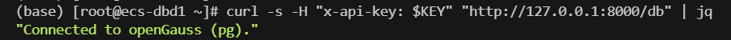
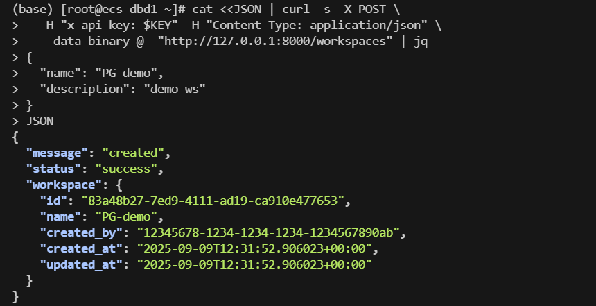
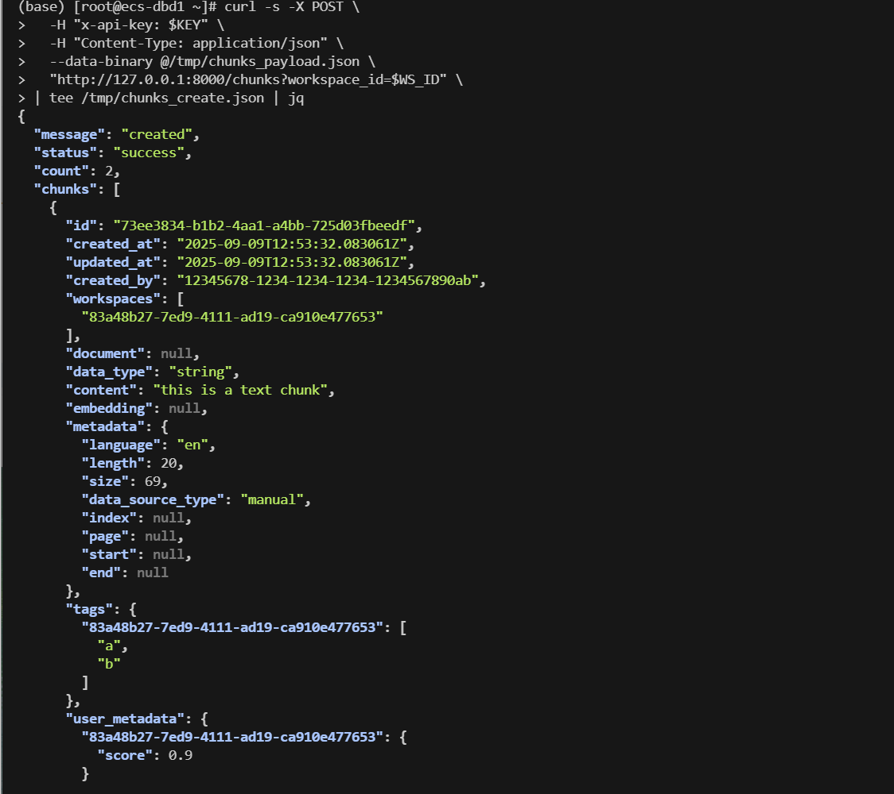
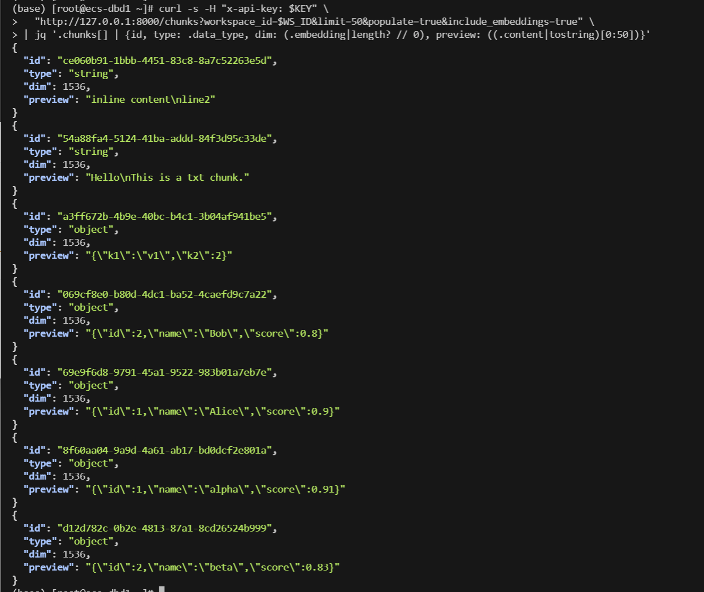
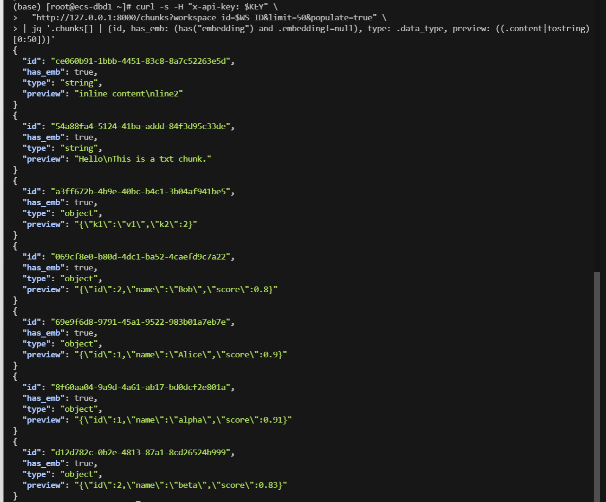
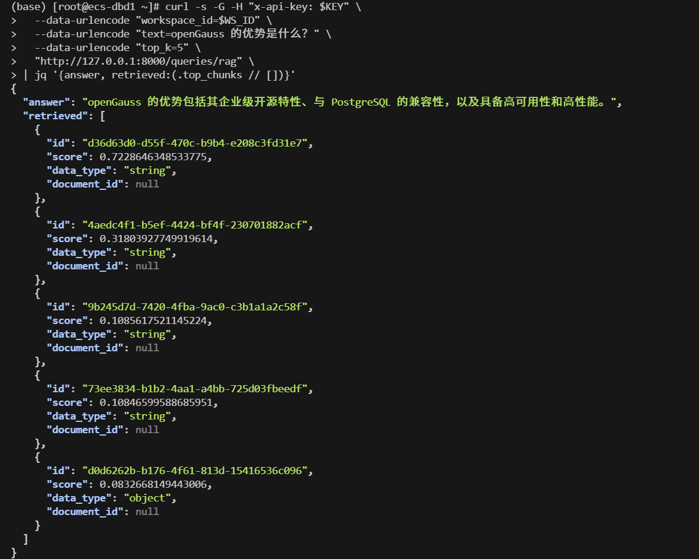
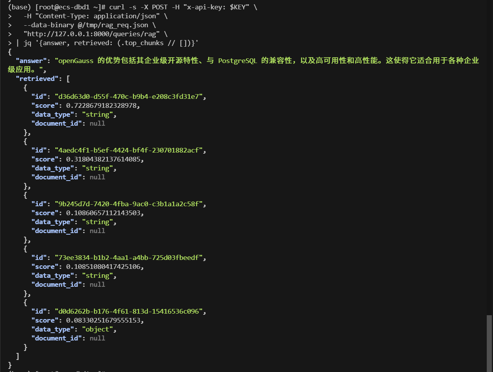
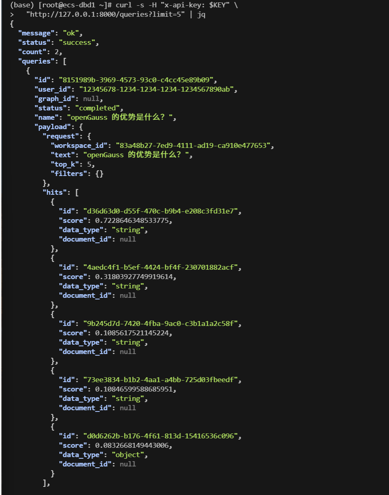
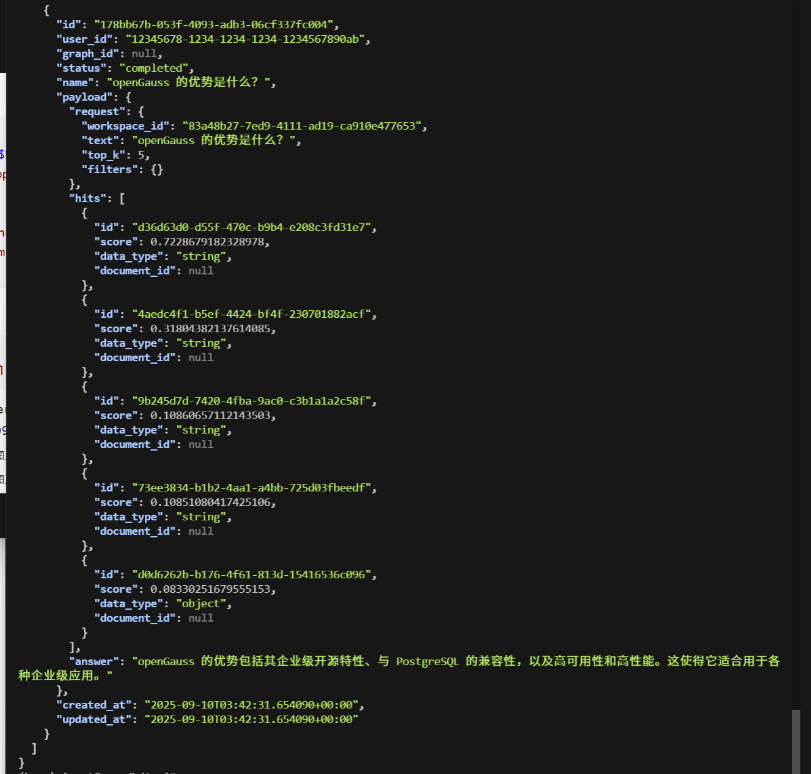

## RAG实践（端到端）

思路：以 **workspace 过滤** → **/chunks 语义检索（OpenAI Embedding）** → **拼接上下文** → **调用 LLM** 为主线

### 0 健康检查

```shell
curl -s -H "x-api-key: $KEY" "http://127.0.0.1:8000/db" | jq
```




### 1 创建工作区

```bash
cat <<JSON | curl -s -X POST \
  -H "x-api-key: $KEY" -H "Content-Type: application/json" \
  --data-binary @- "http://127.0.0.1:8000/workspaces" | jq
{
  "name": "PG-demo",
  "description": "demo ws"
}
JSON
```



```shell
export WS_ID="83a48b27-7ed9-4111-ad19-ca910e477653"
```


### 2 创建chunks

```bash
# 1) 组织 payload
cat >/tmp/chunks_payload.json <<'JSON'
{
  "chunks_in": [
    {
      "content": "this is a text chunk",
      "tags": ["a", "b"],
      "user_metadata": { "score": 0.9 }
    },
    {
      "content": { "k1": "v1", "k2": 2 },
      "tags": ["x"],
      "user_metadata": { "note": "obj" }
    }
  ]
}
JSON

# 2) 创建（按 workspace 归属；只需 x-api-key，不用传 created_by）
curl -s -X POST \
  -H "x-api-key: $KEY" \
  -H "Content-Type: application/json" \
  --data-binary @/tmp/chunks_payload.json \
  "http://127.0.0.1:8000/chunks?workspace_id=$WS_ID" \
| tee /tmp/chunks_create.json | jq

export CHUNK_A=$(jq -r '.chunks[0].id // .chunks_created[0].id' /tmp/chunks_create.json)
export CHUNK_B=$(jq -r '.chunks[1].id // .chunks_created[1].id' /tmp/chunks_create.json)
echo "CHUNK_A=$CHUNK_A"
echo "CHUNK_B=$CHUNK_B"

# 3)增加中文chunk

cat >/tmp/chunks_more.json <<'JSON'
{
  "chunks_in": [
    {
      "content": "openGauss 是企业级开源数据库，兼容 PostgreSQL，具备高可用与高性能。",
      "tags": ["db","opengauss"],
      "user_metadata": { "lang": "zh" }
    },
    {
      "content": "WhyHow 支持文档分块、图谱抽取与 RAG 检索问答，便于企业知识应用。",
      "tags": ["whyhow","rag"],
      "user_metadata": { "lang": "zh" }
    }
  ]
}
JSON

curl -s -X POST \
  -H "x-api-key: $KEY" \
  -H "Content-Type: application/json" \
  --data-binary @/tmp/chunks_more.json \
  "http://127.0.0.1:8000/chunks?workspace_id=$WS_ID" | jq
```



检查embedding

```shell
curl -s -H "x-api-key: $KEY" \
  "http://127.0.0.1:8000/chunks?workspace_id=$WS_ID&limit=50&populate=true&include_embeddings=true" \
| jq '.chunks[] | {id, type: .data_type, dim: (.embedding|length? // 0), preview: ((.content|tostring)[0:50])}'
```



```shell
curl -s -H "x-api-key: $KEY" \
  "http://127.0.0.1:8000/chunks?workspace_id=$WS_ID&limit=50&populate=true" \
| jq '.chunks[] | {id, has_emb: (has("embedding") and .embedding!=null), type: .data_type, preview: ((.content|tostring)[0:50])}'
```




### 3 RAG查询

1. GET

```shell
curl -s -G -H "x-api-key: $KEY" \
  --data-urlencode "workspace_id=$WS_ID" \
  --data-urlencode "text=openGauss 的优势是什么？" \
  --data-urlencode "top_k=5" \
  "http://127.0.0.1:8000/queries/rag" \
| jq '{answer, retrieved:(.top_chunks // [])}'
```



2. POST

```shell
jq -n --arg ws "$WS_ID" --arg txt "openGauss 的优势是什么？" --argjson top 5 \
  '{workspace_id:$ws, text:$txt, top_k:$top}' > /tmp/rag_req.json

curl -s -X POST \
  -H "x-api-key: $KEY" -H "Content-Type: application/json" \
  --data-binary @/tmp/rag_req.json \
  "http://127.0.0.1:8000/queries/rag" \
| tee /tmp/rag_resp.json \
| jq '{answer, retrieved: (.retrieval // [] | map({id, score, preview: ((.content|tostring)[0:80])}))}'
```



3. 查列表

```shell
curl -s -H "x-api-key: $KEY" \
  "http://127.0.0.1:8000/queries?limit=5" | jq
```



