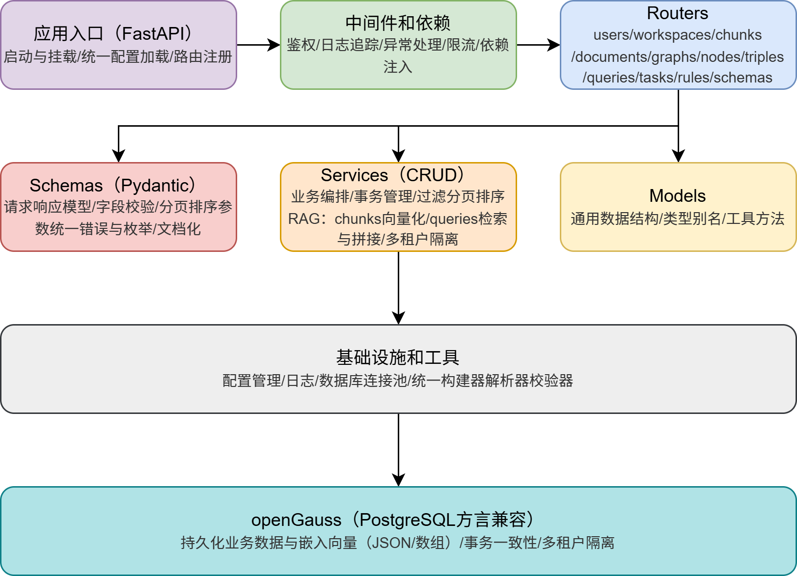
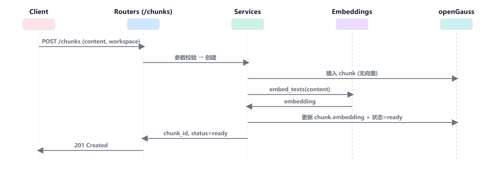
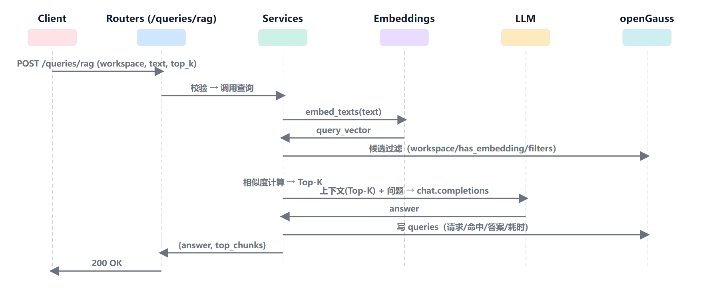

## 项目结构介绍

### 整体架构

​	**WhyHow (openGauss)** 是一个面向企业知识检索与问答的 **RAG 服务**。它把非结构化文本切分为chunks，对其向量化后存入openGauss，在查询阶段按工作空间范围进行语义检索，将命中的片段拼接成上下文并调用 LLM 生成答案。系统采用“**入口 → 中间件 → 路由 → 业务服务 → 基础设施/数据库**”的分层架构，职责单一、依赖清晰，便于扩展到图谱（graphs/nodes/triples）和规则（rules）等高级能力。
 	**openGauss** 作为持久层统一保存业务数据与向量，以事务一致性和多租户隔离为核心；向量相似度在应用层计算。

#### 1) 应用入口（FastAPI）

- **职责**：启动与挂载、统一配置加载、路由注册与生命周期管理。
- **输入/输出**：接收 HTTP 请求，输出统一的 JSON 响应与 OpenAPI 文档。

#### 2) 中间件和依赖

- **内容**：认证（`x-api-key`）、请求/响应日志、异常收敛、CORS、限流、跨请求上下文；依赖注入。
- **特点**：请求进入路由前即生效，确保所有下游层拿到一致的上下文与安全基线。

#### 3) Routers（HTTP 接口）

- **职责**：把 REST 入口映射到 Service；只做**轻校验与参数解析**，不落具体业务。
- **成员**：`users/workspaces/chunks/documents/graphs/nodes/triples/queries/tasks/rules/schemas`。
- **约定**：统一分页/排序参数、统一鉴权头（`x-api-key`）、统一错误格式。

#### 4) Schemas（Pydantic）

- **职责**：请求/响应 DTO、字段校验、公共枚举与错误模型、分页与过滤器定义；为 OpenAPI 生成提供强类型描述。
- **价值**：将“接口契约”前置，解耦路由/服务；避免隐式 JSON 结构造成的兼容风险。

#### 5) Services / CRUD（业务编排）

- **职责**：
  - 事务管理、过滤/分页/排序封装，统一从依赖注入获取 `db/session/config/user`；
  - **RAG 主线**：`chunks` 写入与向量化（创建时或批量重建）→ 检索 Top-K → 拼接上下文 → 调用 LLM → 记录 `queries`；
  - 多租户隔离；读写审计。

#### 6) Models / Common

- **职责**：通用数据结构、类型别名、常量与工具函数；供 Schemas/Services 复用。
- **定位**：放领域无关的共享部件，避免循环依赖与重复实现。

#### 7) 基础设施和工具

- **内容**：配置管理、日志与追踪、数据库连接池/会话、构建器（切分/解析/预处理）、校验器、导出工具、CLI、静态模板。
- **作用**：给上层提供统一的可复用能力。

#### 8) openGauss（PostgreSQL 方言兼容）

- **职责**：单一事实来源，持久化业务数据与嵌入向量（JSON/数组），保障事务一致；以 `workspace` 维度实现多租户隔离。
- **检索策略**：当前在应用层做余弦相似度与 Top-K。
- **表面向对象**：`users/workspaces/documents/chunks/queries`；图谱 `graphs/nodes/triples` 为可选增强。

### 数据模型与表结构

#### 实体介绍

1. **User**：调用方/租户的身份与配额。

2. **Workspace**：数据隔离与分享的基本单元。

3. **Document**：原始载体（文件、网页、表格等），用于聚合 chunks 的来源。

4. **Chunk**：**RAG 的原子单元**。包含文本/对象内容、轻量标签与embedding 向量。一个 chunk 可被多个 workspace 共享。

5. **Query**：一次 RAG 请求的完整记录：查询文本、使用的 workspace、命中片段概要、答案、耗时等。

6. **Graph / Node / Triple**：结构化知识扩展。Chunk 可在 `metadata` 中挂接 Node/Triple 的引用，实现“语义 + 结构化”的混合检索。

7. **Task / Rule**：离线重建、清洗、批处理与规则检查等辅助能力。

#### RAG 主流程时序图

1. /chunks 接口的请求处理时序图

​	客户端向 `/chunks` 提交内容与 `workspace_id`，路由做鉴权与参数校验后把请求交给服务层。服务层先在 openGauss 插入一条 **pending** 的 chunk，随后调用嵌入服务获得向量，回写到该记录并将状态标记为 **ready**，最后把 `chunk_id` 返回给客户端（201 Created）。这一流程确保写入具备事务一致性与多租户隔离。

2. RAG查询时序图

​	客户端向 `/queries/rag` 提交 `workspace_id + text + top_k`，路由校验后由服务层执行检索。服务层先对问题做向量化，随后在 openGauss筛出候选，在应用层计算余弦相似度取 **Top-K**，将命中片段拼成上下文并调用 LLM 生成答案。全过程（请求、命中、答案、耗时）会写入 `queries` 便于审计，最终返回 `{answer, top_chunks}`（200 OK）。

